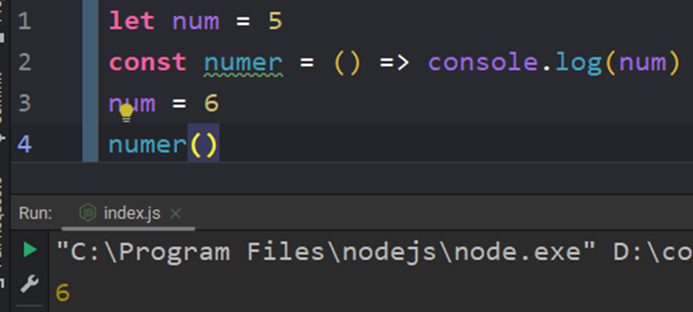
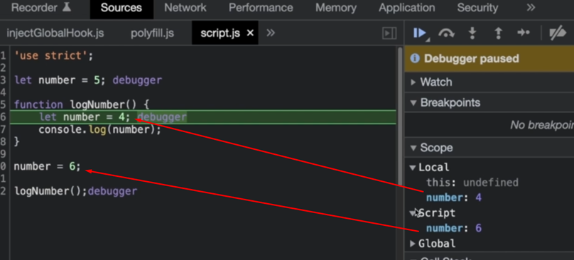
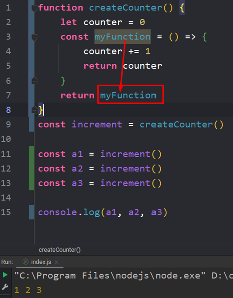

В данном примере кода мы доходим до такого понятия как **лексическое окружение** или **область видимости**. Любая переменная – это свойство объекта лексического окружения. И мы имеем внутреннее лексическое окружение (например, область той же функции) и внешнее (всё, что находится на глобальном уровне).

Тут стоит пояснить, то бОльший приоритет имеют свойства внутренней области, но так же внутреннее окружение может брать значения из внешнего. Так же те же функции берут самое последнее значение переменной, которая может изменяться далеко дальше по коду

Тут функция так же будет брать только актуальное значение переменной (6, а затем уже 8). Так же тут же отметим, что при каждом вызове функции, у нас создаётся разное лексическое окружение, что говорит нам о том, что в функции в разных местах кода спокойно могут находиться разные значения переменных. Но так же эти пространства удаляются, когда они выполняются и полностью исчезают из выполненного программного кода

Тут так же можно увидеть, что при вызове функции у нас создаётся определённая область видимости, где сохраняются ссылки на переменные, которые были им доступны на время создания этих функций (создание == вызов)

