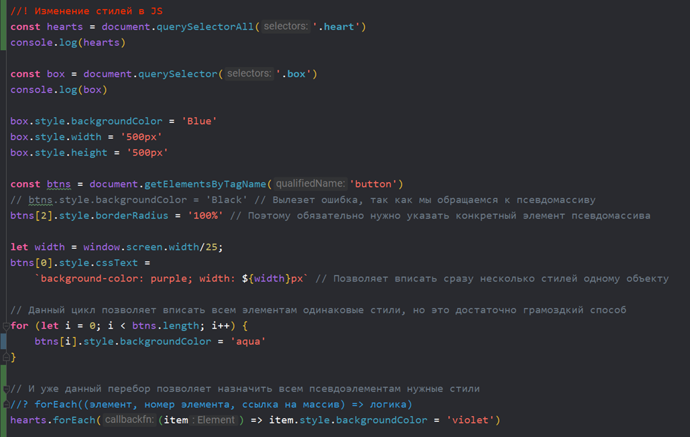
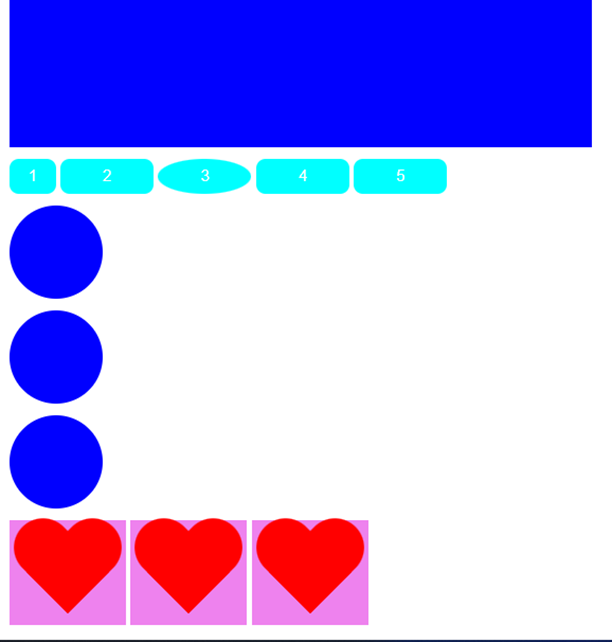
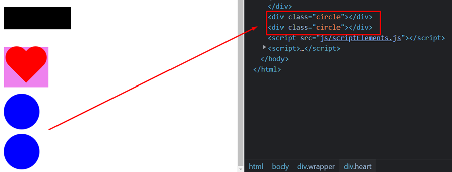
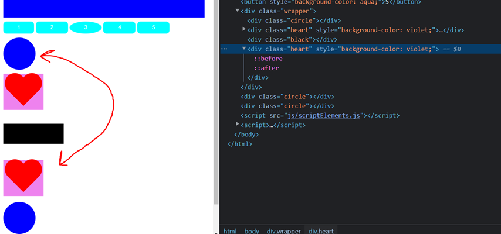
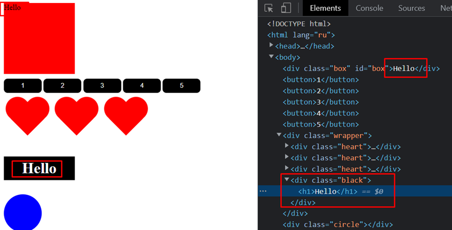

Так же мы можем добавить инлайновые стили определённому элементу страницы через `имя_элемента.style.стиль = 'значение[px]'`.

Тут так же нужно отметить, что мы в основном имеем дело в псевдомассивами, поэтому нужно не забывать обращаться к элементам по индексу.

Так же нужно отметить, что на элемент можно повесить стили через обращение к элементу `cssText`, который представляет из себя просто набор текста стилей элемента `элемент.style.cssText = 'стили'`

И вот тут представлено создание нового элемента нашей страницы с классом black (в CSS заранее прописаны свойства цвета, ширины и высоты данного блока по названию класса):
- `createElement()` - позволит создать элемент на странице по тегу
- `classList()` - свойство объекта, которое позволяет производить манипуляции над классом элемента на странице
	- `add()`- метод добавления класса элементу
	- `remove()` - метод, который позволит удалить определённый стиль с элемента
- `append()` - добавляет определённый элемент в конец
- `querySelector().append()` - такая конструкция позволит добавить элемент в конец определённого блока кода

Это второй вариант записи обращения к элементу (тут мы запихиваем див во враппер)

Так же у нас есть возможность добавить элемент в начало объекта, но через другой метод: `prepend()`

Так же мы можем поместить элемент на страницу через метод `before()` до того элемента, на котором мы вызвали данный метод

Так же мы можем поместить элемент после того, на котором вызвали функцию `after()`

Но есть куда более старый метод, который тоже подойдёт для вставки элемента - `insertBefore()`. Ему нужно передать в качестве аргументов два объекта: вставляемый объект и тот, перед которым вставляем

Тут уже представлено удаление одного из трёх кружков. Осуществляется удаление элемент через вызов на нём метода `remove()`

Раньше был актуален метод `removeChild()`, который позволял удалить дочерний элемент из родительского

Так же мы имеем возможность крайне просто и быстро поменять объекты местами между друг другом с помощью метода `заменяемый.replaceWith(заменяем_на)`

И вот ещё один абсолютно аналогичный по логике выполнения код, но более старый по записи `replaceChild()`

И вот тут уже нужно познакомиться с двумя свойствами `innerHTML` и `innerText`.

Первый добавляет на страницу код HTML, а второй добавляет только текст (который мог ввести, например, пользователь)

Метод `insertAdjacentHTML(позиция, значение)` позволяет вставить HTML-код несколькими заранее определёнными способами. В качестве первого аргумента мы передаём способ вставки, в качестве второго – сам код.

- `afterbegin` - вставит код в самом элементе, на котором вызываем данную функцию
- `afterend` - вставит после блока
- `beforebegin` - вставит до блока
- `beforeend` - вставит как и первый в самом элементе, на котором вызываем данную функцию

Так же при инициализации HTML элемента в JS можно указывать откуда мы будем конкретно брать вложенные элементы. То есть, мы можем искать элементы не по всему документу, а внутри враппера, который мы импортнули в JS

