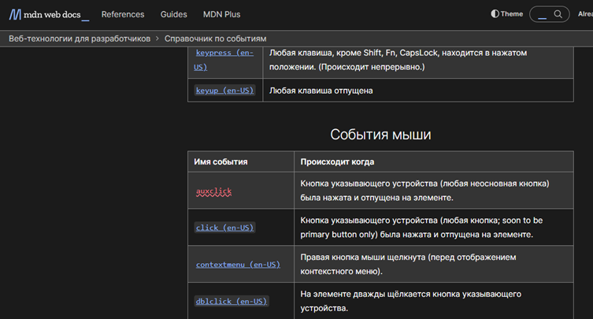
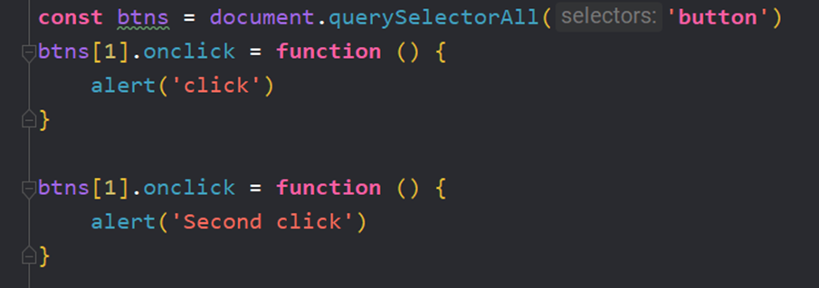
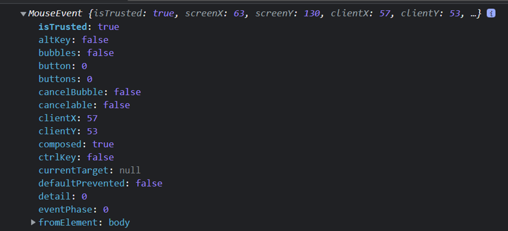
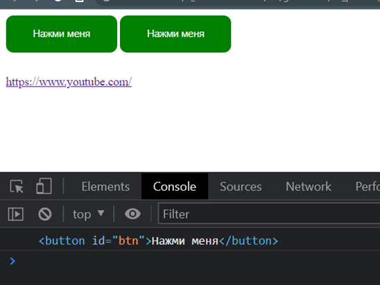
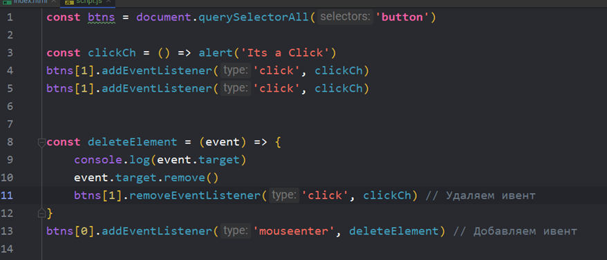
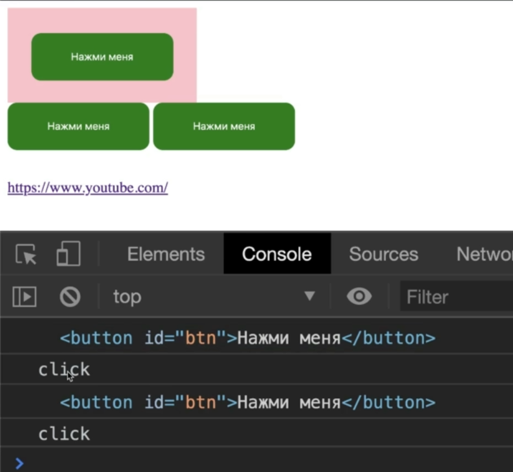
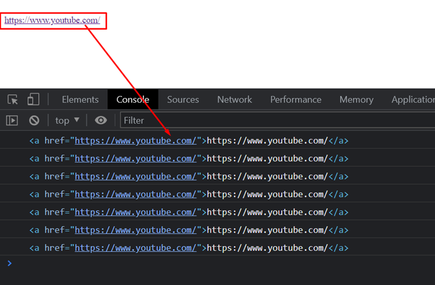

Существует огромное количество событий в JS. Все они применяются при взаимодействии пользователя и нашей формы

Самое первое и простое взаимодействие – это нажатие кнопки пользователем, которое мы можем прописать прямо в теге (но так делать не рекомендуется)

Так будет правильнее писать событие, но всё равно этот метод достаточно устаревший. Этот код плох тем, что мы можем забыть и переназначить кнопке другое действие далее в коде. А это уже точно приведёт к сбою логики программы

Это уже современная форма записи через `addEventListener()`. Первым делом записывается название самого события (нажатие -> `'click'`), уже потом вставляем колбэк-функцию, которая сработает при этом событии

`'mouseenter'` – вызывает срабатывание ивента при наведении мыши на элемент

Выводим сам ивент (так же можно ввести `event.target` – выведет элемент (на котором произошло событие), `event.type` – тип ивента)

Удаляет блок кода (сам элемент), на который навелись мышкой

Так же мы имеем `removeEventListener(событие, функция)`, которая позволяет удалить само событие с элемента 

Тут логика нашей программы описывается так: у нас есть чекер кликов, после нажатия на первую кнопку – она пропадает и вместе с ней удаляется чекер кликов со второй кнопки

Тут показаны **вложенные события**. Когда на родительсском и дочернем элементе находится один и тот же обработчик. Сначала всегда срабатывает вложенное событие

Свойство `currentTarget` указывает на событие каждого конкретного элемента по отдельности (сработали отдельно дочерний, потом родительский элементы)

`event.preventDefault()` – позволяет отменить выполнение стандартной логики для определённого элемента (например, отменяет перезагрузку страницы при нажатии на кнопку-сабмит (отправка) формы)

Так же мы можем через `forEach()` повесить событие сразу на все элементы псевдомассива

Так же в mdn можно увидеть, что метод, добавляющий ивенты, может принимать в себя до трёх значений, последний из которых - модификатор

Пример использования опции:

