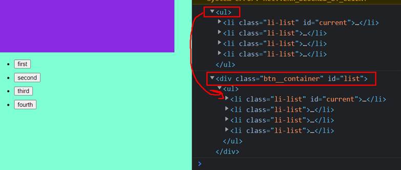
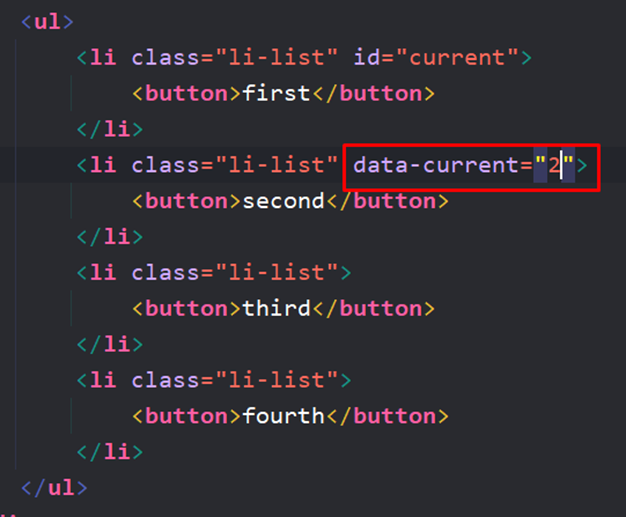

Мы можем легко вывести и увидеть элементы через JS. Тут хочется выделить такую особенность, что `documeentElement` – это `<html></html>` тег, внутри которого всё находится.

Так же, когда мы используем `childNodes` (вывод всех дочерних элементов), мы можем увидеть очень много разных объектов. В качестве `text` выступает перенос строки, который мы можем увидеть в коде, но который не отображается

И тут уже стоит пояснить, что в ДОМ-дереве не всё является элементами или узлами. **Элемент** – это видимая часть HTML, а **узел**, в свою очередь, – это та связующая часть между элементами и текст. Например, кнопка – это элемент, а текст в кнопке – это узел (нода)

`parentNode` выводит родительский узел и повторять его можно много раз

Так же мы можем обращаться к определённым атрибутам в HTML-коде (тут так же работает логика CSS, так как обращение к артрибуту там идёт через `[такой синтаксис]`)

Используя предыдущий синтаксис, мы можем обратиться к предыдущему и следующему объекту (тут как предыдущий, так и следующий объект – это текстовая нода переноса строки)

Но такими методами неудобно пользоваться, так как мы можем попасться на ноду переноса строки, что нам может быть и не нужно

Выводит предыдущий/следующий **элемент** после того, к которому обратились

`firstElementChild` - выводит первого ребёнка в выбранном элементе
`parentElement` - выводит родителя выбранного элемента

И вот как данный функционал пишется: мы перебираем все элементы объекта `body`, и если имя элемента `text`, то данная итерация цикла пропускается (`continue` – пропускает итерацию цикла, `break` – завершает цикл досрочно)

