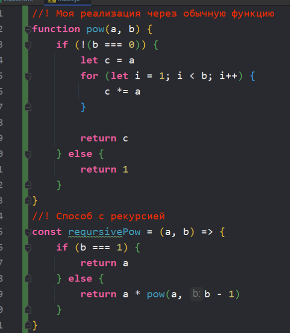
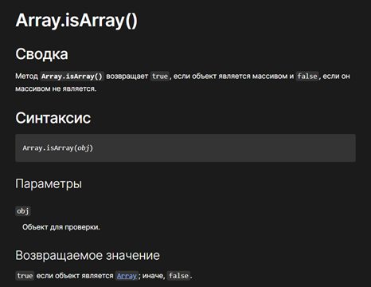
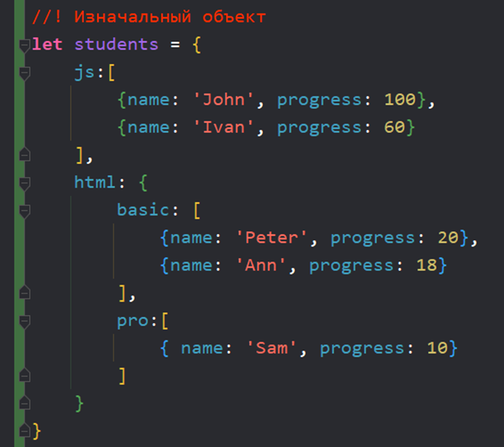
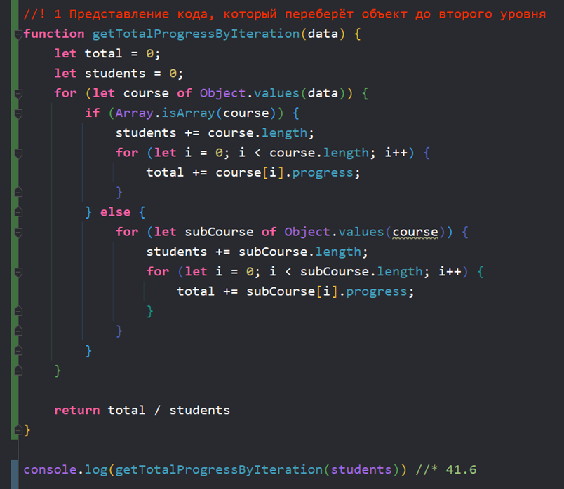
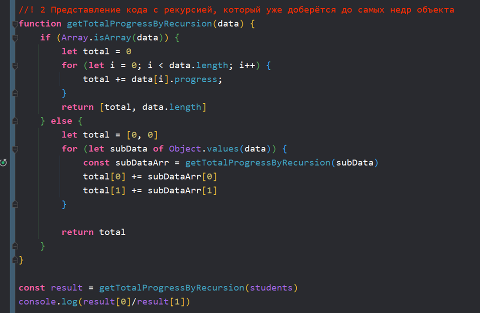

Рекурсия - это функция, которая выполняет саму себя конечное количество раз.

Рекурсия позволяет множество раз перевыполнять код до выполнения поставленной задачи.

Так же имеются основные понятия как: база рекурсии, шаг рекурсии и глубина рекурсии

Нужно сразу упомянуть, что рекурсии менее производительны, нежели чем стандартные функции языка по перебору информации. Однако рекурсии более удобны в большинстве остальных методов

Первый метод `Object.values()` переводит объект в массив, второй метод `Array.isArray()` проверяет является ли объект массивом

Тут представлен объект, который хранит в себе данные о студентах и завершённости прохождения курса

И нам нужно создать переборщик объекта, который выведет общий процент прхождения курсов. Основная проблема этого переборщика заключается в том, что при переборе объекта он не зайдёт в ещё более вложенные объекты кроме тех, что мы описали – это и есть ограничение нерекурсивных методов

И вот представление кода с рекурсией. Он уже может обработать объекты любой сложности и вложенности, так как при каждой встрече объекта, он переходит во второй условный блок кода, где располагается `else` и там запускает массив заново, чтобы дойти до массива, где сработает блок кода `true`

С представленным выше объектом оба массива справляются одинаково

Но если немного изменить структуру

