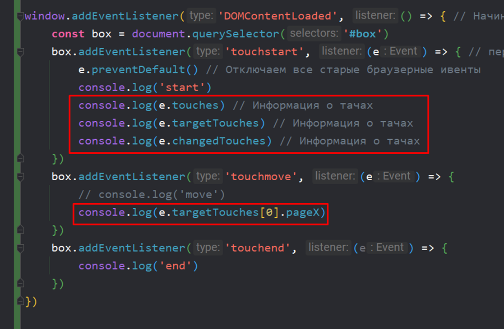
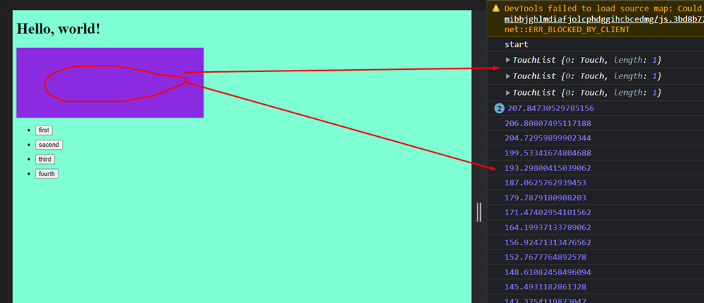

На телефоне в основе своей нет кликов мышкой – есть тачи. Однако события с кликами нормально отрабатывают и в мобильных версиях браузеров

Мобильных событий всего 6:
- `touchstart` – возникает при соприкосновении
- `touchmove` – возникает при перемещении пальцем
- `touchend` – палец отпускается от элемента с данным ивентлистенером
- `touchenter` – срабатывает как только палец при скольжении попадает на элемент с данным ивентом
- `touchleave` – срабатывает когда палец выходит за пределы элемента
- `touchcancel` – срабатывает тогда, когда точка соприкосновения не регистрируется на поверхности (если палец выйдет за пределы браузера)

И вот примеры отображения ивентов в браузере. Первый ивент срабатывает при первом клике на объект, второй ивент срабатывает когда мы тыкаем по объекту и водим по нему, третий срабатывает, когда мы отпускаем палец с объекта

Так же стоит упомянуть, что у ивентов есть свои методы. И вот три из них, которые позволяют отслеживать тачи относительно объекта:

Сама информация о тачах представляет из себя: положение в пространстве, поворот, радиус, количество пальцев и так далее

Вот пример вывода всех методов о клике и вывода положения по X пальца, который перемещается по боксу

_Ресурс, который позволит немного упростить работу с тачами_ - [https://hammerjs.github.io/](https://hammerjs.github.io/)