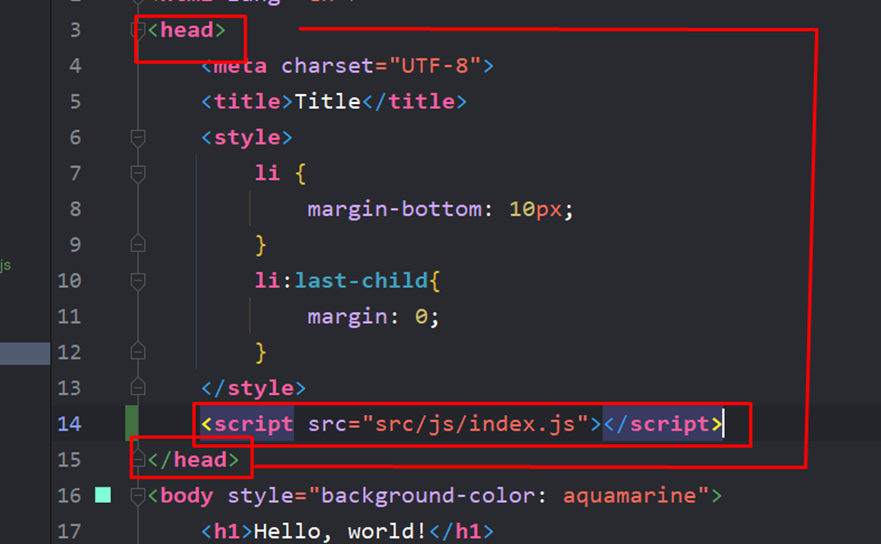
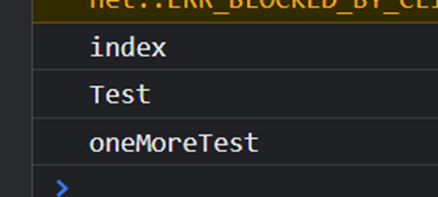

Тут нужно уопмянуть, что при расположении скрипта в `<head>` страницы у нас вылазит две проблемы:

1) Так как скрипт загрузился, а страница нет, то скрипту не с чем будет работать и он выдаст ошибку
2) Сам по себе скрипт стопорит загрузку HTML-страницы и при большом его весе у нас страница может долго загружаться

Но так же перед нами может встать другая проблема: очень большой проект. Сайт может содержать в себе тысячи элементов, которые могут очень долго загружаться. Это приведёт к тому, что скрипт может не сработать в тех местах, где нам это нужно было

Атрибут `defer` сообщает браузеру, чтобы он продолжал загружать страницу, но так же браузер должен загружать и скрипт в фоновом режиме, а затем запустить скрипт, когда он загрузится.

1) Скрипты с `defer` никогда не блокируют страницу
2) Скрипт запустится только тогда, когда DOM-дерево уже готово

Так же ещё одной особенностью является то, что скрипты выполняются последовательно друг за другом, даже если какой-то загрузился раньше.

Это позволяет нам закинуть те же скрипты в хедер сайта, но гугл сео-тест будет ругаться на такое расположение скриптов

Ещё один атрибут, который модифицирует работу скриптов – это `async`.

1) Страница не ждёт асинхронных скриптов – содержимое загружается и обрабатывается
2) Событие `DOMContentLoaded` и асинхронные скрипты не ждут друг друга

Тут уже нужно убедиться, что скрипты не зависят от DOM-структуры, так как выполняются они сразу же

И вот пример подключения скриптов по нужному порядку к сайту

