#Redux #React 

## 001 Основные принципы Redux. Теория


Работа с динамическими данными и со стейтом - это одна из основных задач разработчика. Если логика изменения данных написана правильно, то и их отображение будет несложной задачей.

Первое приложение у нас выглядит следующим образом:
- Все данные хранились в одном компоненте
- Все данные передавались по иерархии вниз, а изменения состояния передавались вверх через коллбэки
- Так же все состояния централизованы (они все находились в одном месте - в компоненте `App`)

Такой подход называется ==Property Drill==, когда мы просверливаем пути для передачи состояний по уровням через несколько компонентов. Такой подход не является достаточно логичным, так как некоторые компоненты могут хранить в себе ненужные для них состояния, которые мы просто перебрасываем дальше.

Второе приложение выглядит уже следующим образом:
- Каждый компонент хранит своё состояние у себя (один компонент содержит список персонажей, а другой список комиксов, третий содержит информацию об одном конкретном персонаже и так далее)

Такой подход сложно масштабировать, особенно, если появятся зависимости между компонентами

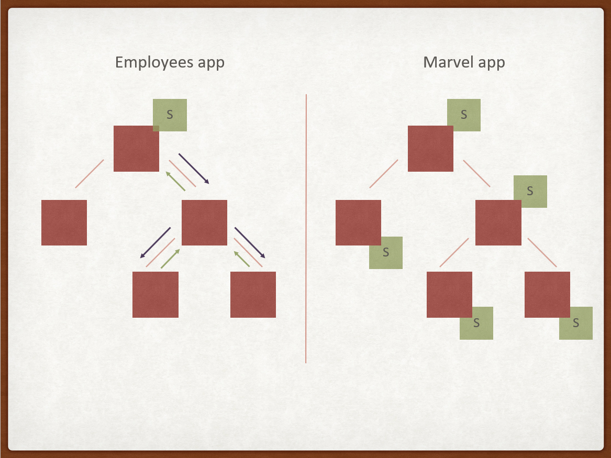

Чтобы решить вышеописанные проблемы, были придуманы определённые паттерны для работы с состояниями продуктов, такие как ==MVC==, ==MVP==, ==MVVM==


И чтобы решить проблему со сложными зависимостями, можно создать один большой источник стейтов для всех компонентов. Однако тут мы сталкиваемся с проблемой, что каждый компонент может поменять наш глобальный стейт

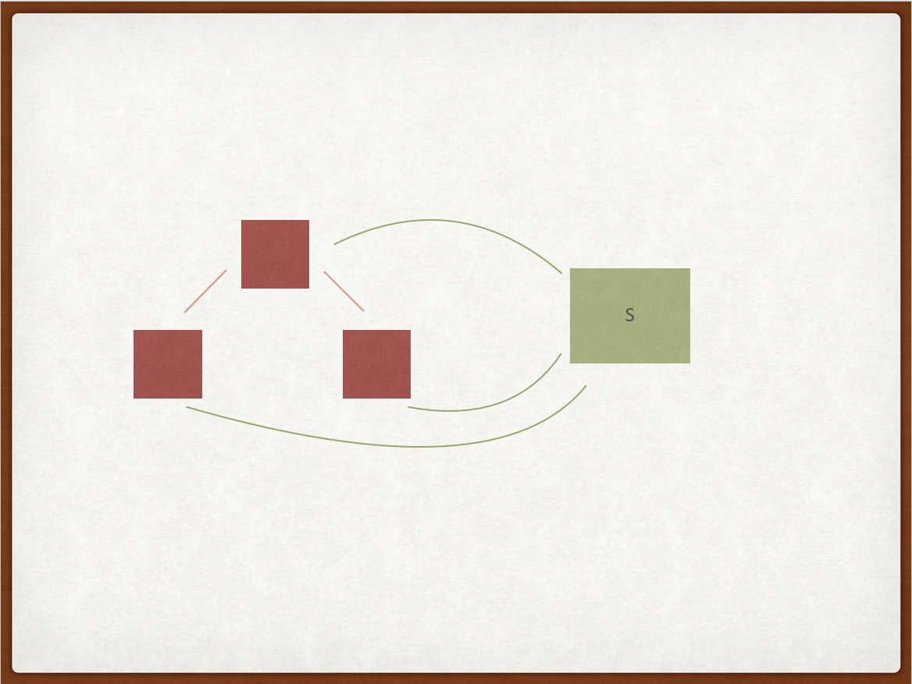

И чтобы решить уже вышеописанную проблему, был придуман следующий подход:
- Мы имеем наши компоненты **View**, которые при выполнении какого-либо действия создают **Actions** (который уже знает, что нужно обновить в стейте)
- Определённые события **Actions** (которые хранят информацию о требуемых изменениях) вызывают срабатывание определённых действий в компоненте **Reducer** (который уже знает, как именно обновить этот стейт). Операция передачи объекта **Actions** в **Reducer** называется ==dispatch==
- Компонент **Reducer** - это компонент, который находится в общем хранилище стейтов и он знает, что делать при любом запросе от компонентов сайта. То есть он регулирует обновление стейтов внутри **S**, чтобы компоненты могли перерисоваться на базе обновлённых данных
- Компонент **S** так же находится внутри хранилища и сам по себе просто хранит все состояния приложения. 

Так же в ==Redux== имеются ==селекторы== - это функции, которые получают часть данных из хранилища для дальнейшего использования (из **S** во **View**)

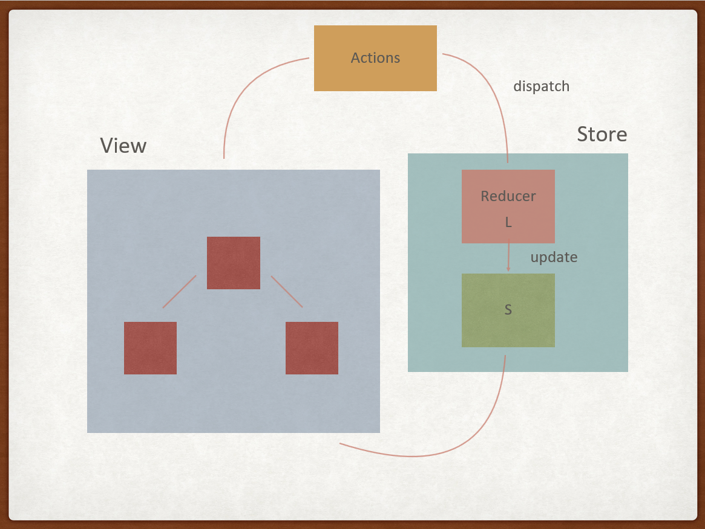

И вот так выглядит работа стейт-менеджера на реальном примере. Из `State` прошлые данные приходят в `Reducer`, чтобы сравнить с новыми значениями.

Примерно такой же подход использовался в хуке `useReducer`.


И тут важно уточнить, что запутаться в трёх разных документациях легко, поэтому нужно знать. что ищем:


Так же очень важное расширение для работы с редаксом в браузере, которое позволяет просмотреть состояния системы:


## 002 Основные принципы Redux. Практика

Первым делом нужно установить библиотеки редакса в приложение

```bash
npm i redux react-redux
```

Дальше распишем базовую схему, которая будет соответствовать архитектуре работы редакса:
- начальное состояние
- функция-редьюсер
- стейт

```JS
// начальное состояние
const initialState = 0;

// функция изменения стейта
const reducer = (state, action) => {
	if (action.type === 'INC') {
		return state + 1;
	}
	return 0;
};

// стейт
const state = reducer(initialState, { type: 'INC' });

console.log('State after reducer = ' + state);
```

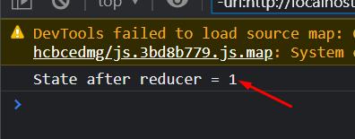

Уже таким образом функция редьюсера будет написана лаконичнее, так как действий может быть множество

```JS
const reducer = (state = 0, action) => {
	switch (action.type) {
		case 'INC':
			return state + 1;
		case 'DEC':
			return state - 1;
		default:
			return state;
	}

	return 0;
};
```

И тут нужно сказать, что стоит установить дефолтное значение, так как в функцию может попасть `undefined`, что может привести к ошибке

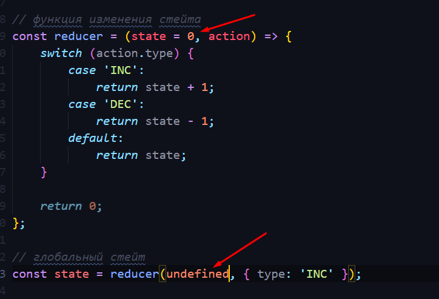

Ну и далее создадим единый стор, который уже принимает в себя функцию-редьюсер. Обычно в приложении располагается только один стор 

```JS
import { createStore } from 'redux';

// начальное состояние
const initialState = 0;

// функция изменения стейта
const reducer = (state = 0, action) => {
	switch (action.type) {
		case 'INC':
			return state + 1;
		case 'DEC':
			return state - 1;
		default:
			return state;
	}

	return 0;
};

// это стор, который хранит функцию-редьюсер и все стейты
const store = createStore(reducer);

// вызываем функцию reducer и передаём в неё значение
store.dispatch({ type: 'INC' });

console.log('Value in state = ' + store.getState());
```


Так же мы можем реализовать подписку на изменения в сторе, что позволит контролировать изменение состояний в приложении

```JS
// начальное состояние
const initialState = 0;

// функция изменения стейта
const reducer = (state = 0, action) => {
	switch (action.type) {
		case 'INC':
			return state + 1;
		case 'DEC':
			return state - 1;
		default:
			return state;
	}

	return 0;
};

// это стор, который хранит функцию-редьюсер и все стейты
const store = createStore(reducer);

// подписка позволяет вызывать функцию, которая будет срабатывать каждый раз при изменении стейта внутри стора
store.subscribe(() => {
	console.log('Value in state = ' + store.getState());
});

// вызываем функцию reducer и передаём в неё значение
store.dispatch({ type: 'INC' });
store.dispatch({ type: 'INC' });
```

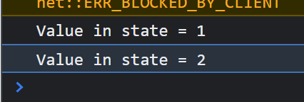

>[!info] Важные правила работы с Reducer:
> - Эта функция должна быть чистой и зависеть только от приходящего в неё стейта и экшена
> - Она должна возвращать один и тот же результат при одинаковых аргументах и не иметь никаких побочных эффектов (никаких логов, запросов на сервер, генераций случайных чисел и никакой работы с ДОМ-деревом)

Вёрстка кнопок

```HTML
<div id="rooter" class="jumbotron">
	<h1 id="counter">0</h1>
	<button id="dec" class="btn btn-primary1">DEC</button>
	<button id="inc" class="btn btn-primary1">INC</button>
	<button id="rnd" class="btn btn-primary1">RND</button>
</div>
```

Стили

```CSS
.jumbotron {
  display: flex;
  justify-content: center;
  align-items: center;

  width: 99vh;
  height: 99vh;
}
```

И использование редакса на странице:

```JS
// начальное состояние
const initialState = 0;

// функция изменения стейта
const reducer = (state = 0, action) => {
	switch (action.type) {
		case 'INC':
			return state + 1;
		case 'DEC':
			return state - 1;
		case 'RND':
			return state * action.payload;
		default:
			return state;
	}

	return 0;
};

// это стор, который хранит функцию-редьюсер и все стейты
const store = createStore(reducer);

const updateCounter = () => {
	document.getElementById('counter').textContent = store.getState();
};

// подписка позволяет вызывать функцию, которая будет срабатывать каждый раз при изменении стейта внутри стора
store.subscribe(updateCounter);

document.getElementById('inc').addEventListener('click', () => {
	store.dispatch({ type: 'INC' });
});

document.getElementById('dec').addEventListener('click', () => {
	store.dispatch({ type: 'DEC' });
});

document.getElementById('rnd').addEventListener('click', () => {
	const value = Math.floor(Math.random() * 10);
	store.dispatch({ type: 'RND', payload: value });
});
```


Отдельно нужно сказать, что так делать нельзя и выше было показано, что мы передали это значение через свойство `payload` (полезная нагрузка)

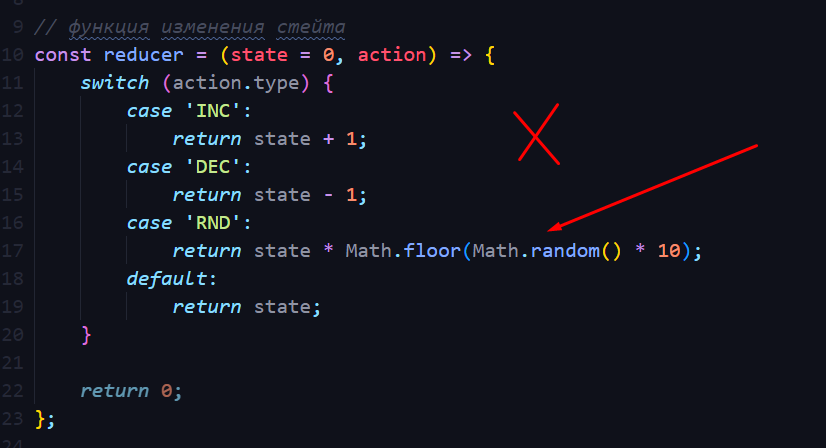

И так же в ==Redux== используется `actionCreator` функция, которая генерирует экшены. Они используются для более безопасного применения редьюсера, чтобы он возвращает не стейт по дефолтному проходу, а ошибку, если мы передали неправильный объект

```JS
// actionCreater'ы, которые создают экшены для редьюсера
const inc = () => ({ type: 'INC' });
const dec = () => ({ type: 'DEC' });
const rnd = (value) => ({ type: 'RND', payload: value });

document.getElementById('inc').addEventListener('click', () => {
	store.dispatch(inc());
});

document.getElementById('dec').addEventListener('click', () => {
	store.dispatch(dec());
});

document.getElementById('rnd').addEventListener('click', () => {
	const value = Math.floor(Math.random() * 10);
	store.dispatch(rnd(value));
});
```

Но так же мы будем часто работать с данными в виде объекта, поэтому и писать придётся код соблюдая иммутабельность:
- переводим начальный стейт в объект
- меняем редьюсер на работу со стейтом по принципу иммутабельности (разворачиваем старый объект и добавляем новые данные)
- далее из стора нужно будет получить не целый объект, а одно значение `store.getState().value` 

```JS
// начальное состояние
const initialState = { value: 0 };

// функция изменения стейта
const reducer = (state = initialState, action) => {
	switch (action.type) {
		case 'INC':
			return { ...state, value: state.value + 1 };
		case 'DEC':
			return { ...state, value: state.value - 1 };
		case 'RND':
			return { ...state, value: state.value * action.payload };
		default:
			return state;
	}

	return 0;
};

// это стор, который хранит функцию-редьюсер и все стейты
const store = createStore(reducer);

const updateCounter = () => {
	document.getElementById('counter').textContent = store.getState().value;
};

// подписка позволяет вызывать функцию, которая будет срабатывать каждый раз при изменении стейта внутри стора
store.subscribe(updateCounter);

// actionCreater'ы, которые создают экшены для редьюсера
const inc = () => ({ type: 'INC' });
const dec = () => ({ type: 'DEC' });
const rnd = (value) => ({ type: 'RND', payload: value });

document.getElementById('inc').addEventListener('click', () => {
	store.dispatch(inc());
});

document.getElementById('dec').addEventListener('click', () => {
	store.dispatch(dec());
});

document.getElementById('rnd').addEventListener('click', () => {
	const value = Math.floor(Math.random() * 10);
	store.dispatch(rnd(value));
});
```

Итог: мы имеем каунтер построенный на базе отслеживания состояния через редакс даже без использования **React** на чистом **JS** 

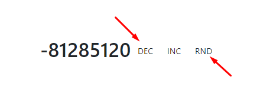


## 003 Чистые функции


Понятие чистой функции исходит из обычного программирования и там это имеется ввиду, когда говорят про прозрачность работы функции

>[!info] Особенности чистых функций:
> - При одинаковых данных они всегда возвращают одинаковый результат
> - Она не вызывает внутри себя побочных эффектов

Представленная функция всегда будет возвращать разные значения ровно по той причине, что она всегда выполняет в себе побочное действие (генерирует рандомное число)

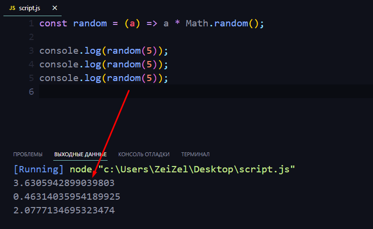

И теперь, когда мы переделали функцию таким образом, она является чистой ровно потому, что при передаче одних и тех же аргументов она всегда будет возвращать тот же результат

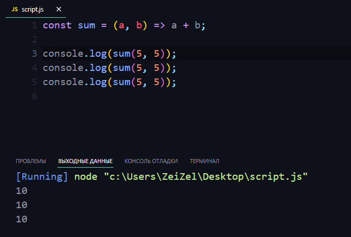

Так же тут нужно понимать, что все зависимости должны находиться внутри данной функции - значений извне она принимать не может 

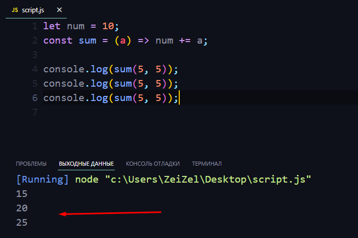

>[!danger] Побочные действия, которые нельзя использовать в чистых функциях:
> - Все асинхронные операции (запросы на сервер, изменение файлов)
> - Получение рандомного значения
> - Вывод логов
> - Работа с ДОМ-деревом
> - Видоизменение входных данных (это нарушение иммутабельности)


## 004 Оптимизация через actionCreators и bindActionCreator


Далее попробуем разбить приложение на отдельные файлы

Экшены вынесем в отдельный файл

`actions.js`
```JS
export const inc = () => ({ type: 'INC' });
export const dec = () => ({ type: 'DEC' });
export const rnd = (value) => ({ type: 'RND', payload: value });
```

Сам редьюсер уберём в другой файл

`reducer.js`
```JS
const initialState = { value: 0 };

const reducer = (state = initialState, action) => {
	switch (action.type) {
		case 'INC':
			return { ...state, value: state.value + 1 };
		case 'DEC':
			return { ...state, value: state.value - 1 };
		case 'RND':
			return { ...state, value: state.value * action.payload };
		default:
			return state;
	}

	return 0;
};

export default reducer;
```

И далее основную логику приложения оптимизируем:
- деструктуризируем и достанем из стора повторяющиеся функции `dispatch`, `subscribe` и `getState`
- Ивентлистенеры повторяют одну и ту же вложенную функцию - вызывают экшен-функцию внутри `dispatch`. Это поведение можно оптимизировать и вынести в отдельную функцию-диспэтчер (`incDispatch` и так далее) 

`index.js`
```JS
import { createStore } from 'redux';
import reducer from './reducer';
import { dec, inc, rnd } from './actions';

const store = createStore(reducer);
const { dispatch, subscribe, getState } = store;

const updateCounter = () => {
	document.getElementById('counter').textContent = getState().value;
};

subscribe(updateCounter);

const incDispatch = () => dispatch(inc());
const decDispatch = () => dispatch(dec());
const rndDispatch = (value) => dispatch(rnd(value));

document.getElementById('inc').addEventListener('click', incDispatch);
document.getElementById('dec').addEventListener('click', decDispatch);
document.getElementById('rnd').addEventListener('click', () => {
	const value = Math.floor(Math.random() * 10);
	rndDispatch(value);
});
```

Однако очень часто разработчики для простоты использования кода создавали функцию `bindActionCreator`, которая возвращала уже сбинженную функцию диспэтча для вызова в других местах

`index.js`
```JS
const store = createStore(reducer);
const { dispatch, subscribe, getState } = store;

const updateCounter = () => {
	document.getElementById('counter').textContent = getState().value;
};

subscribe(updateCounter);

const bindActionCreator =
	(creator, dispatch) =>
	(...args) =>
		dispatch(creator(...args));

const incDispatch = bindActionCreator(inc, dispatch);
const decDispatch = bindActionCreator(dec, dispatch);
const rndDispatch = bindActionCreator(rnd, dispatch);

document.getElementById('inc').addEventListener('click', incDispatch);
document.getElementById('dec').addEventListener('click', decDispatch);
document.getElementById('rnd').addEventListener('click', () => {
	const value = Math.floor(Math.random() * 10);
	rndDispatch(value);
});
```

Однако в редаксе уже есть подобная функция `bindActionCreators`, которая за нас создаёт подобный связыватель

`index.js`
```JS
import { createStore, bindActionCreators } from 'redux';

const incDispatch = bindActionCreators(inc, dispatch);
const decDispatch = bindActionCreators(dec, dispatch);
const rndDispatch = bindActionCreators(rnd, dispatch);
```

Так же мы можем сделать привязку нескольких функций через одну функцию `bindActionCreators`, но уже через объект

`index.js`
```JS
const { incDispatch, decDispatch, rndDispatch } = bindActionCreators(
	{
		incDispatch: inc,
		decDispatch: dec,
		rndDispatch: rnd,
	},
	dispatch,
);

document.getElementById('inc').addEventListener('click', incDispatch);
document.getElementById('dec').addEventListener('click', decDispatch);
document.getElementById('rnd').addEventListener('click', () => {
	const value = Math.floor(Math.random() * 10);
	rndDispatch(value);
});
```

Можно ещё сильнее сократить запись, если импортировать не все именованные импорты по отдельности, а импортировать целый объект и его вложить первым аргументом

`index.js`
```JS
// import { dec, inc, rnd } from './actions';
import * as actions from './actions';

const { inc, dec, rnd } = bindActionCreators(actions, dispatch);
```


## 005 Добавим React в проект


Сначала выделим компонент счётчика в отдельный реакт-компонент

`Counter.js`
```JS
import React from 'react';
import './counter.css';

const Counter = ({ counter, inc, dec, rnd }) => {
	const styles = {
		display: 'flex',
		justifyContent: 'center',
		alignItems: 'center',
		width: '99vh',
		height: '99vh',
	};

	return (
		<div style={styles}>
			<h1>{counter}</h1>
			<button className='btn' onClick={dec}>
				DEC
			</button>
			<button className='btn' onClick={inc}>
				INC
			</button>
			<button className='btn' onClick={rnd}>
				RND
			</button>
		</div>
	);
};

export default Counter;
```

Далее передадим все функции, которые нужны для работы компонента и обернём рендер реакт-компонента в функцию `update`, которая будет вызваться через `subscribe`, когда у нас обновится значение в редаксе

*Тут нужно отметить, что такой подход не используется в реальных проектах*

`index.js`
```JS
const store = createStore(reducer);
const { dispatch, subscribe, getState } = store;
const { inc, dec, rnd } = bindActionCreators(actions, dispatch);

const root = ReactDOM.createRoot(document.getElementById('root'));

const update = () => {
	root.render(
		<React.StrictMode>
			<Counter
				counter={getState().value}
				dec={dec}
				inc={inc}
				rnd={() => {
					const value = Math.floor(Math.random() * 10);
					rnd(value);
				}}
			/>
		</React.StrictMode>,
	);
};

update();

subscribe(update);
```

И счётчик работает


И сейчас подготовим проект для того, чтобы он мог работать вместе с редаксом:

Первым делом нужно убрать все импорты и экспорты разных функций и экшенов. Единственное, что нам нужно - это создать глобальное хранилище `createStore` и закинуть в него `reducer`. Далее нам нужно вложить все компоненты приложения в `Provider`, который отслеживает все изменения стора и распространяет данные по приложению. В провайдер нужно передать будет и сам `store`

Тут нужно упомянуть, что провайдер сам отслеживает изменения и сам сигнализирует компонентам, что данные были изменены

`index.js`
```JS
import React from 'react';
import ReactDOM from 'react-dom/client';

import { createStore, bindActionCreators } from 'redux';
import { Provider } from 'react-redux';

import reducer from './reducer';
import App from './components/App';
import './index.css';

// глобальное хранилище
const store = createStore(reducer);

const root = ReactDOM.createRoot(document.getElementById('root'));
root.render(
	<React.StrictMode>
		<Provider store={store}>
			<App />
		</Provider>
	</React.StrictMode>,
);
```

И далее нужно просто вызвать компонент счётчика внутри `App`

`components > App.js`
```JS
import React from 'react';
import Counter from './Counter';

const App = () => {
	return <Counter />;
};

export default App;
```

> Далее, чтобы приложение заработало, нужно будет с помощью `connect` распространить данные по всем компонентам приложения. Это позволит прокинуть в `Counter` нужные функции и данные для работы со счётчиком. Пока же компонент не работает без данных манипуляций.


## 006 Соединяем React и Redux при помощи connect


Подключить Redux к React можно двумя способами:
- функция `connect`, которая используется в классовых компонентах и в старых проектах 
- хук `useSelector`

[Преимущества и недостатки](https://www.samdawson.dev/article/react-redux-use-selector-vs-connect) использования хука:
- меньше бойлерплейта
- сложнее тестировать, чем обычный коннект
- проще в понимании
- может быть баг с [**"Зомби детьми"**](https://vadim-budarin.medium.com/react-%D0%BF%D0%BE%D0%BD%D1%8F%D1%82%D0%BD%D0%BE-%D0%BE-zombie-children-and-stale-props-d31247ea08)
- более корректен в плане написания кода, но менее производительный

Далее нужно реализовать контроль состояния в нашем каунтере

Для начала, можно перенести логику по генерации рандомного значения прямо в `actionCreator`-функцию 

`actions.js`
```JS
export const inc = () => ({ type: 'INC' });
export const dec = () => ({ type: 'DEC' });
export const rnd = () => ({ type: 'RND', payload: Math.floor(Math.random() * 10) });
```

Первым делом, нужно обернуть вывод компонента в функцию `connect`, получаемую из реакт-редакса. Передаётся функция во вторые скобочки (аргументы вложенного ретёрна). В первые скобки уже будут приниматься аргументы самого коннекта

Работает `connect` по следующей цепочке:
- внутри приложения какой-либо компонент задиспетчил (изменил стейт) какое-либо действие
-  глобальное состояние изменилось
- провайдер отлавливает изменение и даёт сигнал всем компонентам, которые находятся внутри
- дальше запускается `connect` от провайдера
- запускается функция `mapStateToProps`
- и если пропсы компонента поменялись, то весь компонент будет перерисован

И далее создадим две функции `mapStateToProps` и `mapDispatchToProps`, чтобы получить:
- из первой функции значение из стора
- с помощью второй функции сгенерировать три функции-диспэтча

`Counter.js`
```JS
import React from 'react';
import './counter.css';
import { connect } from 'react-redux';
import * as actions from '../actions';
import { bindActionCreators } from 'redux';

const Counter = ({ counter, inc, dec, rnd }) => {
	return (
		<div className='wrapper'>
			<h1>{counter}</h1>
			<button className='btn' onClick={dec}>
				DEC
			</button>
			<button className='btn' onClick={inc}>
				INC
			</button>
			<button className='btn' onClick={rnd}>
				RND
			</button>
		</div>
	);
};

// эта функция будет вытаскивать нужные пропсы для нашего компонента и передавать их в него
// она принимает в себя глобальный стейт, который описан в index.js
const mapStateToProps = (state) => {
	// возвращает объект со свойствами, которые нужно вытащить из стейта
	return { counter: state.value };
};

// данная функция передаёт внутрь коннекта функции-диспетчи
const mapDispatchToProps = (dispatch) => {
	return bindActionCreators(actions, dispatch);
};

export default connect(mapStateToProps, mapDispatchToProps)(Counter);
```

Функция коннекта принимает в себя 4 необязательных значения:
- `mapStateToProps` в виде функции, которая запросит данные из стейта
- `mapDispatchToProps` в виде функции, которая сгенерирует объект с диспетчами или в виде объекта (коннект сам распарсит объект и сделает из него нужные функции)
- `mergeProps` и `options` используются для оптимизации работы функции `connect`

```JS
function connect(mapStateToProps?, mapDispatchToProps?, mergeProps?, options?)
```

Функция `mapStateToProps` применяется для получения данных из стейта и используется внутри коннектора. Она должна быть чистой и синхронной, как функция-редьюсер

То есть функция будет получать данное начальное установленное значение


Функция `mapDispatchToProps` уже имеет предназначение формировать в себе нужные диспэтчи под определённые компоненты

Тут так же нужно сказать, что у нас есть 4 варианта реализации данной функции в зависимости от степени абстракции (первые три функции реализованы с учётом неизменённого `actionCreator`а):

```JS
import { inc, dec, rnd } from '../actions';

// данная функция передаёт внутрь коннекта функции-диспетчи
const mapDispatchToProps = (dispatch) => {
	return {
		inc: () => dispatch(inc()),
		dec: () => dispatch(dec()),
		rnd: () => {
			const value = Math.floor(Math.random() * 10);
			dispatch(rnd(value));
		},
	};
};

/// ИЛИ ...

import * as actions from '../actions';
import { bindActionCreators } from 'redux';

const mapDispatchToProps = (dispatch) => {
	const { inc, dec, rnd } = bindActionCreators(actions, dispatch);

	return {
		inc,
		dec,
		rnd: () => {
			const value = Math.floor(Math.random() * 10);
			rnd(value);
		},
	};
};

/// ИЛИ ...
import * as actions from '../actions';
import { bindActionCreators } from 'redux';

const mapDispatchToProps = (dispatch) => {
	const { inc, dec, rnd } = bindActionCreators(actions, dispatch);

	return {
		inc,
		dec,
		rnd,
	};
};

/// ИЛИ...
const mapDispatchToProps = (dispatch) => {
	return bindActionCreators(actions, dispatch);
};
```

Однако дальше нужно сказать, что вторым аргументом `connect` может получить не только функцию, где мы сами разбиваем `actionCreator'ы`, а просто передать объект, который уже функция коннекта сама разберёт

Однако такой подход работает только тогда, когда нам не нужно проводить дополнительные манипуляции над `actionCreator`ами

`Counter.js`
```JS
import * as actions from '../actions';

export default connect(mapStateToProps, actions)(Counter);
```

Итог: каунтер наконец-то работает

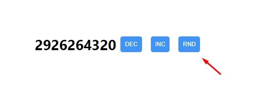

Ну и так выглядит функция с использованием классового компонента:

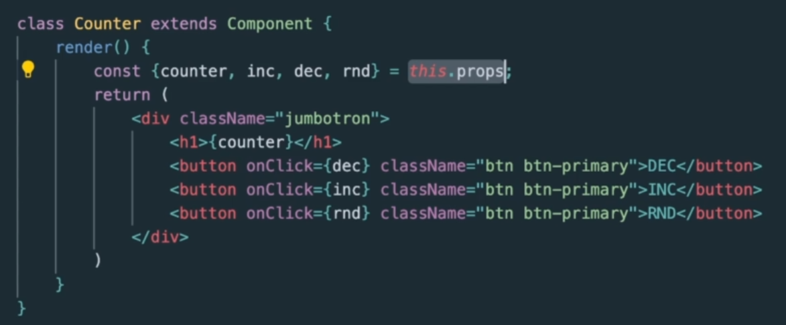


## 007 Соединяем React и Redux при помощи хуков


Так же куда более простым способом в реализации подключения редакса к реакту будет использование хуков:
- `useSelector` - позволяет получить из глобального хранилища (стора) нужное нам состояние 
- `useDispatch` - предоставляет доступ к функции `dispatch`

`Counter.js`
```JS
import { useDispatch, useSelector } from 'react-redux';
import { inc, dec, rnd } from '../actions';

const Counter = () => {
	// эта функция позволяет получить состояние из стора
	const { counter } = useSelector((state) => state);

	// эта функция отвечает за генерацию функций-диспэтчей
	const dispatch = useDispatch();

	return (
		<div className='wrapper'>
			<h1>{counter}</h1>
			<button className='btn' onClick={() => dispatch(dec())}>
				DEC
			</button>
			<button className='btn' onClick={() => dispatch(inc())}>
				INC
			</button>
			<button className='btn' onClick={() => dispatch(rnd())}>
				RND
			</button>
		</div>
	);
};

export default Counter;
```


Отличия `useSelector` от `mapStateToProps`:
- хук возвращает всё, что угодно, а не только то, что идёт на пропсы
- коллюэк функция позволяет сделать всё, что угодно с данными, но она должна оставаться чистой и синхронной
- в само значение, которое вызывает функцию, может помещаться что угодно (строка, массив, функция и так далее)
- в хуке отсутствует свойство `ownProp`, которое используется для передачи собственных пропсов для отслеживания
- при срабатывании диспэтч-функции, хук сам проверяет не изменились ли данные, которые он возвращает. Тут уже проверка проходит не по всему объекту, как в обычной функции, а по отдельным полям объекта (если мы сразу возвращаем объект, но если мы возвращаем через `return`, то тут уже будет проходить проверка по всему объекту)
- Так же хук при изменении стейта в сторе будет вызывать перерендер компонента

Так же, когда мы возвращаем из функции новый объект, то у нас каждый раз будет создаваться новый объект, что будет вызывать перерендеры компонента. Чтобы избавиться от данной ошибки, можно:
- просто дублировать использование хука `useSelector` при запросе отдельных свойств из стора
- использовать функцию [Reselect](https://react-redux.js.org/api/hooks) из сторонней библиотеки
```JS
import React from 'react'
import { useSelector } from 'react-redux'
import { createSelector } from 'reselect'

const selectNumCompletedTodos = createSelector(
  (state) => state.todos,
  (todos) => todos.filter((todo) => todo.completed).length
)

export const CompletedTodosCounter = () => {
  const numCompletedTodos = useSelector(selectNumCompletedTodos)
  return <div>{numCompletedTodos}</div>
}

export const App = () => {
  return (
    <>
      <span>Number of completed todos:</span>
      <CompletedTodosCounter />
    </>
  )
}
```
- либо можно использовать функцию `shallowEqual`:
```JS
import { shallowEqual, useSelector } from 'react-redux'

// later
const selectedData = useSelector(selectorReturningObject, shallowEqual)
```

Если мы говорим про хук `useDispatch`, то тут нужно упомянуть, что при передаче его дальше по иерархии в нижние компоненты, нужно обернуть его в `useCallback`, чтобы каждый раз не пересоздавался диспэтч. Дело в том, что пересоздание диспэтча будет вызывать пересоздание и самого компонента.

```JS
const incrementCounter = useCallback(
	() => dispatch({ type: 'increment-counter' }),
	[dispatch]
)
```

Так же существует хук `useStore`, который возвращает полностью весь объект стора, но им пользоваться не стоит

```JS
import React from 'react'
import { useStore } from 'react-redux'

export const CounterComponent = ({ value }) => {
  const store = useStore()

  // ТОЛЬКО ПРИМЕР! Такое делать в реальном примере нельзя
  // Компонент не будет автоматически обновлён, если стор будет изменён
  return <div>{store.getState()}</div>
}
```

>[!info] В конце стоит отметить, что показанный в начале пример использования компонента с хуками - стоит использовать как конечный вариант. Не стоит использовать оборачивать хуки редакса в дополнительные хуки.

## Zombie Childrens

-   **zombie children**: дочерние компоненты, о которых родитель ничего не знает
-   **stale props**: протухшие свойства - свойства, которые не являются актуальными в данный конкретный момент времени

Большинство разработчиков даже не представляют себе что это такое и когда это может возникнуть.

**zombie children** — давняя проблема попытки синхронизировать внешнее синхронное хранилище состояния (`react-redux`) с асинхронным циклом рендеринга **React**.

> Проблема кроется в порядке возникновения события `ComponentDidMount`/`useEffect` у компонентов **React** при их монтировании в дерево компонент в иерархиях родитель-дети, в ситуации, когда эта связка компонент отображает структуры данных типа “список” или “дерево” и эти компоненты подписаны на изменения в источнике данных, который находится вне контекста **React**.

Для начала давайте рассмотрим типичный PubSub объект

```JS
function createStore(reducer) {  
    var state;  
    var listeners = [];  
  
    function getState() {  
        return state;  
    }  
      
    function subscribe(listener) {  
        listeners.push(listener)  
        return function unsubscribe() {  
            var index = listeners.indexOf(listener);  
            listeners.splice(index, 1);  
        }  
    }  
      
    function dispatch(action) {  
        state = reducer(state, action);  
        listeners.forEach(listener => listener(state));  
    }  
  
    dispatch({});  
  
    return { dispatch, subscribe, getState };  
}
```

Глядя на listeners мы должны понимать одно: так как элементы массива хранятся в том порядке в котором они добавлялись — **коллбэки подписчиков вызываются ровно в том порядке, в котором происходили подписки.**

Теперь давайте посмотрим в каком порядке происходит монтирование компонент в иерархии компонент родитель-дети:

```JSX
<A>  
    <B />  
    <C />  
</A>
```

Если каждому компоненту в ComponentDidMount добавить запись в консоль имени монтируемого компонента, то мы увидим следующее:

mounting component B  
mounting component C  
mounting component A

**Обратите внимание**: родительский компонент А монтируется после своих детей (его метод ComponentDidMount вызывается последним)!

Рассмотрим использования redux контейнеров:

```JS
state = {  
  list: [  
    1: { id: 1, title: 'Component1', text: '...' },  
    2: { id: 2, title: 'Component2', text: '...' }  
  }  
};  
  
const List = ({ list }) => {  
  return list.map(item =>   
      <ListItemContainer id={item.id} title={item.title} />);  
}  
  
const ListContainer = connect()(List);
```

Если в каждом из компонентов, в методе ComponentDidMount происходит подписка subscribe на оповещение об изменении данных, то при возникновении изменений в источнике данных сначала будут вызваны коллбеки у дочерних компонент и лишь затем — у компонента-родителя.

Теперь представим, что в источнике данных мы удалили данные:

`1: { id: 1, title: 'Component1', text: '...' },`

Первым будет вызван коллбэк для компонента ListItemContainer с id=1 (так как он до изменения данных первым монтировался и первым подписался), компонент пойдет в источник данных за данными для отрисовки, а данных там для него уже нет!  
Попытка получения данных, путем обращения

`const { someProp } = store.list[1];`

приведет к краху приложения с ошибкой типа _“Uncaught TypeError: Cannot read property ‘1’ of undefined.”_ или подобной (ошибки может и не быть если сначала проверить на существование элемент в сторе, но компонент в дереве присутствует и он — зомби);

Оказывается, что компонент с `id=1` в данный момент не является дочерним для компонента-контейнера `ListContainer`, хотя на момент возникновения изменений в источнике данных он находится в дереве DOM— **зомби-ребенок**

В некоторых ситуация эти брошенные дочерние компоненты могут остаться в дереве даже после перерисовки родителя.

С **zombie children** разобрались. Теперь пора выяснить что такое stale props.

Рассматривая последний пример: давайте представим что для элемента с `id=1` мы в источнике данных поменяли `title`. Что произойдет?

Сработает коллбэк для компонента `ListContainer` с `id=1`, он начнет перерисовку и отобразит title, который был ему передан в свойствах компонентом ListContainer, до изменений в данных — `title` в данном случае является **stale props**!

Почему же многие разработчики этого не знают? Потому что эти проблемы от них тщательно скрывают!! 😊

К примеру, разработчики react-redux поступают следующим образом — оборачивают отрисовку дочерних компонент в `try…catch`, при возникновении ошибки — они устанавливают счетчик ошибок в 1 и вызывают перерисовку родителя. Если в результате перерисовки родителя и последующей перерисовке дочерних компонент снова возникает ошибка и счетчик `> 0` — значит это не **zombie children**, а что-то более серьезное, поэтому они прокидывают эту ошибку наружу. Если ошибка не повторилась — это был зомби-ребенок и после перерисовки родителя он пропадет.  
Есть и другой вариант — изменяют порядок подписки так, чтобы родитель всегда подписывался на изменения раньше чем дочерние компоненты.

Но, к сожалению, даже такие попытки не всегда спасают — в react-redux предупреждают, что при использовании их хуков все же могут возникать указанные проблемы с [zombie children & stale props](https://react-redux.js.org/7.1/api/hooks#stale-props-and-zombie-children), т.к. у них происходит подписка на события стора в хуке useEffect (что равнозначно componentDidMount), но в отличие от HOCа connect - не кому исправлять порядок подписки и обрабатывать ошибки.

> Пример с [zombie children](https://codesandbox.io/s/42164qln37?file=/src/index.js)

Во избежание этих проблем советуют:

-   Не полагаться на свойства компонента в селекторе при получении данных из источника
-   В случае если без использования свойств компонента не возможно выбрать данные из источника — пытайтесь выбирать данные безопасно: вместо `state.todos[props.id].name` используйте `todo = state.todos[props.id` для начала и затем после проверки на существование `todo` используйте `todo.name`
-   чтобы избежать появления `stale props `— передавайте в дочерние контейнеры только ключевые свойства, по которым осуществляется выборка всех остальных свойств компонента из источника — все свойства всегда будут свежими

При разработке своих библиотек и компонент **React**, разработчику всегда нужно помнить об обратном порядке генерации события жизненного цикла `ComponentDidMount` родителя и детей в случае использования подписок на события одного источника данных, когда данные хранятся вне контекста **React**, чтобы не возникали ошибки данного рода.

Но лучший совет — хранить данные внутри контекста исполнения **React** в хуке `useState` или в `Context /useContext`— вы никогда не столкнетесь с вышеописанными проблемами т.к. в функциональных компонентах вызов этих хуков происходит в естественном порядке — сначала у родителя, а затем — у детей.


## 008 Redux devtools


Когда мы работаем со старым АПИ редакса, нужно использовать вторым аргументом данную строку, чтобы подключить тулзы разработчика (если пишем на современном, то обойтись можно и без этого)

```js
// глобальное хранилище
const store = createStore(reducer, window.__REDUX_DEVTOOLS_EXTENSION__ && window.__REDUX_DEVTOOLS_EXTENSION__());
```

И примерно таким образом выглядит интерфейс тулза:

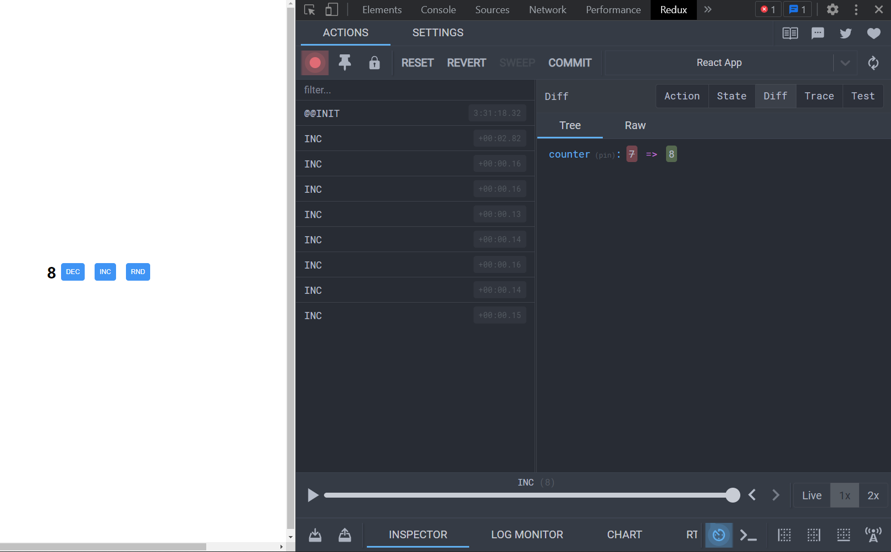

Так же мы можем просмотреть список переходов изменений разных стейтов в виде графа

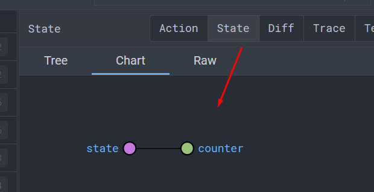

И самая частоиспользуемая вкладка просмотра разницы между состояниями


Ну и так же отображается список выполненных экшенов

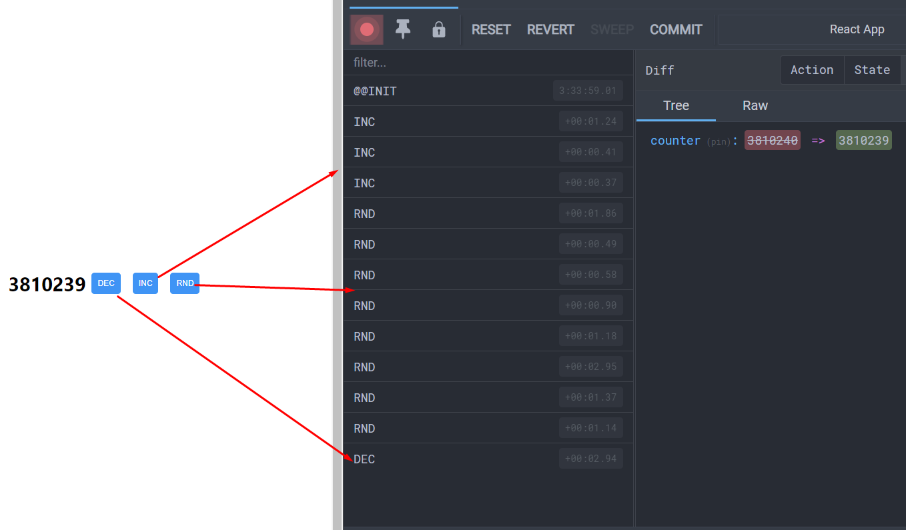

Так же присутствует таймлайн для отмотки состояний в приложении


## 009 Правило названия action и домашнее задание (мини-экзамен)

Структура проекта выглядит примерно следующим образом:


Это тот файл приложения, который будет шэриться через `json-server` и от которого будут выводиться новые посты

`heroses.json`
```JSON
{
    "heroes": [
        {
            "id": 1,
            "name": "Первый герой",
            "description": "Первый герой в рейтинге!",
            "element": "fire"
        },
        {
            "id": 2,
            "name": "Неизвестный герой",
            "description": "Скрывающийся в тени",
            "element": "wind"
        },
        {
            "id": 3,
            "name": "Морской герой",
            "description": "Как аквамен, но не из DC",
            "element": "water"
        }
    ],
    "filters": [
        "all",
        "fire",
        "water",
        "wind",
        "earth"
    ]
}
```

Стор редакса

`src > store > index.js`
```JS
import { createStore } from 'redux';
import reducer from '../reducers';

const store = createStore(reducer, window.__REDUX_DEVTOOLS_EXTENSION__ && window.__REDUX_DEVTOOLS_EXTENSION__());

export default store;
```

Редьюсер редакса. Пока он один, но в дальнейшем будет пополняться их количество.

Все типы экшенов должны быть написаны заглавными буквами. Если они относятся к запросам на сервер, то мы имеем состояние отправки запроса на сервер, полученного ответа от сервера или ошибки.

Второй кейс редьюсера так же в качестве `payload` принимает в себя список героев, который будет отображаться на странице

`src > reducer > index.js`
```JS
const initialState = {
    heroes: [], // герои
    heroesLoadingStatus: 'idle', // начальный статус загрузки
    filters: [] // фильтры просмотра
}

const reducer = (state = initialState, action) => {
    switch (action.type) {
        case 'HEROES_FETCHING':
            return {
                ...state,
                heroesLoadingStatus: 'loading'
            }
        case 'HEROES_FETCHED':
            return {
                ...state,
                heroes: action.payload,
                heroesLoadingStatus: 'idle'
            }
        case 'HEROES_FETCHING_ERROR':
            return {
                ...state,
                heroesLoadingStatus: 'error'
            }
        default: return state
    }
}

export default reducer;
```

А уже тут описаны экшены редакса.

Экшен `heroesFetched` принимает в себя так же список героев, который пришёл от сервера и сохраняет его в состояние.

`src > actions > index.js`
```JS
export const heroesFetching = () => {
    return {
        type: 'HEROES_FETCHING'
    }
}

export const heroesFetched = (heroes) => {
    return {
        type: 'HEROES_FETCHED',
        payload: heroes
    }
}

export const heroesFetchingError = () => {
    return {
        type: 'HEROES_FETCHING_ERROR'
    }
}
```

Хук отправки запроса на сервер будет возвращать один ответ от сервера

`src > hooks > http.hook.js`
```JS
import { useCallback } from "react";

export const useHttp = () => {
    // const [process, setProcess] = useState('waiting');

    const request = useCallback(async (url, method = 'GET', body = null, headers = {'Content-Type': 'application/json'}) => {

        // setProcess('loading');

        try {
            const response = await fetch(url, {method, body, headers});

            if (!response.ok) {
                throw new Error(`Could not fetch ${url}, status: ${response.status}`);
            }

            const data = await response.json();

            return data;
        } catch(e) {
            // setProcess('error');
            throw e;
        }
    }, []);

    // const clearError = useCallback(() => {
        // setProcess('loading');
    // }, []);

    return {
	    request, 
		// clearError, 
		// process, 
		// setProcess
    }
}
```

Тут уже располагается вся основная часть приложения

`src > index.js`
```JS
import React from 'react';
import ReactDOM from 'react-dom';
import { Provider } from 'react-redux';

import App from './components/app/App';
import store from './store';

import './styles/index.scss';

ReactDOM.render(
  <React.StrictMode>
    <Provider store={store}>
      <App />
    </Provider>
  </React.StrictMode>,
  document.getElementById('root')
);
```

Это основной компонент `App`

`src > components > app > App.js`
```JS
import HeroesList from '../heroesList/HeroesList';
import HeroesAddForm from '../heroesAddForm/HeroesAddForm';
import HeroesFilters from '../heroesFilters/HeroesFilters';

import './app.scss';

const App = () => {
    
    return (
        <main className="app">
            <div className="content">
                <HeroesList/>
                <div className="content__interactive">
                    <HeroesAddForm/>
                    <HeroesFilters/>
                </div>
            </div>
        </main>
    )
}

export default App;
```

Чтобы запустить два сервера вместе (react и json-server), нужно будет установить дополнительную библиотеку, которая позволяет запустить две команды одновременно: 

```bash
npm i concurrently
```

И так теперь выглядит сдвоенный запрос:

`package.json`
```JSON
"start": "concurrently \"react-scripts start\" \"npx json-server heroes.json --port 3001\"",
```

Это компонент, который выводит список элементов карточек героев

`components > heroesList > HeroesList.js`
```JS
import { useHttp } from '../../hooks/http.hook';
import { useEffect } from 'react';
import { useDispatch, useSelector } from 'react-redux';

import { heroesFetching, heroesFetched, heroesFetchingError } from '../../actions';
import HeroesListItem from '../heroesListItem/HeroesListItem';
import Spinner from '../spinner/Spinner';

// список персонажей
const HeroesList = () => {
	// из глобального хранилища получаем героев и статус их загрузки
	const { heroes, heroesLoadingStatus } = useSelector((state) => state);
	const dispatch = useDispatch(); // получаем диспетч
	const { request } = useHttp(); // получаем хук запроса на сервер

	// при загрузке страницы
	useEffect(() => {
		// устанавливаем состояние в загрузку
		dispatch(heroesFetching());

		// отправляем запрос на сервер на получение персонажей
		request('http://localhost:3001/heroes')
			.then((data) => dispatch(heroesFetched(data))) // герои получены
			.catch(() => dispatch(heroesFetchingError())); // получили ошибку с сервера
	}, []);

    // если герои загружаются
	if (heroesLoadingStatus === 'loading') {
		// то возвращаем загрузку
        return <Spinner />; 
        
        // если ошибка 
	} else if (heroesLoadingStatus === 'error') {
        // то возвращаем ошибку
		return <h5 className='text-center mt-5'>Ошибка загрузки</h5>;
	}

    // рендер списка героев
	const renderHeroesList = (arr) => {
		if (arr.length === 0) {
			return <h5 className='text-center mt-5'>Героев пока нет</h5>;
		}

		return arr.map(({ id, ...props }) => {
			return <HeroesListItem key={id} {...props} />;
		});
	};

    // элементы списка героев
	const elements = renderHeroesList(heroes);
	
    // возвращаем список героев
    return <ul>{elements}</ul>;
};

export default HeroesList;
```

А это компонент самой карточки

`components > heroesListItem > HeroesListItem.js`
```JS
const HeroesListItem = ({name, description, element}) => {
    // тут будет храниться класс, который попадёт в айтем
    let elementClassName;

    // тут мы присваиваем класс по выбранному элементу
    switch (element) {
        case 'fire':
            elementClassName = 'bg-danger bg-gradient';
            break;
        case 'water':
            elementClassName = 'bg-primary bg-gradient';
            break;
        case 'wind':
            elementClassName = 'bg-success bg-gradient';
            break;
        case 'earth':
            elementClassName = 'bg-secondary bg-gradient';
            break;
        default:
            elementClassName = 'bg-warning bg-gradient';
    }

    return (
        <li 
            className={`card flex-row mb-4 shadow-lg text-white ${elementClassName}``}>
            
            <div className="card-body">
                
                <h3 className="card-title">{name}</h3>
                <p className="card-text">{description}</p>
            </div>
            <span className="position-absolute top-0 start-100 translate-middle badge border rounded-pill bg-light">
                <button type="button" className="btn-close btn-close" aria-label="Close"></button>
            </span>
        </li>
    )
}

export default HeroesListItem;
```

Тут уже находится вёрстка компонента смена активностей классов: 

`components > heroesFilters > HeroesFilters.js`
```JS
const HeroesFilters = () => {
    return (
        <div className="card shadow-lg mt-4">
            <div className="card-body">
                <p className="card-text">Отфильтруйте героев по элементам</p>
                <div className="btn-group">
                    <button className="btn btn-outline-dark active">Все</button>
                    <button className="btn btn-danger">Огонь</button>
                    <button className="btn btn-primary">Вода</button>
                    <button className="btn btn-success">Ветер</button>
                    <button className="btn btn-secondary">Земля</button>
                </div>
            </div>
        </div>
    )
}

export default HeroesFilters;
```

Тут представлена вёрстка формы для добавления персонажей без логики

`components > heroesAddForm > HeroesAddForm.js`
```JS
const HeroesAddForm = () => {
    return (
        <form className="border p-4 shadow-lg rounded">
            <div className="mb-3">
                <label htmlFor="name" className="form-label fs-4">Имя нового героя</label>
                <input 
                    required
                    type="text" 
                    name="name" 
                    className="form-control" 
                    id="name" 
                    placeholder="Как меня зовут?"/>
            </div>

            <div className="mb-3">
                <label htmlFor="text" className="form-label fs-4">Описание</label>
                <textarea
                    required
                    name="text" 
                    className="form-control" 
                    id="text" 
                    placeholder="Что я умею?"
                    style={{"height": '130px'}}/>
            </div>

            <div className="mb-3">
                <label htmlFor="element" className="form-label">Выбрать элемент героя</label>
                <select 
                    required
                    className="form-select" 
                    id="element" 
                    name="element">
                    <option >Я владею элементом...</option>
                    <option value="fire">Огонь</option>
                    <option value="water">Вода</option>
                    <option value="wind">Ветер</option>
                    <option value="earth">Земля</option>
                </select>
            </div>

            <button type="submit" className="btn btn-primary">Создать</button>
        </form>
    )
}

export default HeroesAddForm;
```

И так выглядит итоговое приложение, которое нужно дорабатывать, чтобы оно отправляло запросы на `json-server`, создавало новых персонажей, меняло стейт и фильтровало персонажей по элементам:


## 010 Разбор самых сложных моментов


Фильтры были расширены и внутрь них были помещены дополнительные данные по лейблу и классам, которые нужно будет вставить в кнопки

`heroes.json`
```JSON
{
  "heroes": [
    {
      "id": 1,
      "name": "Первый герой",
      "description": "Первый герой в рейтинге!",
      "element": "fire"
    },
    {
      "id": 2,
      "name": "Неизвестный герой",
      "description": "Скрывающийся в тени",
      "element": "wind"
    },
    {
      "id": 3,
      "name": "Морской герой",
      "description": "Как аквамен, но не из DC",
      "element": "water"
    }
  ],
  "filters": [
    {
      "name": "all",
      "label": "Все",
      "className": "btn-outline-dark"
    },
    {
      "name": "fire",
      "label": "Огонь",
      "className": "btn-danger"
    },
    {
      "name": "water",
      "label": "Вода",
      "className": "btn-primary"
    },
    {
      "name": "wind",
      "label": "Ветер",
      "className": "btn-success"
    },
    {
      "name": "earth",
      "label": "Земля",
      "className": "btn-secondary"
    }
  ]
}
```

В экшены были добавлены креэйторы, которые отвечают за состояние фильтров и состояние добавления персонажей

`actions > index.js`
```JS
// отправка запроса на получение героев
export const heroesFetching = () => {
    return {
        type: 'HEROES_FETCHING'
    }
}

// герои получены
// так же сюда поступают и сами данные по героям, чтобы занести их в хранилище
export const heroesFetched = (heroes) => {
    return {
        type: 'HEROES_FETCHED',
        payload: heroes
    }
}

// ошибка отправки запроса
export const heroesFetchingError = () => {
    return {
        type: 'HEROES_FETCHING_ERROR'
    }
}

// получение фильтров с бэка
export const filtersFetching = () => {
    return {
        type: 'FILTERS_FETCHING'
    }
}

// фильтры получены
// так же сюда поступают и сами данные по фильтрам, чтобы занести их в хранилище
export const filtersFetched = (filters) => {
    return {
        type: 'FILTERS_FETCHED',
        payload: filters
    }
}

// ошибка фетча филтров
export const filtersFetchingError = () => {
    return {
        type: 'FILTERS_FETCHING_ERROR'
    }
}

// информация об изменении филтров
export const activeFilterChanged = (filter) => {
    return {
        type: 'ACTIVE_FILTER_CHANGED',
        payload: filter
    }
}

// герой создан 
// сюда передаются данные по герою с формы
export const heroCreated = (hero) => {
    return {
        type: 'HERO_CREATED',
        payload: hero
    }
}

// герой удалён
// сюда поступают данные id персонажа для удаления
export const heroDeleted = (id) => {
    return {
        type: 'HERO_DELETED',
        payload: id
    }
}
```

В редьюсер были добавлены кейсы для добавления персонажа, удаления и реагирование на изменение фильтра. Так же было добавлены дополнительные состояния в хранилище

`reducers > index.js`
```JS
const initialState = {
    heroes: [], // герои
    heroesLoadingStatus: 'idle', // статус загрузки героя
    filters: [], // фильтры
    filtersLoadingStatus: 'idle', // статус загрузки фильтров
    activeFilter: 'all', // активный фильтр // по умолчанию все активны
    filteredHeroes: [] // массив отфильтрованных героев
}

const reducer = (state = initialState, action) => {
    switch (action.type) {
        case 'HEROES_FETCHING':
            return {
                ...state,
                heroesLoadingStatus: 'loading'
            }
        case 'HEROES_FETCHED':
            return {
                ...state,
                heroes: action.payload,
                // ЭТО МОЖНО СДЕЛАТЬ И ПО ДРУГОМУ
                // Я специально показываю вариант с действиями тут, но более правильный вариант
                // будет показан в следующем уроке
                filteredHeroes: state.activeFilter === 'all' ? 
                                action.payload : 
                                action.payload.filter(item => item.element === state.activeFilter),
                heroesLoadingStatus: 'idle'
            }
        case 'HEROES_FETCHING_ERROR':
            return {
                ...state,
                heroesLoadingStatus: 'error'
            }
        case 'FILTERS_FETCHING':
            return {
                ...state,
                filtersLoadingStatus: 'loading'
            }
        case 'FILTERS_FETCHED':
            return {
                ...state,
                filters: action.payload,
                filtersLoadingStatus: 'idle'
            }
        case 'FILTERS_FETCHING_ERROR':
            return {
                ...state,
                filtersLoadingStatus: 'error'
            }
        case 'ACTIVE_FILTER_CHANGED':
            return {
                ...state,
                activeFilter: action.payload,
                filteredHeroes: action.payload === 'all' ? 
                                state.heroes :
                                state.heroes.filter(item => item.element === action.payload)
            }
        // Самая сложная часть - это показывать новые элементы по фильтрам
        // при создании или удалении
        case 'HERO_CREATED':
            // Формируем новый массив    
            let newCreatedHeroList = [...state.heroes, action.payload];
            return {
                ...state,
                heroes: newCreatedHeroList,
                // Фильтруем новые данные по фильтру, который сейчас применяется
                filteredHeroes: state.activeFilter === 'all' ? 
                                newCreatedHeroList : 
                                newCreatedHeroList.filter(item => item.element === state.activeFilter)
            }
        case 'HERO_DELETED': 
            // Формируем новый массив, в котором не будет удалённого персонажа
            const newHeroList = state.heroes.filter(item => item.id !== action.payload);
            return {
                ...state,
                heroes: newHeroList,
                // Фильтруем новые данные по фильтру, который сейчас применяется
                filteredHeroes: state.activeFilter === 'all' ? 
                                newHeroList : 
                                newHeroList.filter(item => item.element === state.activeFilter)
            }
        default: return state
    }
}

export default reducer;
```

В компонент списка героев добавилась функция, которая позволяет удалить персонажа и она передаётся в компонент с одним персонажем. Так же была добавлена анимация для удаления и появления элементов в списке

`components > heroesList > HeroesList.js`
```JS
import {useHttp} from '../../hooks/http.hook';
import { useEffect, useCallback } from 'react';
import { useDispatch, useSelector } from 'react-redux';
import { CSSTransition, TransitionGroup} from 'react-transition-group';

import { heroesFetching, heroesFetched, heroesFetchingError, heroDeleted } from '../../actions';
import HeroesListItem from "../heroesListItem/HeroesListItem";
import Spinner from '../spinner/Spinner';

import './heroesList.scss';

const HeroesList = () => {
    const {filteredHeroes, heroesLoadingStatus} = useSelector(state => state);
    const dispatch = useDispatch();
    const {request} = useHttp();

    useEffect(() => {
        dispatch(heroesFetching());
        request("http://localhost:3001/heroes")
            .then(data => dispatch(heroesFetched(data)))
            .catch(() => dispatch(heroesFetchingError()))

        // eslint-disable-next-line
    }, []);

    // Функция берет id и по нему удаляет ненужного персонажа из store
    // ТОЛЬКО если запрос на удаление прошел успешно
    // Отслеживайте цепочку действий actions => reducers
    // так как функция передаётся ниже по иерархии, то её стоит обернуть в useCallback, чтобы она не вызывала перерендер компонента
    const onDelete = useCallback((id) => {
        // Удаление персонажа по его id
        request(`http://localhost:3001/heroes/${id}`, "DELETE")
            .then(data => console.log(data, 'Deleted'))
            .then(dispatch(heroDeleted(id)))
            .catch(err => console.log(err));
    }, [request]);

    if (heroesLoadingStatus === "loading") {
        return <Spinner/>;
    } else if (heroesLoadingStatus === "error") {
        return <h5 className="text-center mt-5">Ошибка загрузки</h5>
    }

    const renderHeroesList = (arr) => {
        if (arr.length === 0) {
            return (
                <CSSTransition
                    timeout={0}
                    classNames="hero">
                    <h5 className="text-center mt-5">Героев пока нет</h5>
                </CSSTransition>
            )
        }

        return arr.map(({id, ...props}) => {
            return (
                <CSSTransition 
                    key={id}
                    timeout={500}
                    classNames="hero">
                    <HeroesListItem  {...props} onDelete={() => onDelete(id)}/>
                </CSSTransition>
            )
        })
    }

    const elements = renderHeroesList(filteredHeroes);
    return (
        <TransitionGroup component="ul">
            {elements}
        </TransitionGroup>
    )
}

export default HeroesList;
```

В компонент одного героя была добавлена только функция для удаления персонажа, которая приходит из списка 

`components > heroesListItem > HeroesListItem.js`
```JS
const HeroesListItem = ({name, description, element, onDelete}) => {

    let elementClassName;

    switch (element) {
        case 'fire':
            elementClassName = 'bg-danger bg-gradient';
            break;
        case 'water':
            elementClassName = 'bg-primary bg-gradient';
            break;
        case 'wind':
            elementClassName = 'bg-success bg-gradient';
            break;
        case 'earth':
            elementClassName = 'bg-secondary bg-gradient';
            break;
        default:
            elementClassName = 'bg-warning bg-gradient';
    }

    return (
        <li 
            className={`card flex-row mb-4 shadow-lg text-white ${elementClassName}``}>
            
            <div className="card-body">
                
                <h3 className="card-title">{name}</h3>
                <p className="card-text">{description}</p>
            </div>
            <span onClick={onDelete} 
                className="position-absolute top-0 start-100 translate-middle badge border rounded-pill bg-light">
                <button type="button" className="btn-close btn-close" aria-label="Close"></button>
            </span>
        </li>
    )
}

export default HeroesListItem;
```

В форму добавления нового персонажа были добавлены состояния для контроля инпутов.

Была добавлена функция `onSubmitHandler`, которая контролирует действие при отправке формы

`components > heroesAddForm > HeroesAddForm.js`
```JS
// Задача для этого компонента:
// Реализовать создание нового героя с введенными данными. Он должен попадать
// в общее состояние и отображаться в списке + фильтроваться
// Уникальный идентификатор персонажа можно сгенерировать через uiid
// Усложненная задача:
// Персонаж создается и в файле json при помощи метода POST
// Дополнительно:
// Элементы <option></option> желательно сформировать на базе
// данных из фильтров

import {useHttp} from '../../hooks/http.hook';
import { useState } from 'react';
import { useDispatch, useSelector } from 'react-redux';
import { v4 as uuidv4 } from 'uuid';

import { heroCreated } from '../../actions';

const HeroesAddForm = () => {
    // Состояния для контроля формы
    const [heroName, setHeroName] = useState('');
    const [heroDescr, setHeroDescr] = useState('');
    const [heroElement, setHeroElement] = useState('');

    const {filters, filtersLoadingStatus} = useSelector(state => state);
    const dispatch = useDispatch();
    const {request} = useHttp();

    const onSubmitHandler = (e) => {
        e.preventDefault();
        // Можно сделать и одинаковые названия состояний,
        // хотел показать вам чуть нагляднее
        // Генерация id через библиотеку
        const newHero = {
            id: uuidv4(),
            name: heroName,
            description: heroDescr,
            element: heroElement
        }

        // Отправляем данные на сервер в формате JSON
        // ТОЛЬКО если запрос успешен - отправляем персонажа в store
        request("http://localhost:3001/heroes", "POST", JSON.stringify(newHero))
            .then(res => console.log(res, 'Отправка успешна'))
            .then(dispatch(heroCreated(newHero)))
            .catch(err => console.log(err));

        // Очищаем форму после отправки
        setHeroName('');
        setHeroDescr('');
        setHeroElement('');
    }

    const renderFilters = (filters, status) => {
        if (status === "loading") {
            return <option>Загрузка элементов</option>
        } else if (status === "error") {
            return <option>Ошибка загрузки</option>
        }
        
        // Если фильтры есть, то рендерим их
        if (filters && filters.length > 0 ) {
            return filters.map(({name, label}) => {
                // Один из фильтров нам тут не нужен
                if (name === 'all')  return;

                return <option key={name} value={name}>{label}</option>
            })
        }
    }

    return (
        <form className="border p-4 shadow-lg rounded" onSubmit={onSubmitHandler}>
            <div className="mb-3">
                <label htmlFor="name" className="form-label fs-4">Имя нового героя</label>
                <input 
                    required
                    type="text" 
                    name="name" 
                    className="form-control" 
                    id="name" 
                    placeholder="Как меня зовут?"
                    value={heroName}
                    onChange={(e) => setHeroName(e.target.value)}/>
            </div>

            <div className="mb-3">
                <label htmlFor="text" className="form-label fs-4">Описание</label>
                <textarea
                    required
                    name="text" 
                    className="form-control" 
                    id="text" 
                    placeholder="Что я умею?"
                    style={{"height": '130px'}}
                    value={heroDescr}
                    onChange={(e) => setHeroDescr(e.target.value)}/>
            </div>

            <div className="mb-3">
                <label htmlFor="element" className="form-label">Выбрать элемент героя</label>
                <select 
                    required
                    className="form-select" 
                    id="element" 
                    name="element"
                    value={heroElement}
                    onChange={(e) => setHeroElement(e.target.value)}>
                    <option value="">Я владею элементом...</option>
                    {renderFilters(filters, filtersLoadingStatus)}
                </select>
            </div>

            <button type="submit" className="btn btn-primary">Создать</button>
        </form>
    )
}

export default HeroesAddForm;
```

Тут были добавлены фильтры, которые мы получаем с сервера

`components > heroesFilters > HeroesFilters.js`
```JS
import {useHttp} from '../../hooks/http.hook';
import {useEffect} from 'react';
import {useDispatch, useSelector} from 'react-redux';
import classNames from 'classnames';

import {filtersFetching, filtersFetched, filtersFetchingError, activeFilterChanged} from '../../actions';
import Spinner from '../spinner/Spinner';

// Задача для этого компонента:
// Фильтры должны формироваться на основании загруженных данных
// Фильтры должны отображать только нужных героев при выборе
// Активный фильтр имеет класс active

const HeroesFilters = () => {

    const {filters, filtersLoadingStatus, activeFilter} = useSelector(state => state);
    const dispatch = useDispatch();
    const {request} = useHttp();

    // Запрос на сервер для получения фильтров и последовательной смены состояния
    useEffect(() => {
        dispatch(filtersFetching());
        request("http://localhost:3001/filters")
            .then(data => dispatch(filtersFetched(data)))
            .catch(() => dispatch(filtersFetchingError()))

        // eslint-disable-next-line
    }, []);

    if (filtersLoadingStatus === "loading") {
        return <Spinner/>;
    } else if (filtersLoadingStatus === "error") {
        return <h5 className="text-center mt-5">Ошибка загрузки</h5>
    }

    const renderFilters = (arr) => {
        if (arr.length === 0) {
            return <h5 className="text-center mt-5">Фильтры не найдены</h5>
        }

        // Данные в json-файле я расширил классами и текстом
        return arr.map(({name, className, label}) => {

            // Используем библиотеку classnames и формируем классы динамически
            const btnClass = classNames('btn', className, {
                'active': name === activeFilter
            });

            return <button
                key={name}
                id={name}
                className={btnClass}
                onClick={() => dispatch(activeFilterChanged(name))}
            >{label}</button>
        })
    }

    const elements = renderFilters(filters);

    return (
        <div className="card shadow-lg mt-4">
            <div className="card-body">
                <p className="card-text">Отфильтруйте героев по элементам</p>
                <div className="btn-group">
                    {elements}
                </div>
            </div>
        </div>
    )
}

export default HeroesFilters;
```

Теперь работает фильтрация и добавление персонажей


## 011 Комбинирование reducers и красивые селекторы. CreateSelector()


При разрастании приложения увеличивается и количество действий, которые должен контролировать реакт. Если экшены можно спокойно разделить по папкам и обращаться конкретно к нужным, то данное разрастание не позволит спокойно поделить функцию-редьюсер

В нашем приложении достаточно логичным будет отделить логику работы с персонажами и фильтрами. Однако мы сталкиваемся с тем, что фильтры так же используют состояние персонажей, чтобы контролировать их список.


Чтобы сократить код и разбить логику, можно:
- разделить логику редьюсера через функцию `combineReducers`
- вынести фильтрацию внутрь компонента, чтобы разбить логику стейтов

Тут мы выносим фильтрацию полученных данных из стейта и теперь её не нужно проводить внутри редьюсера

`components > heroesList > HeroesList.js`
```JS
const HeroesList = () => {
	const filteredHeroes = useSelector((state) => {
		if (state.activeFilter === 'all') {
			return state.heroes;
		} else {
			return state.heroes.filter((item) => state.heroes === state.activeFilter);
		}
	});

	// сейчас отсюда достаём просто статус загрузки
	const heroesLoadingStatus = useSelector((state) => state.heroesLoadingStatus);

	/// CODE ...
```

Теперь нам не нужно данное состояние


И данная фильтрация в редьюсере

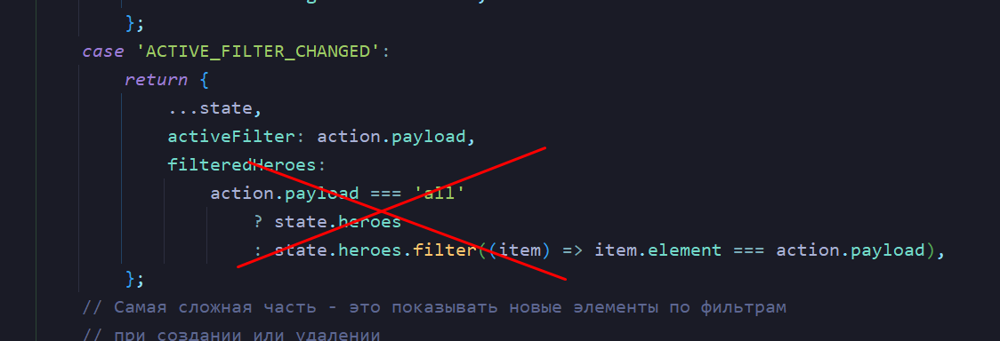

Вынесем из главного `reducer` логику по работе с персонажами и его стейты в отдельный файл

`reducers > heroes.js`
```JS
const initialState = {
	heroes: [],
	heroesLoadingStatus: 'idle',
};

export const heroes = (state = initialState, action) => {
	switch (action.type) {
		case 'HEROES_FETCHING':
			return {
				...state,
				heroesLoadingStatus: 'loading',
			};
		case 'HEROES_FETCHED':
			return {
				...state,
				heroes: action.payload,
				heroesLoadingStatus: 'idle',
			};
		case 'HEROES_FETCHING_ERROR':
			return {
				...state,
				heroesLoadingStatus: 'error',
			};
		// Самая сложная часть - это показывать новые элементы по фильтрам
		// при создании или удалении
		case 'HERO_CREATED':
			return {
				...state,
				heroes: [...state.heroes, action.payload],
			};
		case 'HERO_DELETED':
			return {
				...state,
				heroes: state.heroes.filter((item) => item.id !== action.payload),
			};
		default:
			return state;
	}
};
```

Тут уже будем хранить логику фильтрации

`reducers > filters.js`
```JS
const initialState = {
	filters: [],
	filtersLoadingStatus: 'idle',
	activeFilter: 'all',
};

export const filters = (state = initialState, action) => {
	switch (action.type) {
		case 'FILTERS_FETCHING':
			return {
				...state,
				filtersLoadingStatus: 'loading',
			};
		case 'FILTERS_FETCHED':
			return {
				...state,
				filters: action.payload,
				filtersLoadingStatus: 'idle',
			};
		case 'FILTERS_FETCHING_ERROR':
			return {
				...state,
				filtersLoadingStatus: 'error',
			};
		case 'ACTIVE_FILTER_CHANGED':
			return {
				...state,
				activeFilter: action.payload,
			};
		default:
			return state;
	}
};
```

И тут через функцию `combineReducers` объединяем две функции редьюсера в один внутри объекта. Теперь обычный `reducer` не нужен и его можно будет удалить

`store > index.js`
```JS
import { createStore, combineReducers } from 'redux';
import { heroes } from '../reducers/heroes';
import { filters } from '../reducers/filters';

const store = createStore(
	combineReducers({ heroes, filters }),
	window.__REDUX_DEVTOOLS_EXTENSION__ && window.__REDUX_DEVTOOLS_EXTENSION__(),
);

export default store;
```

И теперь, после манипуляций с объединением редьюсеров, нужно будет вытаскивать нужные объекты из объектов, которые были названы и переданы в `combineReducers`


И вот уже с таким синтаксисом мы можем импортировать поля из нескольких объектов
Однако такой подход приводит к тому, что компонент будет перерисовываться при каждом изменении стейта
*Такой вариант не стоит использовать в проекте, так как он не оптимизирован*

```JS
const someState = useSelector((state) => ({  
   activeFilter: state.filters.activeFilter,  
   heroes: state.heroes.heroes,  
}));
```

Откорректируем логику филтрации героев.
Но тут мы встретимся с такой проблемой, что каждый раз при нажатии кнопки фильтрации, у нас будет воспроизводиться перерендер компонента. Это происходит из-за того, что каждый раз у нас вызывается `useSelector()` при изменении глобального стейта.

`components > heroesList > HeroesList.js`
```JS
const HeroesList = () => {  
   const filteredHeroes = useSelector((state) => {  
      if (state.filters.activeFilter === 'all') {  
	      console.log('render');
         return state.heroes.heroes;  
      } else {  
         return state.heroes.heroes.filter(  
            (item) => item.element === state.filters.activeFilter,  
         );  
      }  
   });

	/// CODE ...
```

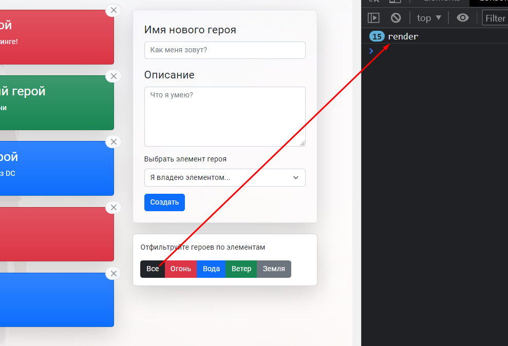

Чтобы решить данную проблему, нужно мемоизировать функцию вызова `useSelector()`

```bash
npm i reselect
```

Данный модуль позволяет нам вызвать по определённым правилам функцию `useSelector`. То есть мы создаём массив запросов в селектор первым аргументом, а вторым аргументом берём полученные значения и используем их в функции, которую хотели использовать в селекторе. 
После вышеописанных манипуляций просто помещаем функцию реселекта внутрь `useSelector` 

`components > heroesList > HeroesList.js`
```JS
import { createSelector } from 'reselect';

/// CODE ...

// эта функция будет вызвать useSelector по заданным правилам и будет мемоизировать значение  
const filteredHeroesSelector = createSelector(  
   // вызываем срабатывание двух селекторов  
   // получаем сам активный фильтр и массив героев   [(state) => state.filters.activeFilter, (state) => state.heroes.heroes],  
   // производим операции над результатами двух вызванных селекторов  
   (filter, heroes) => {  
      if (filter === 'all') {  
         console.log('render');  
         return heroes;  
      } else {  
         return heroes.filter((item) => item.element === filter);  
      }  
   },  
);  
  
const filteredHeroes = useSelector(filteredHeroesSelector);

/// CODE ...
```

Теперь рендер вызвается только тогда, когда данные в стейте изменяются


## 012 Про сложность реальной разработки

Реальные приложения требуют от разработчика большое количество знаний - это сложно, но нужна практика

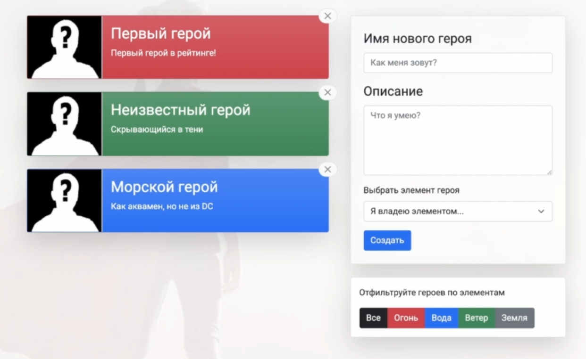

> **Спасибо за внимание**


## 013 Store enhancers


==Store enhancers== - это дополнительный функционал, который упрощает взаимодействие с хранилищем. Зачастую просто используют сторонние *npm-пакеты*, но так же можно написать и свой функционал улучшителя.

Так же частным случаем энхэнсеров является `middleware` функции, которые так же передаются в стор.

Конкретно для нашего проекта можно сделать простой энхэнсер, который модифицирует работу диспэтча. Он будет в себя принимать не только объект с определённым действием, но и принимать строку с экшен тайптом.

Тут уже нужно сказать, что самих улучшителей стора может быть большое количество и поэтому их часто передают внутри функции `compose`, которая объединяет их в один. Однако так же нужно будет соблюдать последовательно передачи функций, так как они будут модифицировать логику последовательно. Конкретно в данном случае, строку с подключением к редакс-девтулзу стоит поместить в конец списка.

```JS
import { createStore, combineReducers, compose } from 'redux';
import { heroes } from '../reducers/heroes';
import { filters } from '../reducers/filters';

const enhancer =
	(createStore) =>
	// сюда попадают аргументы для функции
	(...args) => {
		// тут мы передаём в функцию стора аргументы и вызваем её
		const store = createStore(...args);

		// это старый диспетч, который будет срабатывать, когда мы передаём объект
		const oldDispatch = store.dispatch;

		// переопределяем стандартный диспетч, который будет работать с текстом
		store.dispatch = (action) => {
			if (typeof action === 'string') {
				return oldDispatch({ type: action });
			}

			// если была передана не строка, то имитируем стандартную работу
			return oldDispatch(action);
		};

		return store;
	};

const store = createStore(
	combineReducers({ heroes, filters }),
	compose(
		enhancer, 
		window.__REDUX_DEVTOOLS_EXTENSION__ && window.__REDUX_DEVTOOLS_EXTENSION__()
	),
);

export default store;
```

Приложение так же работает, но теперь у нас есть возможность передавать в диспетч и просто строку с действием


## 014 Middleware


==Middleware== - это `enhancer`, который занимается улучшением только `dispatch`. Так же зачастую пользуются уже готовыми middleware, которые предоставляет коммьюнити npm

Конкретно тут сделаем посредника, который позволить `dispatch` принимать не только объекты, но и строки 

`store > index.js`
```JS
// функция-посредник, которая работает только на dispatch
// сюда автоматически будет попадать две сущности из store - dispatch, getState
const stringMiddleware =
	({ dispatch, getState }) =>
	// потом здесь мы буем принимать dispatch
	(dispatch) =>
	// а это уже по-факту и есть новая функция dispatch с изменением функционала
	(action) => {
		if (typeof action === 'string') {
			return dispatch({ type: action });
		}

		return dispatch(action);
	};
```

- первым аргументом можно так же ничего не передавать, потому что нам не всегда нужен `store`
- обычно, функцию `dispatch` называют `next`, так как будет вызываться следующая функция из `middleware`

`store > index.js`
```JS
const stringMiddleware =
	() =>
	(next) =>
	(action) => {
		if (typeof action === 'string') {
			return next({ type: action });
		}

		return next(action);
	};
```

Чтобы применять `middleware` в `createStore`, нужно будет воспользоваться функцией `applyMiddleware`, которая будет применять посредника. 

Чтобы вернуть подключение к редакс-девтулзу, можно опять же обернуть весь второй аргумент `createStore` в функцию `compose()`

`store > index.js`
```JS
const store = createStore(
	combineReducers({ heroes, filters }),
	compose(
		applyMiddleware(stringMiddleware),
		window.__REDUX_DEVTOOLS_EXTENSION__ && window.__REDUX_DEVTOOLS_EXTENSION__(),
	),
);
```


## 015 Redux-thunk


Основная задача модуля `redux-thunk` передавать функцию, которая потом будет производить асинхронную операцию

Устанавливаем пакет в проект. 

```bash
npm i redux-thunk
```

И далее, чтобы убедиться, что он работает, можно просто попробовать передать `actionCreater` функцию в `dispatch` без вызова:

`components > heroesList > HeroesList.js`
```JS
// функция получения персонажей с сервера
useEffect(() => {  
   dispatch(heroesFetching); // передаём функцию экшена без вызова
   request('http://localhost:3001/heroes')  
      .then((data) => dispatch(heroesFetched(data)))  
      .catch(() => dispatch(heroesFetchingError()));  
}, []);
```

Так же мы можем расширять наши экшены, так как в их вложенную функцию может автоматически поступать dispatch, над которым мы можем проводить различные манипуляции. 
Конкретно тут будет срабатывать передача данных в стейт через определённый промежуток времени.

`actions > index.js`
```JS
// когда мы вызываем функцию, она возвращает функцию, принимающую в себя dispatch  
// dispatch приходит в функцию автоматически, так как мы используем thunk middleware  
export const activeFilterChanged = (filter) => (dispatch) => {  
   setTimeout(() => {  
      dispatch({  
         type: 'ACTIVE_FILTER_CHANGED',  
         payload: filter,  
      });  
   }, 1000);  
};
```

Но так же мы можем и упростить себе жизнь тем, что мы можем вызвать логику диспетча прямо внутри самой папки экшенов. 
Конкретно, мы можем вынести запрос на получение персонажей и занесение их в стейт прямо из экшенов. Там нам не нужно будет импортировать и экспортировать отдельные экшены - можно будет ими просто воспользоваться.

`actions > index.js`
```JS
export const fetchHeroes = (request) => (dispatch) => {
	dispatch(heroesFetching());
	request('http://localhost:3001/heroes')
		.then((data) => dispatch(heroesFetched(data)))
		.catch(() => dispatch(heroesFetchingError()));
};
```


И тут далее в самом компоненте уже можем воспользоваться одним экшеном, который сам занесёт данные по персонажам в стейт, передав в него функцию совершения реквеста

`components > heroesList > HeroesList.js`
```JS
import { fetchHeroes, heroDeleted } from '../../actions';

const HeroesList = () => {
	/// CODE ...
	
	const { request } = useHttp();

	useEffect(() => {
		dispatch(fetchHeroes(request));
	}, []);
```


## Redux Toolkit

#RTK #Redux #ReduxToolkit


Проблемы больших проектов на обычном редакса:
- очень много *boilerplates* при создании `actionCreators` и `reducers`
- при большом количестве `enhancers` и `middlewares` функция по созданию `store` сильно разрастается 

**Redux Toolkit** включает в себя набор инструментов для более простой и быстрой работы с `states` и `store`. 

Та же функция `createSelector` была переэкспортирована из модуля **Reselect** в **RTK** 

### Redux Toolkit `configureStore()`

Функция `configureStore` предназначена для того, чтобы удобно автоматически регулировать `reducers`, подключать `middlewares` или `enhancers` и автоматически подключать **redux devtools** без дополнительных строк кода  

В тулкит так же включены изначально самые популярные `middlewares`:
- *Serializability Middlweware* - проверяет, чтобы в стейте были только те значения, которые должны быть в сторе
- *Immutability Middlweware* - предназначен для обнаружения мутаций, которые могут быть в сторе
- *Thunk Middlweware* - позволяет в экшены автоматически получать `dispatch`

И уже так будет выглядеть создание нового `store` с использованием **RTK** 

`store > index.js`
```JS
import { heroes } from '../reducers/heroes';
import { filters } from '../reducers/filters';
import { configureStore } from '@reduxjs/toolkit';

const stringMiddleware = () => (next) => (action) => {
	if (typeof action === 'string') {
		return next({ type: action });
	}

	return next(action);
};

const store = configureStore({
	// подключаем редьюсеры
	reducer: { heroes, filters },
	// подключаем девтулз
	devTools: process.env.NODE_ENV === 'development',
	// подключаем все стандартные middleware (включая thunk) и наши собственные
	middleware: (getDefaultMiddleware) => getDefaultMiddleware().concat(stringMiddleware),
});

export default store;
```

### Redux Toolkit `createAction()`

Функция `createAction()` позволяет автоматически выполнять операцию по созданию экшена

Функция принимает в себя:
- тип действия 
- вспомогательную функцию

И далее тут нужно сказать, что данная функция автоматически обрабатывает поступающие в неё данные. Т.е. если вызвать `heroesFetched` и передать в него аргумент, то он автоматически отправится в поле `payload`

Ниже представлены две реализации экшенов - классическая и через `createAction` и обе из них работают полностью взаимозаменяемо

```JS
export const heroesFetching = () => {
	return {
		type: 'HEROES_FETCHING',
	};
};

export const heroesFetched = (heroes) => {
	return {
		type: 'HEROES_FETCHED',
		payload: heroes,
	};
};

// ИЛИ ...

export const heroesFetching = createAction('HEROES_FETCHING');
export const heroesFetched = createAction('HEROES_FETCHED');
```

> Тут уже стоит отметить, что в `reducer` стоит передавать только одно поле payload. Таким образом будет проще читать код и воспринимать его. Остальные побочные действия лучше делать вне `reducer`.

И вот пример, когда мы вторым аргументом передаём дополнительную функцию, которая осуществляет возврат обогащённого `payload`, который уже будет содержать не просто переданные данные, а ещё и сгенерированные нами

```JS
import { createAction, nanoid } from '@reduxjs/toolkit'

const addTodo = createAction('todos/add', function prepare(text) {
  return {
    payload: {
      text,
      id: nanoid(),
      createdAt: new Date().toISOString(),
    },
  }
})
```

> Тут так же стоит отметить, что в **RTK** была добавлена функция `nanoid`, которая генерирует уникальный идентификатор для объекта

### Redux Toolkit `createReducer()`

Функция `reducer` зачастую представляет из себя очень много блоков `switch-case` и много вложенных конструкций, которые нужно редактировать в глубине, что усложняет разработку

Для упрощения создания `reducer` была добавлена функция `createReducer`, которая принимает в себя:
- начальное состояние
- `builder`, который позволяет строить `reducer` за счёт встроенных в него трёх функций

`builder` использует три функции:
- `addCase` - добавляет кейс в свитчер редьюсера
- `addDefaultCase` - устанавливает дефолтный кейс выполнения
- `addMatcher` - позволяет фильтровать входящие экшены

И так выглядит реализация нашего редьюсера героев через `createReducer`:

`reducers > heroes.js`
```JS
import { createReducer } from '@reduxjs/toolkit';

import {
	heroesFetching,
	heroesFetched,
	heroesFetchingError,
	heroCreated,
	heroDeleted,
} from '../actions';

const initialState = {
	heroes: [],
	heroesLoadingStatus: 'idle',
};

export const heroes = createReducer(initialState, (builder) => {
	// вызываем объект билдера
	builder
		// создаём отдельный кейс как в switch-case
		.addCase(
			// action кейса
			heroesFetching,
			// reducer
			(state, action) => {
				// меняем состояние напрямую
				state.heroesLoadingStatus = 'loading';
			},
		)
		.addCase(heroesFetched, (state, action) => {
			state.heroes = action.payload;
			state.heroesLoadingStatus = 'idle';
		})
		.addCase(heroesFetchingError, (state, action) => {
			state.heroesLoadingStatus = 'error';
		})
		.addCase(heroCreated, (state, action) => {
			state.heroes.push(action.payload);
		})
		.addCase(heroDeleted, (state, action) => {
			state.heroes = state.heroes.filter((item) => item.id !== action.payload);
		})
		.addDefaultCase(() => {});
});
```

> Так же нужно отметить, что внутри функций `builder` используется библиотека `ImmerJS`, которая сама отвечает за сохранение логики иммутабельности в проекте. То есть мы можем писать визуально проект с мутациями, а библиотека сама переведёт код в иммутабельные сущности.
> Такой подход будет работать ровно до тех пор, пока мы ничего не возвращаем из этих функций через `return`

Однако функция `createReducer` требует для работы, чтобы все экшены были написаны с помощью `createAction`

`actions > index.js`
```JS
import { createAction } from '@reduxjs/toolkit';

export const fetchHeroes = (request) => (dispatch) => {
	dispatch(heroesFetching());
	request('http://localhost:3001/heroes')
		.then((data) => dispatch(heroesFetched(data)))
		.catch(() => dispatch(heroesFetchingError()));
};

export const heroesFetching = createAction('HEROES_FETCHING');
export const heroesFetched = createAction('HEROES_FETCHED');
export const heroesFetchingError = createAction('HEROES_FETCHING_ERROR');
export const heroCreated = createAction('HERO_CREATED');
export const heroDeleted = createAction('HERO_DELETED');
```

Так же у нас есть вариант использовать более короткий способ создания редьюсеров через объект. Такой способ уже не работает с TS.

`reducers > heroes.js`
```JS
export const heroes = createReducer(
	// начальное состояние
	initialState,
	// карта действий (кейсы)
	{
		[heroesFetching]: (state) => {
			state.heroesLoadingStatus = 'loading';
		},
		[heroesFetched]: (state, action) => {
			state.heroes = action.payload;
			state.heroesLoadingStatus = 'idle';
		},
		[heroesFetchingError]: (state, action) => {
			state.heroesLoadingStatus = 'error';
		},
		[heroCreated]: (state, action) => {
			state.heroes.push(action.payload);
		},
		[heroDeleted]: (state, action) => {
			state.heroes = state.heroes.filter((item) => item.id !== action.payload);
		},
	},
	// массив функций сравнения
	[],
	// действие по умолчанию
	() => {},
);
```

### Redux Toolkit `createSlice()`

- Данная функция объединяет функции `createAction` и `createReducer` в одно
- Обычно она располагается рядом с файлом, к которому она и относится
- В конец названия файла обычно добавляется суффикс `Slice` 

Функция `createSlice` принимает в себя 4 аргумента:
- `name` - пространство имён создаваемых действий (имя среза). Это имя *будет являться префиксом для всех имён экшенов*, которые мы будем передавать в качестве ключа внутри объекта `reducers`
- `initialState` - начальное состояние
- `reducers` - объект с обработчиками
- `extraReducers` - объект с редьюсерами другого среза (обычно используется для обновления объекта, относящегося к другому слайсу)

Конкретно тут был создан срез `actionCreators` и `reducer` для героев в одном файле рядом с самим компонентом 

`components > heroesList > HeroesList.js`
```JS
import { createSlice } from '@reduxjs/toolkit';

const initialState = {
	heroes: [],
	heroesLoadingStatus: 'idle',
};

const heroesSlice = createSlice({
	// пространство имён, в котором будут происходить все экшены
	name: 'heroes',
	// начальное состояние
	initialState,
	reducers: {
		// свойство генерирует экшен
		// а значение генерирует действие редьюсера
		heroesFetching: (state) => {
			state.heroesLoadingStatus = 'loading';
		},
		heroesFetched: (state, action) => {
			state.heroes = action.payload;
			state.heroesLoadingStatus = 'idle';
		},
		heroesFetchingError: (state, action) => {
			state.heroesLoadingStatus = 'error';
		},
		heroCreated: (state, action) => {
			state.heroes.push(action.payload);
		},
		heroDeleted: (state, action) => {
			state.heroes = state.heroes.filter((item) => item.id !== action.payload);
		},
	},
});

const { actions, reducer } = heroesSlice;

export const { heroCreated, heroDeleted, heroesFetched, heroesFetchingError, heroesFetching } =
	actions;
export default reducer;
```

И далее импортируем наш `reducer` в `store`

`store > index.js`
```JS
import heroes from '../components/heroesList/heroesSlice';

const store = configureStore({
	reducer: { heroes, filters },
	devTools: process.env.NODE_ENV === 'development',
	middleware: (getDefaultMiddleware) => getDefaultMiddleware().concat(stringMiddleware),
});
```

Теперь всё то, что относится к `actionCreators` героев можно удалить из файла экшенов и импортировать нужные зависимости для работы функции `fetchHeroes`

`actions > index.js`
```JS
import {
	heroCreated,
	heroDeleted,
	heroesFetched,
	heroesFetchingError,
	heroesFetching,
} from '../components/heroesList/heroesSlice';

export const fetchHeroes = (request) => (dispatch) => {
	dispatch(heroesFetching());
	request('http://localhost:3001/heroes')
		.then((data) => dispatch(heroesFetched(data)))
		.catch(() => dispatch(heroesFetchingError()));
};

/// CODE ...
```

Далее нужно поправить некоторые импорты в `HeroesList` и в `HeroesAddForm`

И теперь мы имеем работающее приложение, которое мы переписали на более коротком синтаксисе.

Однако тут стоит сказать, что теперь наши действия были переименованы под образ `createSlice`, где обозначается пространство выполняемых действий экшеном (`heroes`) и сам `actionCreator` (`heroesFetching`) 

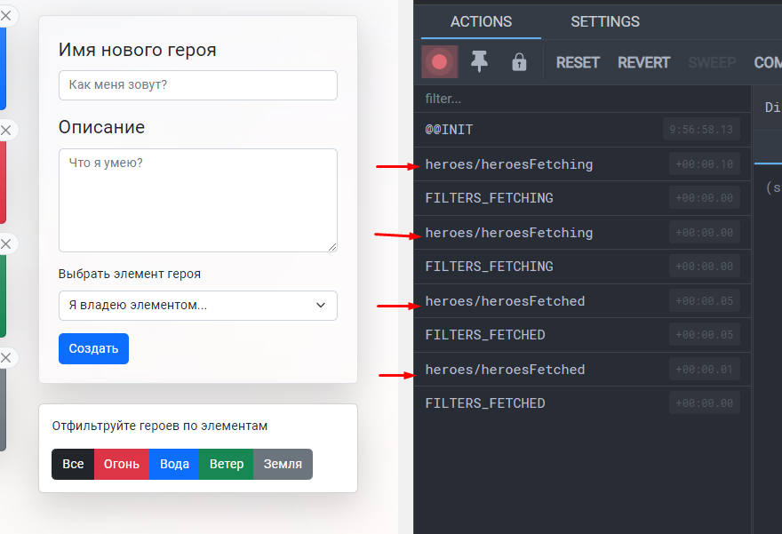

Если нам нужно будет не только получить, но и обогатить `payload`, то можно будет добавить передать в экшен два объекта:
- `reducer` - это сам обработчик
- `prepare` - обработчик, который обогащает `payload`

```JS
import { createSlice, nanoid } from '@reduxjs/toolkit'

const todosSlice = createSlice({
  name: 'todos',
  initialState: [],
  reducers: {
    addTodo: {
      // это та стандартная функция, которую мы просто помещаем в экшен
      // тут мы получаем и стейт и экшен для передачи payload
      reducer: (state, action) => {
        state.push(action.payload)
      },
      // а это дополнительное действие для формирования самого payload
      prepare: (text) => {
        const id = nanoid()
        return { payload: { id, text } }
      },
    },
  },
})
```

Если нам нужно изменить стейт уже в другом компоненте из нашего, то мы можем воспользоваться для этого `extraReducers`

```JS
import { createAction, createSlice } from '@reduxjs/toolkit'
import { incrementBy, decrement } from './actions'

function isRejectedAction(action) {
  return action.type.endsWith('rejected')
}

createSlice({
  name: 'counter',
  initialState: 0,
  reducers: {},
  extraReducers: (builder) => {
    builder
      .addCase(incrementBy, (state, action) => {
      })
      .addCase(decrement, (state, action) => {})
      .addMatcher(
        isRejectedAction,
        (state, action) => {}
      )
      .addDefaultCase((state, action) => {})
  },
})
```

### Redux Toolkit `createAsyncThunk()`

Функция `createAsyncThunk()` позволяет сделать асинхронный `actionCreator`, который будет вести себя ровно так же, как и при использовании обычного `redux-thunk`. 
Использование данной функции является приоритетным, так как при таком запросе `heroes/fetchHeroes` функция возвращает нам три экшена, которые поделены на:
-   `pending`: `'heroes/fetchHeroes/pending'`
-   `fulfilled`: `'heroes/fetchHeroes/fulfilled'`
-   `rejected`: `'heroes/fetchHeroes/rejected'`
Такой подход позволит нам не обрабатывать три разных состояния функции самостоятельно, а перекладывать это на функционал тулкита.

> Тут нужно отметить, что из данной функции мы должны возвращать `Promise`, который функция сама и обработает по трём состояниям

Сам `reducer`, который мы создали через `createAsyncThunk` будет передаваться в основной `reducer` уже как четвёртый аргумент - объект `extraReducers`

Тут мы создали функцию `fetchHeroes`, которая заменит `fetchHeroes` находящийся в `actions`. Далее нужно будет обработать три состояния `fetchHeroes` уже внутри самого `heroesSlice`, передав внутрь `extraReducers`

`components > heroesList > heroesSlice.js``
```JS
import { createAsyncThunk, createSlice } from '@reduxjs/toolkit';
import { useHttp } from '../../hooks/http.hook';

const initialState = {
	heroes: [],
	heroesLoadingStatus: 'idle',
};

export const fetchHeroes = createAsyncThunk(
	// название среза / тип действия
	'heroes/fetchHeroes',
	// асинхронная функция
	// 1 арг - то, что приходит при диспетче
	// 2 арг - thunkAPI (dispatch, getState)
	async () => {
		const { request } = useHttp();
		return await request('http://localhost:3001/heroes');
	},
);

const heroesSlice = createSlice({
	name: 'heroes',
	initialState,
	reducers: {
		// а тут мы удалим heroesFetching, heroesFetched, heroesFetchingError, так как функционал перенесён в fetchHeroes
		heroCreated: (state, action) => {
			state.heroes.push(action.payload);
		},
		heroDeleted: (state, action) => {
			state.heroes = state.heroes.filter((item) => item.id !== action.payload);
		},
	},
	extraReducers: (builder) => {
		builder
			// добавляем формирование запроса
			.addCase(fetchHeroes.pending, (state) => {
				state.heroesLoadingStatus = 'loading'; // состояние загрузки
			})
			// запрос выполнен
			.addCase(fetchHeroes.fulfilled, (state, action) => {
				state.heroes = action.payload; // данные, полученные с сервера попадут сюда
				state.heroesLoadingStatus = 'idle'; // состояние ожидания
			})
			// запрос отклонён
			.addCase(fetchHeroes.rejected, (state, action) => {
				state.heroesLoadingStatus = 'error'; //
			});
	},
});

const { actions, reducer } = heroesSlice;

export const { heroCreated, heroDeleted, heroesFetched, heroesFetchingError, heroesFetching } =
	actions;
export default reducer;
```

Теперь тут меняем импорты

`components > heroesList > HeroesList.js`
```JS
import { heroDeleted, fetchHeroes } from './heroesSlice';
```

Ну и так же из нашего хука `useHttp` нужно убрать `useCallback`, так как это приведёт к ошибке


```JS
export const useHttp = () => {
	// убрать useCallback
	const request = async (
		url,
		method = 'GET',
		body = null,
		headers = { 'Content-Type': 'application/json' },
	) => {
		try {
			const response = await fetch(url, { method, body, headers });

			if (!response.ok) {
				throw new Error(`Could not fetch ${url}, status: ${response.status}`);
			}

			const data = await response.json();

			return data;
		} catch (e) {
			throw e;
		}
	};

	return {
		request,
	};
};
```

И теперь всё работает и функция за нас реализовала сразу три состояния стейта


### Redux Toolkit `createEntityAdapter()`

Функция `createEntityAdapter()` позволит создавать готовый объект с часто-выполняемыми CRUD-операциями в `reducer`

В самом начале в файле со слайсом нужно создать сам адаптер и переписать создание `initialState` под адаптер

Так же мы можем внутрь адаптера вложить свойства, которые мы не хотим обрабатывать через него (`heroesLoadingStatus`), а хотим обработать самостоятельно

`components > heroesList > heroesSlice.js`
```JS
// создаём адаптер
const heroesAdapter = createEntityAdapter();

// создаём начальное состояние
const initialState = heroesAdapter.getInitialState({
	heroesLoadingStatus: 'idle',
});
```

Если вывести адаптер в консоль, то он будет иметь в себе объект, который будет хранить все попадающие внутрь него сущности и идентификаторы. Так же он будет отображать все те поля, которые мы передали как объект внутрь адаптера - уже с ними можно будет работать отдельно без круд-функций адаптера


Так же нужно сказать, что функция `createEntityAdapter` принимает в себя объект с переопределением начальных функций 

```JS
const booksAdapter = createEntityAdapter({
  // тут мы указываем, что будем брать id не из book.id, а из book.bookId
  selectId: (book) => book.bookId,
  // тут мы производим сортировку всех книг по тайтлам
  sortComparer: (a, b) => a.title.localeCompare(b.title),
})
```

CRUD-операции, которые предоставляет `createEntityAdapter`:

-   `addOne`: принимает один объект и добавляет его, если он еще не присутствует.
-   `addMany`: принимает массив сущностей или объект в форме `Record<EntityId, T>` и добавляет их, если они еще не присутствуют.
-   `setOne`: принимает отдельный объект и добавляет или заменяет его
-   `setMany`: принимает массив сущностей или объект в форме `Record<EntityId, T>` и добавляет или заменяет их.
-   `setAll`: принимает массив сущностей или объект в форме `Record<EntityId, T>` и заменяет все существующие сущности значениями в массиве.
-   `removeOne`: принимает единственное значение идентификатора объекта и удаляет объект с этим идентификатором, если он существует.
-   `removeMany`: принимает массив значений идентификатора объекта и удаляет каждый объект с этими идентификаторами, если они существуют.
-   `removeAll`: удаляет все объекты из объекта состояния сущности.
-   `updateOne`: принимает "объект обновления", содержащий идентификатор объекта, и объект, содержащий одно или несколько новых значений поля для обновления внутри `changes` поля, и выполняет поверхностное обновление соответствующего объекта.
-   `updateMany`: принимает массив объектов обновления и выполняет мелкие обновления для всех соответствующих объектов.
-   `upsertOne`: принимает единую сущность. Если объект с таким идентификатором существует, он выполнит поверхностное обновление, и указанные поля будут объединены в существующий объект, а любые совпадающие поля будут перезаписывать существующие значения. Если объект не существует, он будет добавлен.
-   `upsertMany`: принимает массив объектов или объект в форме`Record<EntityId, T>`, который будет слегка изменен.

> Все вышеописанные методы следуют принципу **нормализации данных**. Они производят действия над данными по определённым условиям, если они существуют/не существуют

Реализуем добавление персонажей в массив через адаптер. Для этого нам может подойти функция `setAll`, в которая будет являться местом, куда помещаем все данные, а вторым аргументом данные для помещения.

`components > heroesList > heroesSlice.js`
```JS
const heroesSlice = createSlice({
	name: 'heroes',
	initialState,
	reducers: {
		heroCreated: (state, action) => {
			state.heroes.push(action.payload);
		},
		heroDeleted: (state, action) => {
			state.heroes = state.heroes.filter((item) => item.id !== action.payload);
		},
	},
	extraReducers: (builder) => {
		builder
			.addCase(fetchHeroes.pending, (state) => {
				state.heroesLoadingStatus = 'loading';
			})
			.addCase(fetchHeroes.fulfilled, (state, action) => {
				state.heroesLoadingStatus = 'idle';
				// устанавливаем все полученные данные в стейт
				// первый аргумент - место, куда помещаем все данные
				// второй - что помещаем
				heroesAdapter.setAll(state, action.payload); // state.heroes = action.payload;
			})
			.addCase(fetchHeroes.rejected, (state, action) => {
				state.heroesLoadingStatus = 'error';
			});
	},
});
```

Все данные, которые мы помещаем в стейт, отправляются в объект `entities`


Чтобы работать с данным объектом и получать из него нужные сущности, нужно воспользоваться функциями выбора. Адаптер выбранной сущности содержит метод `getSelectors()`, которая предоставляет функционал селекторов уже знающих как считывать содержимое этой сущности:

-   `selectIds`: возвращает массив с идентификаторами `state.ids`.
-   `selectEntities`: возвращает объект `state.entities`.
-   `selectAll`: возвращает массив объектов с идентификаторами `state.ids`.
-   `selectTotal`: возвращает общее количество объектов, сохраняемых в этом состоянии.
-   `selectById`: учитывая состояние и идентификатор объекта, возвращает объект с этим идентификатором или `undefined`.

Если мы использем селекторы в глобальной областивидимости, то нам нужно будет самостоятельно указывать, с чем именно должна работать данная команда

```JS
const store = configureStore({
  reducer: {
    books: booksReducer,
  },
})

const simpleSelectors = booksAdapter.getSelectors()
const globalizedSelectors = booksAdapter.getSelectors((state) => state.books)

// указываем конкретный объект, с которым будет работать селектор
const bookIds = simpleSelectors.selectIds(store.getState().books)

// уже этот селектор знает, с каким объектом в стейте он имеет дело
const allBooks = globalizedSelectors.selectAll(store.getState())
```

И теперь нам нужно добавить функционал по вытаскиванию всех элементов из стейта. Сделать это легко - мы просто из файла со слайсом будем экспортировать функцию `selectAll`, которую привяжем к `state.heroes`

`components > heroesList > heroesSlice.js`
```JS
// и теперь все функции для получения значений из стейта, которые мы используем, будут обращаться к героям
export const { selectAll } = heroesAdapter.getSelectors((state) => state.heroes);
```

Вторым аргументом в листе мы возвращали с помощью отдельной функции список всех персонажей. Теперь же можно вернуть всё с помощью функции-селектора 


И теперь приложение работает, так как на фронт попадает тот массив, который нам и был нужен


Если мы попытаемся вывести массив с логами о героях, то тут можно увидеть, что в первые две смены состояния были пустые, но дальше мы получили массив с объектами


И теперь можно переписать все операции модификации стейта на круд-операции из самого адаптера. 

Тут нужно сказать, что данные по `reducer`, действия над которыми происходят в пространстве имён `heroes`, будут помещаться в `state.entities.heroes`. Однако напрямую с ними взаимодействовать не придётся, так как мы их можем автоматически достать через селекторы


Ну и так же можно оптимизировать код и создавать селекторы (библиотека `Reselect`) уже внутри самого слайса


>[!success] Вышеописанный подход с использованием ==Redux== позволяет нам скрывать логическую часть работы с данными от самого компонента, который эти данные отображает. Теперь ==View== работает отдельно и занимается только отображением данных без какого-либо их преобразования.


## 024 Redux Toolkit RTK Query


RTK Qeury и React Query концептуально меняют подход к использованию данных в приложении. Они предлагают не изменять глобальные состояния, а оперировать загруженными данными

Сейчас наше взаимодействие выглядит так:
- мы отправляем запрос на сервер
- мы получаем данные с сервера
- отправляем изменение состояния в стейт


Далее потребуются две основные функции для работы с Query:
- `createApi` - полностью описывает поведение RTK Query
- `fetchBaseQuery` - модифицированная функция `fetch()`

Чтобы начать работать с данной библиотекой, нужно будет написать будущее АПИ общения с RTK Query:
- Пишем функцию `createApi`, которая описывает взаимодействие с библиотекой и передаём в неё объект
	- `reducerPath` будет указывать то пространство имён, в котором происходят все запросы
	- `baseQuery` описывает полностью базовые параметры запроса на сервер
		- функция `fetchBaseQuery` выполняет функцию фетча, но хранит дополнительные параметры для ртк
		- `baseUrl` принимает строку для обращения к серверу
	- `endpoints` хранит функцию, которая возвращает объект с теми запросами и изменениями, что мы можем вызвать
		- свойство объекта будет входить в имя хука, который будет сгенерирован. Если мы имеем имя `getHeroes`, то библиотека сформирует хук `useGetHeroes[Query/Mutation]` (суффикс уже будет зависеть от типа того, что делает хук - просто запрос или мутация данных)

`api > apiSlice.js`
```JS
import { createApi, fetchBaseQuery } from '@reduxjs/toolkit/query/react';

// эта функция генерирует хуки (эндпоинты) на каждое наше действие
// так же она генерирует и редьюсер (как createSlice)
export const apiSlice = createApi({
	// путь к редьюсеру
	reducerPath: 'api',
	// формирование базового запроса
	baseQuery: fetchBaseQuery({
		// тут указываем ссылку до сервера
		baseUrl: 'http://localhost:3001',
	}),
	// тут указываем те операции, которые будем проводить по базовому адресу (получение, отправка, удаление данных)
	// query - запросы, которые получают данные и сохраняют их
	// mutation - запросы на изменение данных на сервере
	endpoints: (builder) => ({
		// тут мы просто хотим получить героев с сервера
		getHeroes: builder.query({
			query: () => '/heroes',
		}),
	}),
});

export const { useGetHeroesQuery } = apiSlice;
```

Далее нужно сконфигурировать хранилище:
- чтобы добавить новый reduce, нужно в качестве свойства указать динамическую строку `apiSlice.reducerPath` и указать значение переменной самого редьюсера `apiSlice.reducer`
- далее добавляем `middleware` для обработки специфических запросов RTK Query

`store > index.js`
```JS
import { apiSlice } from '../api/apiSlice';

const store = configureStore({
	reducer: { 
		heroes, 
		filters, 
		// добавляем reducer, сформированный через RTK Query
		[apiSlice.reducerPath]: apiSlice.reducer 
	},
	devTools: process.env.NODE_ENV === 'development',
	middleware: (getDefaultMiddleware) =>
		getDefaultMiddleware().concat(
			stringMiddleware, 
			// передаём сюда middleware для обработки запросов RTK Query
			apiSlice.middleware
		),
});
```

И уже тут мы можем воспользоваться хуком, который сгенерировал Query. Через хук `useGetHeroesQuery` мы получаем все те промежуточные состояния, которые могут быть присвоены запросы, который приходит с сервера

> Так же нужно упомянуть, что все те данные, что мы получили с сервера будут кешироваться в браузере на определённое время

`components > heroesList > HeroesList.js`
```JS
import { heroDeleted, fetchHeroes, filteredHeroesSelector } from './heroesSlice';
import { useGetHeroesQuery } from '../../api/apiSlice';

const HeroesList = () => {
	const {
		// тут нужно установить значение по умолчанию, так как это асинхронный код
		data: heroes = [], // получаем данные, которые запишем в переменную heroes
		isUninitialized, // если true, то запрос вообще не был отправлен
		isFetching, // состояние отправленного запроса
		isLoading, // состояние загрузки
		isError, // состояние ошибки
		error, // переменная с ошибкой
	} = useGetHeroesQuery();

	// получаем доступ к выбранному пользователем фильтру
	const activeFilter = useSelector((state) => state.filters.activeFilter);

	// это фильтр героев, которых мы получили с сервера
	const filteredHeroes = useMemo(() => {
		// создаём копию массива персонажей
		const filteredHeroes = heroes.slice();

		if (activeFilter === 'all') {
			return filteredHeroes;
		} else {
			return filteredHeroes.filter((item) => item.element === activeFilter);
		}
	}, [heroes, activeFilter]);

	/// CODE ...

	if (isLoading) {
		return <Spinner />;
	} else if (isError) {
		return <h5 className='text-center mt-5'>Ошибка загрузки</h5>;
	}

	/// CODE ...

	// и сюда подставляем отсортированных персонажей  
	const elements = renderHeroesList(filteredHeroes);
	return <TransitionGroup component='ul'>{elements}</TransitionGroup>;
};

export default HeroesList;
```

И наше приложение работает теперь так же, как и до изменений - список героев нормально получается с сервера


Далее добавим запрос на мутацию стейта, который будет отправлять на сервер запрос на добавление персонажа в список

`api > apiSlice.js`
```JS
import { createApi, fetchBaseQuery } from '@reduxjs/toolkit/query/react';

export const apiSlice = createApi({
	reducerPath: 'api',
	baseQuery: fetchBaseQuery({
		baseUrl: 'http://localhost:3001',
	}),
	endpoints: (builder) => ({
		getHeroes: builder.query({
			query: () => '/heroes',
		}),
		createHero: builder.mutation({
			query: (hero) => ({
				url: '/heroes',
				method: 'POST',
				body: hero,
			}),
		}),
	}),
});

export const { useGetHeroesQuery, useCreateHeroMutation } = apiSlice;
```

И далее можно будет применить данный хук мутации в коде:
- хук возвращает массив из двух объектов:
	- функция отправки мутации данных
	- объект со статусом обработки запроса (тот же объект, что и у `query`)
- далее можно будет применить функцию отправки героя на сервер и передать в него нового героя
- и для нормальной работы всех обработчиков (объект из второго аргумента) используется функция `unwrap()`


Однако после отправки запроса на сервер, мы не получаем на главной странице нового списка персонажей с нашим созданным героем.

Чтобы исправить данную ситуацию, нам нужно будет использовать наш стейт `api` и обновлять стейт на фронте, когда мы получаем актуальные данные с сервера

Чтобы подвязать выполнение одних запросов под другие, нужно использовать теги в `createApi`


И теперь тут правим ситуацию:
- объявляем глобально в АПИ поле `tagTypes`, которое принимает в себя массив тегов, которые будут использоваться для общения между методами
- добавляем в первый запрос `providesTags` и тег, по которому будет оповещаться данный метод, чтобы он сработал при изменении данных
- добавляем в запрос мутации `invalidatesTags`, который будет отправлять в хранилище тегов запрос, откуда на все подписанные методы с подходящими тегами будет приходить уведомление о переиспользовании

`api > apiSlice.js`
```JS
import { createApi, fetchBaseQuery } from '@reduxjs/toolkit/query/react';

export const apiSlice = createApi({
	reducerPath: 'api',
	baseQuery: fetchBaseQuery({
		baseUrl: 'http://localhost:3001',
	}),
	// тут мы задаём, какие метки (теги) существуют
	tagTypes: ['Heroes'],
	endpoints: (builder) => ({
		getHeroes: builder.query({
			query: () => '/heroes',
			// указываем, когда данные запрашиваются при помощи обычного запроса
			providesTags: ['Heroes'], // а тут мы подцепляемся к тегам - функция триггерится от тегов
		}),
		createHero: builder.mutation({
			query: (hero) => ({
				url: '/heroes',
				method: 'POST',
				body: hero,
			}),
			// если мы мутировали эти данные, то по какой метке мы должны получить эти данные
			invalidatesTags: ['Heroes'], // а тут мы указываем, что именно нужно обновить повторно, когда данные изменились
		}),
	}),
});

export const { useGetHeroesQuery, useCreateHeroMutation } = apiSlice;
```

И теперь всё работает - при создании нового персонажа триггерится функция обновления списка персонажей на фронте


`api > apiSlice.js`
```JS
import { createApi, fetchBaseQuery } from '@reduxjs/toolkit/query/react';

export const apiSlice = createApi({
	reducerPath: 'api',
	baseQuery: fetchBaseQuery({
		baseUrl: 'http://localhost:3001',
	}),
	tagTypes: ['Heroes'],
	endpoints: (builder) => ({
		getHeroes: builder.query({
			query: () => '/heroes',
			providesTags: ['Heroes'],
		}),
		createHero: builder.mutation({
			query: (hero) => ({
				url: '/heroes',
				method: 'POST',
				body: hero,
			}),
			invalidatesTags: ['Heroes'],
		}),
		deleteHero: builder.mutation({
			query: (id) => ({
				url: `/heroes/${id}`,
				method: 'DELETE',
			}),
			invalidatesTags: ['Heroes'],
		}),
	}),
});

export const { 
	useGetHeroesQuery, 
	useCreateHeroMutation, 
	useDeleteHeroMutation 
} = apiSlice;
```


И по итогу мы теперь можем удалить весь `heroesSlice.js`, который использовался для реализации управления состояниями 

И теперь список персонажей выглядит таком образом:

`components > heroesList > HeroesList.js`
```JS
import { useCallback, useMemo } from 'react';
import { useSelector } from 'react-redux';
import { CSSTransition, TransitionGroup } from 'react-transition-group';

import HeroesListItem from '../heroesListItem/HeroesListItem';
import Spinner from '../spinner/Spinner';

import './heroesList.scss';

import { useGetHeroesQuery, useDeleteHeroMutation } from '../../api/apiSlice';

const HeroesList = () => {
	const {
		data: heroes = [],
		isUninitialized,
		isFetching,
		isLoading,
		isError,
		error,
	} = useGetHeroesQuery();

	const activeFilter = useSelector((state) => state.filters.activeFilter);

	const filteredHeroes = useMemo(() => {
		const filteredHeroes = heroes.slice();

		if (activeFilter === 'all') {
			return filteredHeroes;
		} else {
			return filteredHeroes.filter((item) => item.element === activeFilter);
		}
	}, [heroes, activeFilter]);

	const [deleteHero] = useDeleteHeroMutation();

	const onDelete = useCallback((id) => {
		deleteHero(id);
	}, []);

	if (isLoading) {
		return <Spinner />;
	} else if (isError) {
		return <h5 className='text-center mt-5'>Ошибка загрузки</h5>;
	}

	const renderHeroesList = (arr) => {
		if (arr.length === 0) {
			return (
				<CSSTransition timeout={0} classNames='hero'>
					<h5 className='text-center mt-5'>Героев пока нет</h5>
				</CSSTransition>
			);
		}

		return arr.map(({ id, ...props }) => {
			return (
				<CSSTransition key={id} timeout={500} classNames='hero'>
					<HeroesListItem {...props} onDelete={() => onDelete(id)} />
				</CSSTransition>
			);
		});
	};

	const elements = renderHeroesList(filteredHeroes);
	return <TransitionGroup component='ul'>{elements}</TransitionGroup>;
};

export default HeroesList;
```

>[!success] И сейчас можно сделать следующие выводы:
> - RTK Query предлагает нам не пользоваться каким-либо единственным хранилищем состояния, а пользоваться активным взаимодействием с сервером для актуализации данных 
> - В браузере же данные хранятся только в кешированном формате (то есть тех данных, что хранится просто в нашем стейте просто нет - они в памяти браузера)
