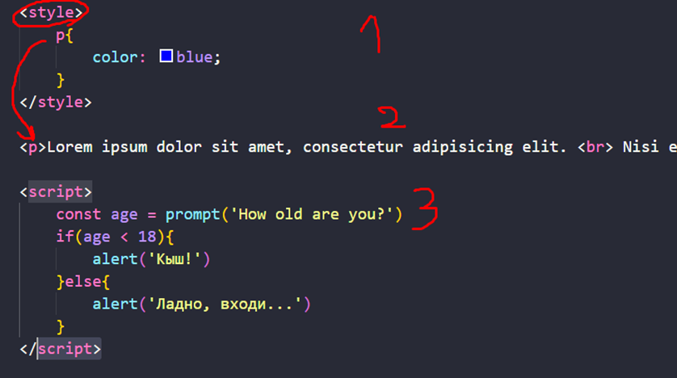
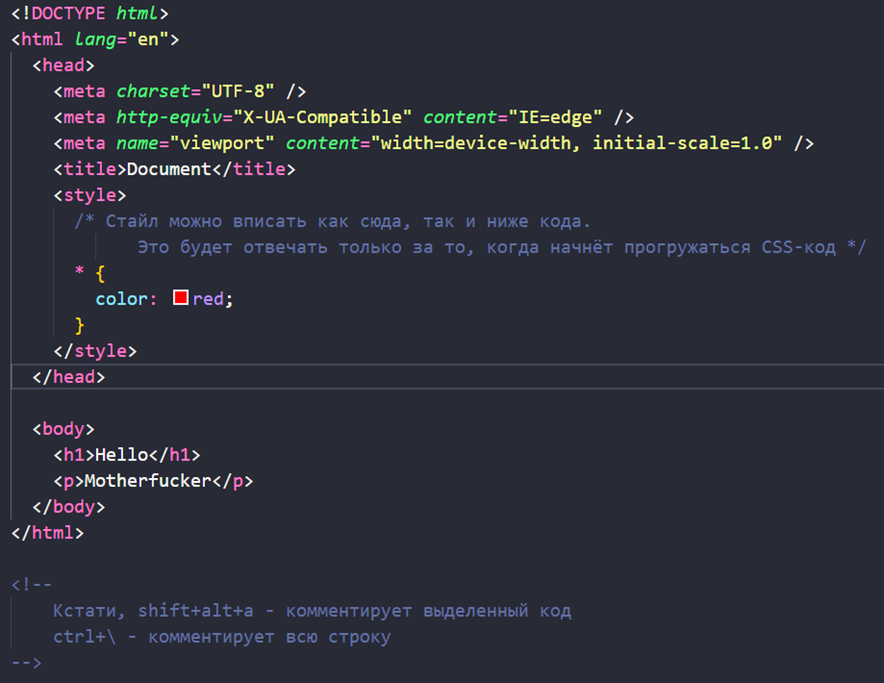
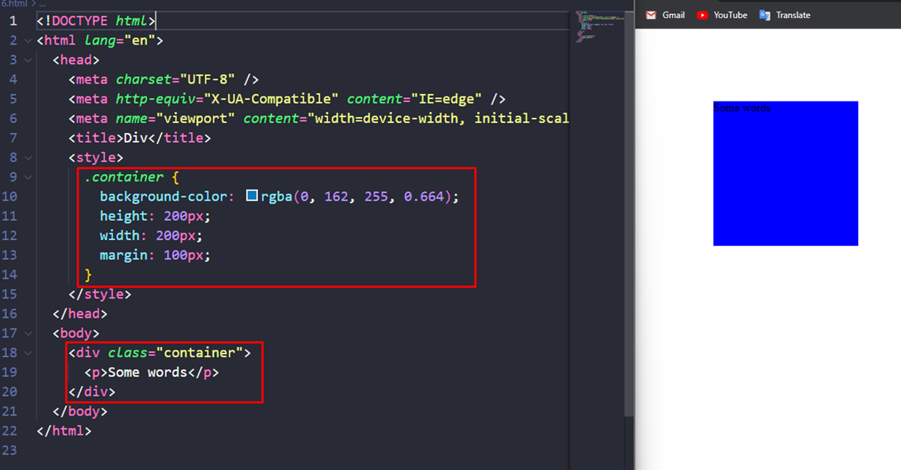
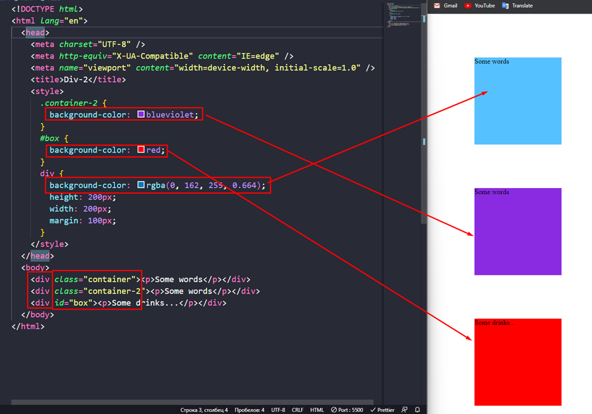
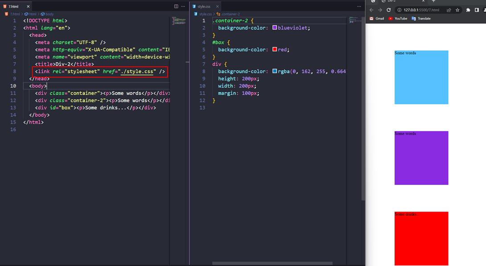
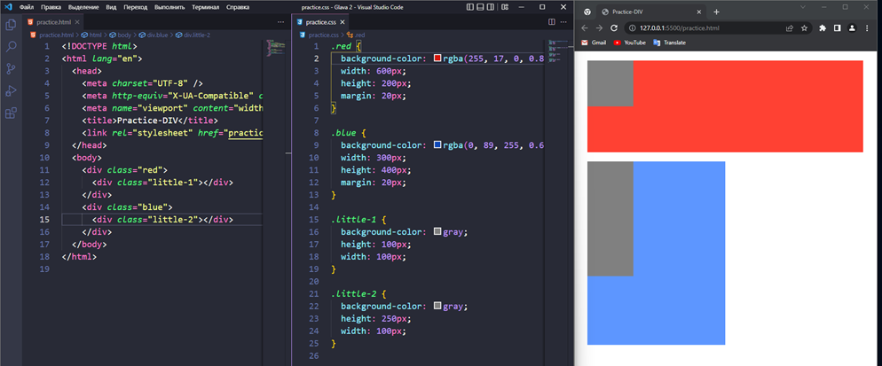

#HTML #CSS 

### 2.3 Как работают теги HTML и стили CSS

Порядок расположения тегов влияет на то, кто раньше запустится

### 2.4 Теги Head и Body. Правильная структура веб страницы

Head хранит в себе техническую информацию о документе. Там же можно вставить фавикон и стили. В бади мы уже спокойно себе пишем внутреннюю часть документа

### 2.5 Как работают теги заголовка и описания, в теге head

Тут представлен тайтл и описание для тайтла сайта в поисковике

### 2.6 Как работает тег контейнер' – div

### 2.7 Как работать с классами в версте

К каждому тегу html можно приписать свой класс и уже по нему обращаться через селекторы класса в css. Селекторы классов и id имеют более высокий приоритет, поэтому они не перезатираются инструкциями внутри селекторов класса (на рисунке показано, как не перезатираются цвета от инструкций для селекторов тегов)

### 2.8 Как подключить лист со стилями к файлу html

Есть три разных способа подключения стилей к HTML-коду (инлайн-стили, вписать в стайл и линкануть), но самый удобный из них – это подключить стили отдельным файлом, чтоб было проще

### 2.9-10 Практика

