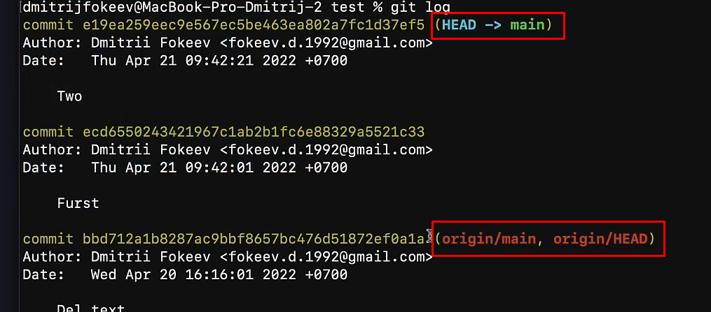
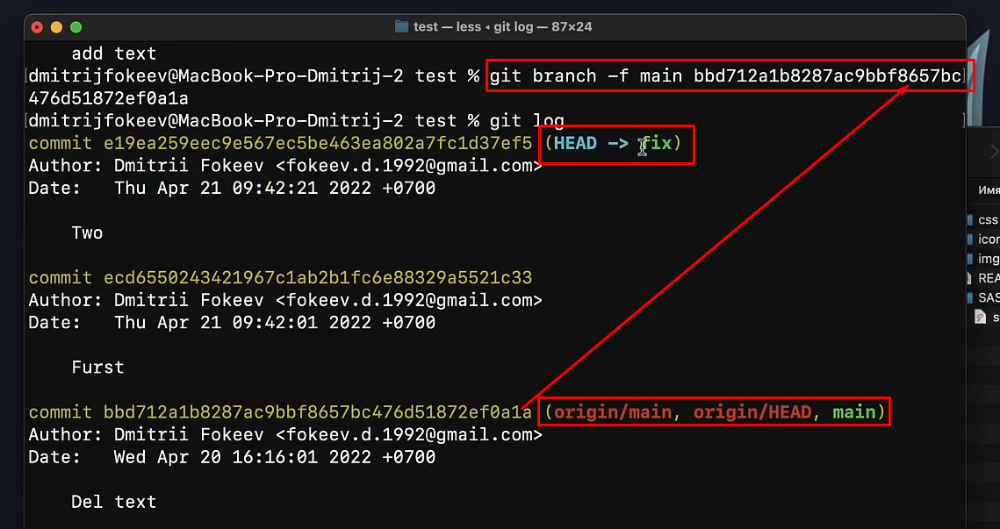

==HEAD== отмечает, что это у нас коммит, на котором мы стоим. Дальше после него идут указатели в скобках, куда он залит (принадлежность удалённому репозиторию). Если мы не будем пушить изменения, то мы увидим, что отметки принадлежности останутся на том коммите, который был залит последним.



Однако перед нами встала задача: нам нужно все новые коммиты перекинуть на новую ветку. При создании новой ветки, можно увидеть, что ==HEAD== ссылается на старую и новую ветку. Дело в том, что в новой ветке пока нет своих коммитов


Чтобы решить проблему, нужно принудительно переключить ветку main на прошлый коммит

```bash
git branch -f main номер_коммита
```


Как итог мы имеем новые коммиты на другой ветке, а основную ветку мы откинули на нужный коммит без лишних изменений