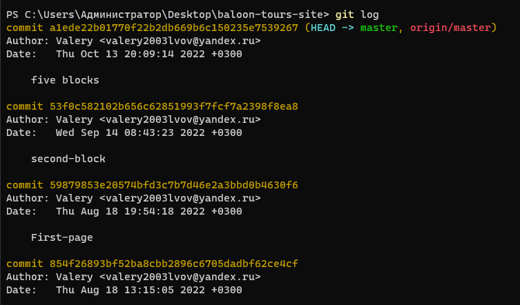
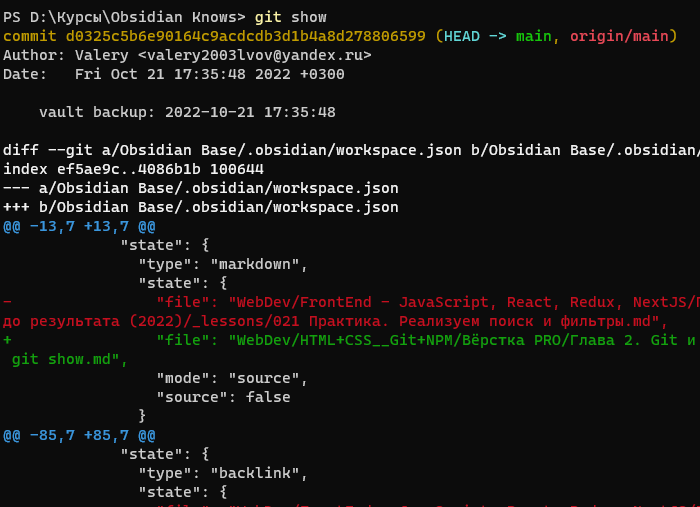
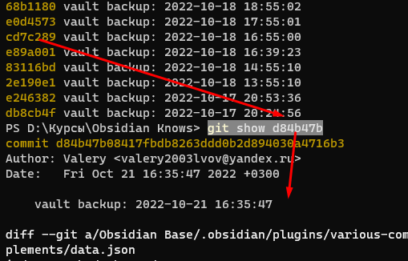
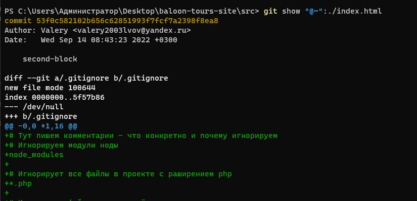

У нас есть грамоздка конструкция, которая позволяет нам увидеть все коммиты проекта

```bash
git log
```


Однако мы можем вывести куда больше коммитов просто с хешем и сообщением

```bash
git log --online
```


Так же есть отдельная команда, которая выводит коммит с изменениями в нём

```bash
git show
```


Так же по короткому идентификатору можно показать изменения по определённому коммиту



Так же мы можем не искать хеши коммитов, а вводить `HEAD` и откатываться на коммит дальше используя `~`

```bash
// Выведет последний коммит (на котором стоит голова)
git show HEAD
// выведет прошлый коммит
git show HEAD~
// выведет позапрошлый коммит
git show HEAD~~
// и так далее тильды можно вписывать долго...
// Поэтому можно указать сколько конкретно коммитов назад нужно вывести
git show HEAD~4 // 4 коммита назад
```

В гите зарезервирован знак, чтобы не писать ==HEAD==, можно написать просто =="@"==

```bash
git show HEAD
// ==
git show "@"
```

Так же мы можем безопасно просматривать старые версии прошлых файлов, просто находя их по коммитам

```bash
git show "@~":./index.html
```
