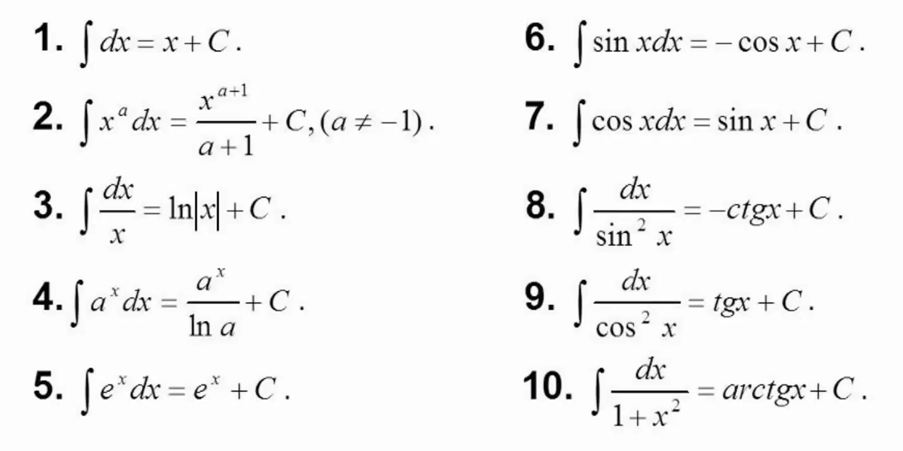

#Patterns #SOLID 

### Введение

Паттерны, принципы, архитектура - это инструменты, которые позволяют разработчикам общаться на одном и том же языке. Определённая архитектура позволяет быстрее въехать разработчику в проект, так как она диктует общие принципы и правила, по которым мы пишем приложение. 
Все эти парадигмы позволяют нам строить системы примерно похоже. Очень многие ошибки начинают сходиться и повторяться, отчего их проще находить и исправлять

Мир без паттернов можно представить так: мы каждый раз выводим формулу для решения определённой задачи, вместо того, чтобы использовать определённый алгоритм решения собственно этой задачи

Однако за нас эти формулы уже вывели и нам не нужно этого делать. Мы просто открываем формулы и используем их для решения задачи

Паттерны помогают нам творить хороший и чистый код

Принципы SOLID:

### SRP (Single Resposibility Principle)

Это принцип, при котором мы назначаем одной сущности (классу, функции) ровно одну задачу 

Представим, что у нас есть система, которая имеет свои данные и она должна уметь сохранять себя, отправлять свои данные, печатать их, логировать и так далее. Если писать всё в одном классе, то дополнять систему в будущем и править её не будет представляться возможным - система станет кашей, которую невозможно будет править и поддерживать, а нововведения от заказчика станут недобавляемы

Поэтому нам нужно будет делить модель данных и поведение сущности

И вот самый простой пример: в первом случае, весь функционал пользователя находится в нём самом, а во втором мы вынесли логику в другие классы

Либо вот пример с `DataFetcher`, который реализует в себе использование большого числа отдельных методов

В идеальном варианте, стоит сделать отдельный класс, который будет выполнять всю избыточную логику класса

###### Примеры на фронте

Мы имеем компонент, который отвечает за отрисовку формы отправки реквизитов

Далее в него мы добавляем функционал по отправке реквизитов, обнулению формы и валидации данных.
Пока всё нормально, так как вся вложенная логика относится к одной форме

И далее нам приходит задача обрабатывать одним способом русские реквизиты и иностранные, что требует от нас проверку компонента на разные локали

Для более правильной реализации данной задачи нужно вынести логику функций в отдельные модули

И уже из этих модулей вызывать нашу форму с подходящими функциями

Такой способ позволит сохранить подход единственной ответственности в приложении

А сюда мы выносим отдельное создание реквизитов под разные локали

> [!success] Преимущества подхода:
> - Избавление от антипаттерна GodObject
> - Приложение разбивается на отдельные модули (декомпозиция), что приводит к лучшей читабельности
> - Логика выполнения определённых операций инкапсулируется в определённых функциях, что так же упрощает написание тестов
> - Становится легче вносить изменения в проект

### OCP (Opened-Closed Principle)

Все программные сущности (классы, компоненты, модули, сущности) должны быть открыты для расширения, но закрыты для изменения

Мы должны добавлять новый функционал за счёт добавления новой сущности, которая будет посредством определённой логики связана с другой сущностью

###### Первый пример

У нас есть персонаж, который принимает в себя имя и оружие, а так же вызывает функцию из оружия 

Само оружие хранит в себе характеристики и атаку 

Вывод:

Однако, если мы столкнёмся с тем, что нам нужно будет добавить несколько оружий, то уже придётся городить разные условия

Чтобы вынести логику отдельного метода, можно имплементировать нужные методы через интерфейс

И экстендить исходящие классы оружия от родительского, чтобы наследовать функционал

Теперь можно удалить выбор типа из конструктора

И создаём новое оружие через отдельный класс 

###### Второй пример

Мы имеем два класса: персонаж и список персонажей

А так же имеем три типа сортировок списков

Данные методы сортировки мы применяем в разных случаях, чтобы оптимизировать работу кода

Так же у нас имеется список музыки, который так же сортируется в зависимости от размера массива

Тут мы сталкиваемся с такой проблемой, что мы дублируем код условия

Первое, что мы должны сделать, чтобы привести все связанные классы к одному родителю - это создать базовый класс

Далее мы создаём клиент, который будет сам определять, какую сортировку от массива применять

И теперь сортировку за нас выполняет отдельный клиент, который инкапсулировал в себе логику выполнения

> [!success] Основные плюсы данного подхода:
>  - Отпадает потребность в регрессионном тестировании (e2e)
>  - Падает вероятность ошибок

### LSP (Liskov Substitution Principle)

Функции и сущности, которые используют родительский тип должны точно так же работать и с дочерними классами, т.е. наследуемый класс должен дополнять поведение базового класса, а не замещать

Представим такую ситуацию, что у нас имеется базовый класс. Далее мы создаём функцию, которая принимает в себя класс, который подходит по интерфейсу к базовому классу. Если мы заэкстендим другой класс от базового, то у нас **должна остаться возможность** передать его в ту функцию.

Мы имеем базовый класс базы данных, имеющий три базовых операции для всех БД, в который мы так же добавили специфический метод объединения таблиц 

Если первая БД нормально заэкстендилась, так как она реляционная 

То уже вторая база (документоориентированная) не может иметь такой метод объединения таблиц

Более правильным вариантом было бы создать от базового класса ещё два разветвлённых класса, которые имеют отношение к разным видам БД 

И уже конкретные БД экстендить от обобщённых  

Это позволит нормально работать с разными БД под один базовый тип - `Database`

### ISP (Interface Segragation Principle)

### DIP

### SOLID итоги

