## **03 Основные типы**
### **008 Вводное видео**

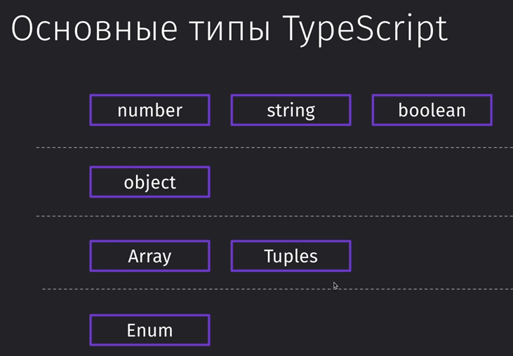

### **009 Подготовка проекта**

- Команды для подключения и запуска ТСки:

npm i -g typescript – устанавливаем ТС глобально

mkdir ts – создание папки с именем «ts»

cd ts – переход в данную папку

tsc --init – инициализация ТС в нашем проекте (пока находимся в нём)

- И с помощью команды tsc мы будем компилировать наш ТС-файл в нативный JS

### **010 Использование типов**

Собственно, запись различных типов на примере нативного JS

И, как можно увидеть, так как ТС – это надстройка, то и писать можно в нём спокойно по правилам JS

tsc – сначала всегда компиляция

node app.js – запустит конкретный файл в консоли (запускаем только скомпилированный JS файл)

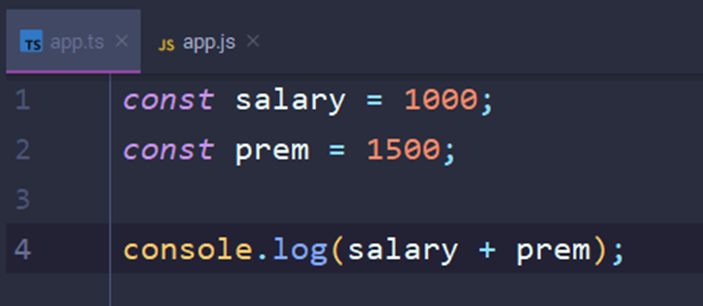

Нативный JS так же позволяет нам сложит строку с числом и это приведёт к очевидной конкатенации строк, что нам не нужно

Если в качестве результата укажем, что мы должны всегда получать число, то тут у нас встанет проблема, потому что одно из значений не является намбером и потому результат присваивается в строковую переменную

Если указать типы вообще всем переменным, то мы увидим, что ошибка находится на уровне создания самой переменной, а суммирования

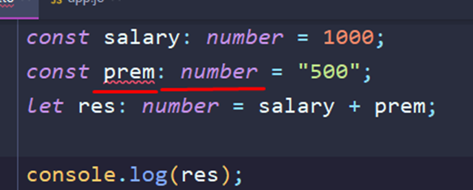

### **011 Типы в функциях**

Изначально мы обязаны писать типы для функции. По умолчанию компилятор предлагает нам установить any (однако луче этого не делать)

Чтобы эни стоял по умолчанию, мы можем в конфиге раскомментировать данную строку

В обычной ситуации мы можем указать типы как для аргументов, так и для самой функции после объявления аргументов

Запись типов для стрелочной функции выглядит так же

Если убрать типы, то у нас будет работать динамическая типизация по умолчанию

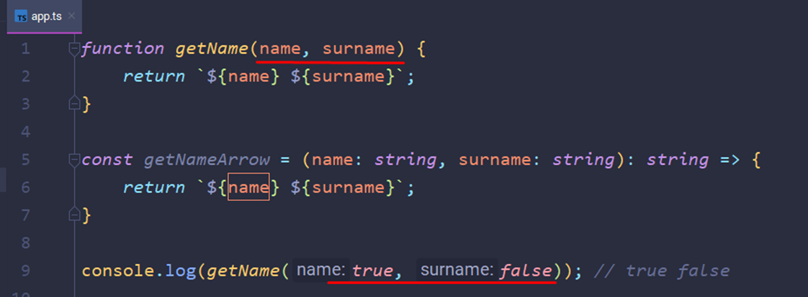

Однако стоит прописать типы и уже мы не сможем передать другие типы в тут обозначенную строку

### **012 Объекты**

При обработке объекта мы можем указать типы данных на получаемые строки из этого объекта

А если мы попытаемся обратиться к свойству, которого нет в объекте, то мы получим ошибку, что позволяет нам обезопасить обращение к получаемому объекту

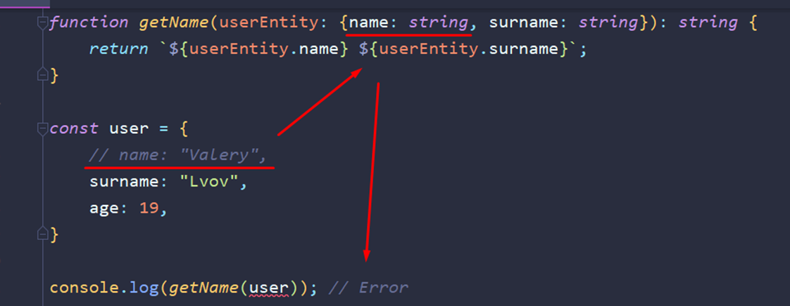

### **013 Упражнение - Типизируем объект**

При получении объекта с сервера, мы можем указать его типы заранее до получения, чтобы знать, какой тип данных мы будем получать. И тут показана типизация всего объекта и его получение

### **014 Массивы**

Массивы указываются как обычные типы, но с квадратными скобками. Так же можно увидеть, что редактор нам отображает типы, с которыми мы работаем (как можно увидеть в редьюсе). Так же можно задать самостоятельно типы для аргументов (только тогда аргумент нужно писать обязательно в скобочках)

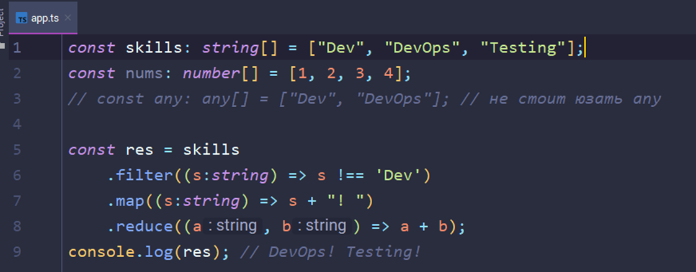

Если мы дальше по массиву вернём число (мэп вернёт числа в массив), то это число будет работать и дальше. В консоль выйдет строка «2»

### **015 Tuples**

- Таплс или кортежи – это массивы, которым мы задали определённый список на типы данных

1) Массив без определённого типа данных – можно поместить всё
2) Массив из одного элемента (можно через запятую указывать какие типы данных будет иметь каждая позиция)
3) Массив с определённым типом данных
4) Юнион – он хранит определённый разрез типов данных (тут на примере вмещает в себя и стрингу, и число)

Конкретно тут был создан ограниченный массив из числа и строки – больше вписать в него не получится. Мы можем получить эти значения. Однако, если мы захотим получить ещё один элемент сверх указанной нормы, то у нас ничего не получится

Запушить новый объект в массив мы сможем (так как в процессе работы массив спокойно может получать новые значения), а получить их напрямую не получится

Более короткий формат записи создания и получения сразу нескольких переменных по значениям массива

В таплах можно задать как массивы определённых типов, так и добавить этот массив со спредом (чтобы просто вписывать значения массива без вложения его в массив внутри)

### **016 Readonly**

Кратко опишем проблему. Когда мы пытаемся поменять значение у константы, JS нас бьёт по рукам и запрещает это делать. Когда мы меняем значения под индексами у массивов, то мы спокойно это можем сделать, потому как мы в качестве константы устанавливаем ссылку на массив

Однако на массив мы можем установить модификатор ридонли и будем получать по рукам при попытке изменения этого массива

- И вот примерно так выглядят массивы с ридонли

1) Тут представлен обычный массив строк
2) Тут уже массив строк, который изменять нельзя. Сколько будет и какие будут базовые значения, такими они и останутся – изменить нельзя
3) Тут показан пример создания массива строк через дженерик. Он работает аналогично первому примеру
4) Это дженерик ридонли массива <строкового>. Как видно, запушить в него новое значение так же нельзя и изменять тоже. Это просто ещё одна вариация записи ридонли массива через дженерик

### **017 Enums**

Представим такую ситуацию. Мы проверяем запрос от сервера и при успешном выполнении мы должны выполнить определённую логику. Проблема заключается в том, что мы можем допустить ошибку в записи результата объекта и получить неверную логику выполнения программы

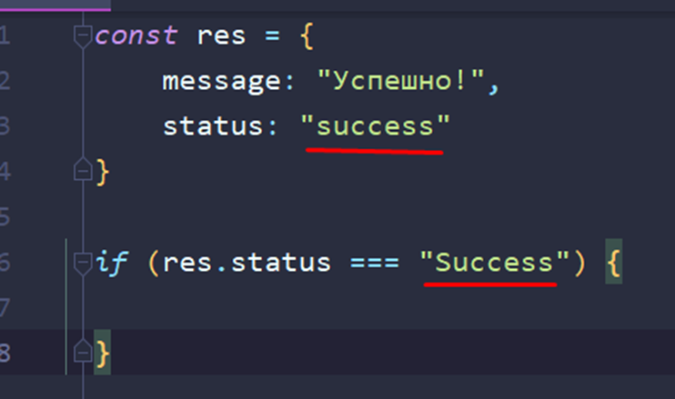

Более правильным вариантом в нативке будет использование отдельной константы

И для решения этой проблемы в ТС используют енамы. Это определённые объектоподобные конструкции, которые хранят в себе фиксированные значения. Тут мы задаём наши параметры статуса и можем спокойно их использовать в любом удобном для нас месте

Хочется дополнить, что енамы активно используются в очень маленьких либо монолитных проектах

Есть множество вариантов записи и задания значений для наших енамов. Можно оставить их по умолчанию и тогда присвоение будет идти с 0. Можно начать со своего числа. Можно задать свои значения разным свойствам. Можно задать строковые значения (но это уже будет неудобно)

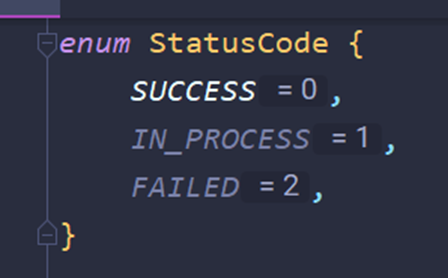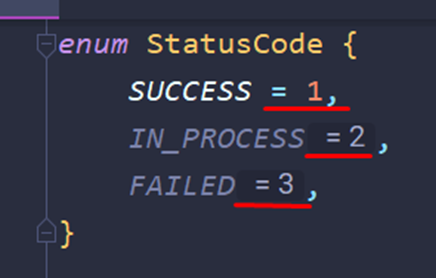
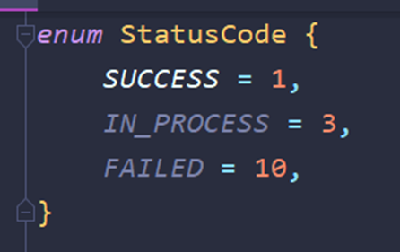

Так же енам может быть гетерогенным и вполне себе состоять из чисел и строк

Так же можно в качестве типа данных указать наш енам, чтобы функция могла принять только его. Тут стоит указать такую особенность, что гетерогенный енам (который указан чуть выше) из-за того, что имеет в себе числа до сих пор ведёт себя как числовой, поэтому мы не сможем передать текст, который был присвоен для значения енама

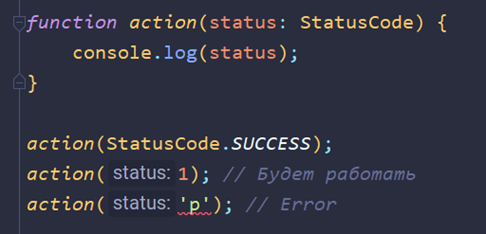

В качестве значений для енама можно присваивать спокойно результаты математических вычислений. Однако не стоит использовать для них функции, которые могут отправлять запросы на сервер, так как код может не успеть выполниться и вернуть undefined

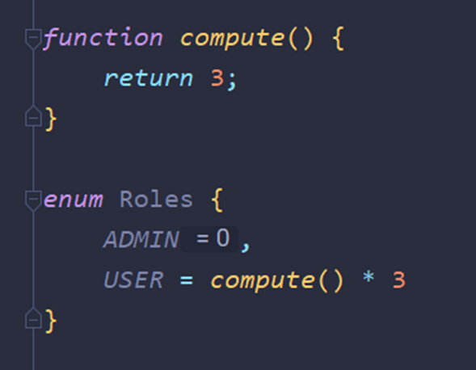

Енамы могут вести себя похоже на объекты

Так же нужно отметить, что енамы в рабочем проекте существуют ровно до рантайма (так как они находятся только в пределах тайпскрипта, который компилируется в JS). Уже в сам JS они переходят в виде ифи-функций

Однако, если мы объявим енам в виде константы, то компилятор будет искать все вхождения енама в код и приравнивать только их. То есть мы отказываемся от фукнкции, которая может замедлить наш код

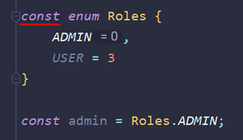
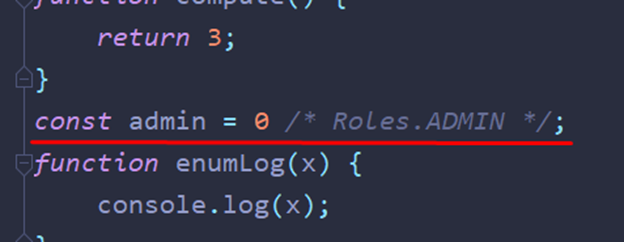

### **018 Упражнение - Типизируем функцию**

Сейчас нужно немного разобрать монстра типизации, который за счёт неё съел пространства больше, чем сама функция. Конкретно тут нам показан код, который представляет из себя: мы получили данные -> это должно выйти из полученных данных

Заранее нужно упомянуть, то все такие большие типизации убираются в интерфейсы и типы, а затем уже вызываются отдельно, чтобы не перепрописывать постоянно так много кода.

Так же когда мы в качестве типа указываем енам, нам нужно поставить посте имени ключа оператор «?», который скажет, что может быть несколько значений енама

Итак. Первым делом тут описан статус, который может иметь три позиции. Дальше типизируем получаемые данные, которые представляют из себя два свойства: топик и статус. Потом типизируем функцию. Её тип будет сформирован дженериком Promise<{}[]> - то есть это будет массив объектов. Объекту мы внутри описали все типы. В идеале эту структуру изнутри промиса нужно описать и для нашей выводимой даты

