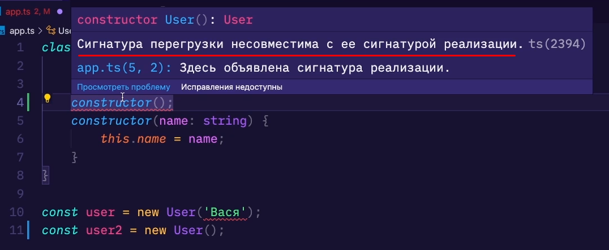
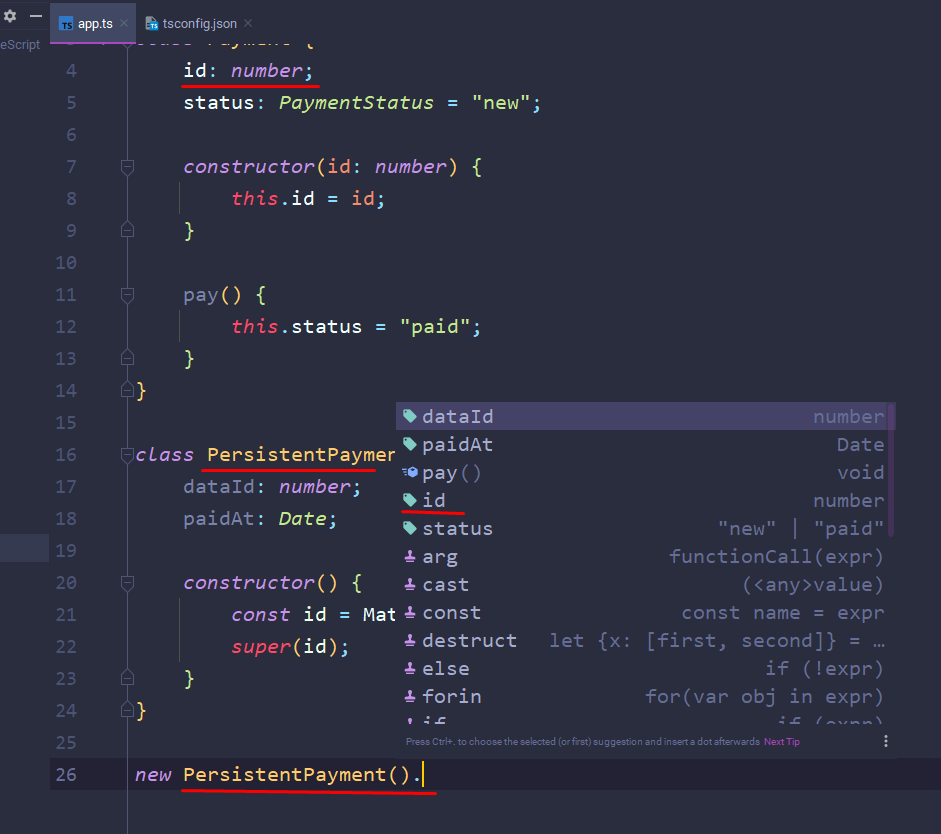
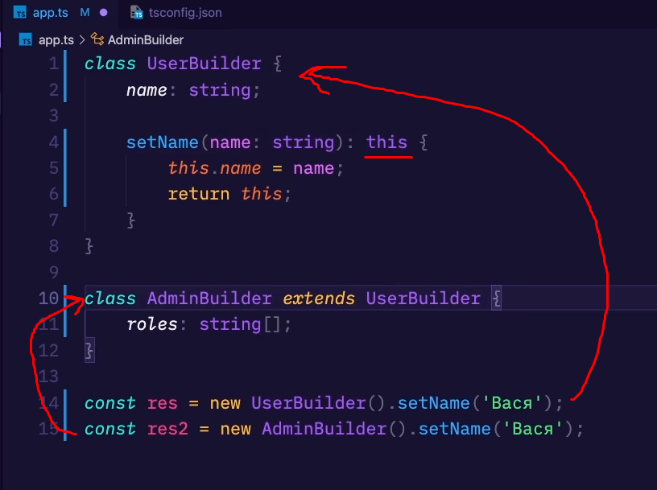
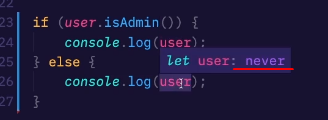

## **05 Классы**

### **034 Вводное видео** - немного об ООП

- ООП подход хорошо реализован в ТС. Он предлагает нам работать с объектами на основе реальной жизни. Делать связи между определёнными сущностями и описывать для них функционал


- Принципы ООП:
	- **Абстракция** - написание реальной сущности, абстрагируясь от его реальных свойств и качеств
	- **Инкапсуляция** - обеспечивает присвоение данных и функций к определённому объекту и сокрывает его данные от внешних изменений
	- **Полиморфизм** - один интерфейс - множество абстракций (реализаций)
	- **Наследование** - делегирование кода дочерним элементам объекта


**Класс** - это чертёж объекта. Он определяет структуру будущего инстанса. 
Класс пользователь содержит функционал и начертания того, что будет хранить пользователь. При регистрации нового пользователя, мы создаём инстанс юзера и присваиваем ему свои данные, сохраняя методы и свойства оригинального класса (родителя)


### **035 Создание класса**

Синтаксис классов очень похож на стоковый JS. Дополнительно только в самом классу прописываем поля с типами и в конструкторе вписываем их. 
```TS
class User{  
    name: string;  
    surname: string;  
  
    constructor(name: string, surname: string) {  
        this.name = name;  
        this.surname = surname;  
    }  
}  
  
const user = new User("Вася", "Пупкин");
```

Для расширения функционала классов, нам стоит поставить данную настройку в фолс. Теперь нам можно создавать классы без инициализации через конструктор.
Обычно в реальных проектах именно так и используют подобный функционал
```TS
"strictPropertyInitialization": false,
```

И теперь мы можем использовать классы в качестве конструктора. Так же такой функционал расширяют декораторы
```TS
class Admin {  
    role: number;  
}  
const admin = new Admin();  
admin.role = 1;
```

Однако, если мы хотим оставить настройку инициализации, то мы можем поставить "!" после ключа в классе. Это так же говорит ТС, что мы знаем, что делаем и не потребует инициализации данного поля
```TS
"strictPropertyInitialization": true,
```

```TS
class Admin {  
    role!: number; // "Отстань, я знаю, что делаю"
}  
const admin = new Admin();  
admin.role = 1;
```

### **036 Конструктор**

- Что такое конструктор?
	- Нужно сразу сказаать, что конструктор триггерится при написании оператора <span style="color: yellow">new</span>. 
	- Так же конструктор всегда возвращает свой объект (это функция, которая возвращает свой класс)
	- Следующее идёт из прошлого. Мы не можем типизировать возврат конструктора
	- Конструктор не может принимать дженерики. Их может принять только класс
	- Так же конструктору можно описать некоторый оверлоад (с дополнительными сигнатурами). Например, можно добавить необязательные поля

```TS
class User{  
    name: string;  
  
    constructor(name: string) { // function(name:string): User
        this.name = name;  
    }  
}
```

И далее попробуем реализовать класс, который должен нормально работать и без передачи аргументов (чтобы у нас была возможность передать параметр и не передать его)

```TS
class User{  
    name: string;  
  
    constructor();  
    constructor(name: string) {  
        this.name = name;  
    }  
}
```

И тут мы можем увидеть подобную ошибку. Тут уже нужно остановиться на самих типах конструкторов.



Это конструктор реализации (имплементации)

```TS
constructor(name: string)
```

А это уже внешний конструктор, который мы вызываем

```TS
constructor();
```

И чтобы у нас была возможность вызвать пустой конструктор, мы должны описать все конструкторы. То есть первые два конструктора - являются внешними и позволяют описать разную логику поведения нашего основного конструктора (конструктора реализации). **Все внешние конструкторы должны быть совместимыми с конструктором реализации!**
Для конструктора реализации нам нужно указать, что те параметры, которые отсутствуют в одном из конструкторов - необязательны (через "?"). Так же, чтобы всё работало, нужно реализовать сужение типов (так как при вызове первого внешнего конструктора будет *undefined*, а при вызове второго - *string*)

```TS
class User{  
    name: string;  
  
    constructor();  
    constructor(name: string);  
    constructor(name?: string) {  
        if (typeof name === 'string') {  
            this.name = name;  
        }    }  
}  
  
const user = new User("Вася");  
const user2 = new User();
```

Преймущество использования такого подхода заключается в том, что мы можем описывать совершенно различные конструкторы, скрывая логику применения внутри них

Например, мы хотим реализовать теперь конструктор, который будет принимать в себя либо имя, либо возраст. 
Создаём третий внешний конструктор, который будет принимать в себя только число. И теперь далее в конструкторе реализации мы будем принимать не просто имя, а в переменную может попасть либо имя, либо число. В самом конструкторе реализации нужно будет продолжить сужение типов (стринга - число)

```TS
class User{  
    name: string;  
    age: number;  
  
    constructor();  
    constructor(name: string);  
    constructor(age: number);  
    constructor(ageOrName?: string | number) {  
        if (typeof ageOrName === 'string') {  
            this.name = ageOrName;  
        } else if (typeof ageOrName === 'number') {  
            this.age = ageOrName;  
        }    }  
}  
  
const userName = new User("Вася");  
const userNull = new User();  
const userAge = new User(33);
```

А теперь мы реализовали ввод сразу и имени, и возраста в конструктор

```TS
class User{  
    name: string;  
    age: number;  
  
    constructor();  
    constructor(name: string);  
    constructor(age: number);  
    constructor(name: string, age: number);  
    constructor(ageOrName?: string | number, age?: number) {  
        if (typeof ageOrName === 'string') {  
		    this.name = ageOrName;  
		} else if (typeof ageOrName === 'number') {  
		    this.age = ageOrName;  
		}  
		  
		if (typeof age === 'number') {  
		    this.age = age;  
		}
}  
  
const userName = new User("Вася");  
const userNull = new User();  
const userAge = new User(33);  
const userNameAndAge = new User("Вася", 33);
```

Однако тут нужно объяснить одну простую истину: **делать конструкторы более чем с 3-4 перегрузками - уже нечитабельно и так делать некруто**. 
Чтобы нормально реализовать более громоздкую реализацию класса, нужно делать статичные методы

### **037 Методы**

Методы - это свойства объекта, значениями которых является функция. 
Конкретно в классе объект записывается как функция, но без ключевого слова **function**

```TS
enum PaymentStatus {  
    SUCCESS,  
    HOLD,  
    REVERSED,  
    FAILED  
}  
  
class Payment {  
    id: number;  
    status: PaymentStatus;  
    createdAt: Date;  
    updatedAt: Date;  
  
    constructor(id: number) {  
        this.id = id;  
        this.status = PaymentStatus.HOLD;  
        this.createdAt = new Date();  
    }  
  
    getPaymentLifeTime(): number {  // !
        return new Date().getTime() - this.createdAt.getTime();  
    }  
  
    unholdPayment(): void {  // !
        if (this.status === PaymentStatus.SUCCESS) {  
            throw new Error("Платёж уже совершён успешно!");  
        }        this.status = PaymentStatus.REVERSED;  
        this.updatedAt = new Date();  
    }  
}  
  
const payment = new Payment(1);  
const paymentTime = payment.getPaymentLifeTime();  // !
payment.unholdPayment(); // !
```

Метод <span style="color: cyan">getTime()</span>  возвращает значение времени в миллисекундах

```TS
return new Date().getTime() - this.createdAt.getTime();
```

Так же мы можем немного улучшить код, присвоив дефолтные значения для *"this.полей"* класса прямо при их инициализации, а не в конструкторе

```TS
class Payment {  
    id: number;  
    status: PaymentStatus = PaymentStatus.HOLD; // Таким образом
    createdAt: Date = new Date(); // ! 
    updatedAt: Date;  
  
    constructor(id: number) {  
        this.id = id;  
    }
}
```


### **038 Упражнение - Перегрузка методов**

И сейчас опять взглянем на полиморфизм - реализуем перегрузку, при которой мы сможем поместить либо один навык пользователя, либо массив навыков. 

```TS
class User {  
    skills: string[];  
  
    addSkill(skill: string): void; // !
    addSkill(skills: string[]): void; // !
    addSkill(skillOrSkills: string | string[]): void {  
        if (typeof skillOrSkills === "string") {  
            this.skills.push(skillOrSkills);  
        } else {  
            this.skills.concat(skillOrSkills);  
        }    }  
}  
  
const user1 = new User().addSkill("technoPunk"); // !
const user2 = new User().addSkill(["write", "slept"]); // !
```

Так же перегрузку можно реализовать и для функции (внутри ТС, конечно же)

```TS
function run(info: string): void;  
function run(info: number): void;  
function run(info: string | number): void {  
    if (typeof info === "string") {  
        console.log(info);  
    } else {  
        info++;  
    }  
}
```

Однако для сигнатуры перегрузки мы можем записать тип возвращаемого значения отличный от реализации функции

```TS
function run(info: string): string;  // !
function run(info: number): number;  // !
function run(info: string | number): string | number {  // !
    if (typeof info === "string") {  
        return info;  // !
    } else {  
        return info++;  // !
    }  
}
```

### **039 Getter** **и** **Setter**

Методы, которые мы инициализируем через get и set, реализуют функционал вывода/задания значения. Обычно их реализую для возможности просматривать или изменять приватные поля класса. 
- Особенности геттеров и сеттеров:
	- Тип данных сеттера по умолчанию равен типу, который возвращает геттер.
	- Геттеры и сеттеры не могут быть асинхронными

```TS
class User {  
    _login: string;  
    _password: string;  
  
    set login(login: string) {  
        this._login = login;  
    }  
  
    get login() {  
        return this._login;  
    }  
}  
  
const user = new User();  
user.login = "user";  
console.log(user.login);
```

Дополним, что если у поля есть геттер или сеттер, то работаем с этим полем только через геттер или сеттер. Напрямую обращаться к полю не надо. Поэтому, если у нас присутствует только геттер, то поле становится ридонли (можно только прочесть)
Однако мы до сих пор можем поменять значение внутри инстанса через прямое обращение к полю

```TS
class User {  
    _login: string;  
    _password: string;  
  
    get login() {  
        return this._login;  
    }  
}  
  
const user = new User();  
user.login = "user";  
console.log(user.login);
```

Гет/сет синхронны, как описывалось выше, поэтому они останаливают основной поток программы для выполнения своих функций.
Для асинхронных функций (например, если нам нужно получить зашифрованный пароль) нам нужно использовать методы. 

```TS
async getPassword(p: string) {  
    return await "crypted" + this._password;  
}
```


### **040 Implements**

Имплементация  - это сигнатура, которая позволяет нам реализовать класс по определённой абстракции. То есть мы создаём прообраз для нашего класса. Реализуется такой подход через интерфейсы и ключевое слово  *implements*.

Конкретно тут мы реализовали имплементацию методов в класс от интерфейса

```TS
interface ILogger {  
    log: (...args: any[]) => void; // Первая реализация метода 
    error(...args: any[]): void;  // Вторая
}  
  
class Logger implements ILogger {  
    log (...args: any[]): void {  
        console.log(...args);  
    }  
    error(...args: any[]): void {  
        console.log(...args);  
    }  
}
```

Уже тут реализована имплементация, при которой мы в классе должны иметь обязательный метод *pay* и необязательное поле *price* (так как оно с "?")

```TS
interface IPayment {  
    pay: (paymentID: number) => void;  
    price?: number; // необязательное поле  
}  
  
class User implements IPayment{  
    pay (paymentID: number | string) : void {  
        console.log(paymentID);  
    }  
  
    // price?: number | undefined;  
}  
  
new User().pay("StringA");
```


Конкретно в данном случае, в функции класса, аргумент paymentID должен иметь всегда тип либо шире, чем в интерфейсе (юнион либо эни), либо иметь тот же тип (number)

```TS
class User implements IPayment{  
    pay (paymentID: string) : void {  // Ошибка
        console.log(paymentID);  
    }
}
```

```TS
class User implements IPayment{  
    pay (paymentID: number | string) : void {  // Так уже можно
        console.log(paymentID);  
    }
}
```

>[!Note] Использовать имплементацию нужно:
>1) Для отделения реализации от абстракции
>2) Для обязательного наделения свойствами какого-либо класса (например, для нужно всем классам присваивать методы, обязательные для связи с API)


### **041 Extends**

Extends - реализует зависимость одного класса от другого, при этом принимая все его свойства и методы.
Таким наследованием нельзя злоупотреблять, так как код будет сильно связан и его сложно будет размонолитить

```TS
type PaymentStatus = "new" | "paid";  
  
class Payment {  
    id: number;  
    status: PaymentStatus = "new";  
  
    constructor(id: number) {  
        this.id = id;  
    }  
  
    pay() {  
        this.status = "paid";  
    }  
}  
  
class PersistentPayment extends Payment { // Расширяем родителем
    dataId: number;  
    paidAt: Date;  
  
    constructor() {  
        const id = Math.random();  
        super(id);  
    }  
}  
  
new PersistentPayment().pay();
```

Через extends мы передали всё, что было в родительском классе и теперь в через дочерний класс мы можем вызвать методы родительского и обратиться к свойствам, которые не прописаны в дочернем классе (однако они принадлежат дочернему элементу)



Через метод super() мы вызываем конструктор родительского класса. Его обязательно вызвать при переопределении конструктора в дочернем классе. Однако его не нужно писать, если новый конструктор мы не пишем в дочернем классе


Чтобы переопределить метод в дочернем классе, нужно его переписать так, чтобы он был расширением для метода родителя (чтобы его можно было вызвать так же как родителя).
Так же и тут нужно воспользоваться супером, чтобы перенести логику метода в дочерний объект

```TS
pay(date?: Date) {  
    super.pay();  
    if (date) {  
        this.paidAt = new Date();  
    }
}
```

И тут нужно упомянуть один очень важный модификатор *override*. В чём заключается его задача? Он указывает нам на то, что он переопределяет родительский метод. Это сильно обезопасит наш код, так как теперь мы будем видеть ошибку, если в родительском классе мы, например, удалим этот метод

```TS
override pay(date?: Date) {  
    super.pay();  
    if (date) {  
        this.paidAt = new Date();  
    }
}
```


### **042 Особенности наследования**

- Порядок вызова конструкторов
Конкретно в этом случае, мы увидим - user. Дело в том, что у нас вызывается сначала родительский класс и его конструктор, а уже затем вызывается дочерний 

```TS
class User {  
    name: string = "User";  
    constructor() {  
        console.log(this.name);  
    }  
}  
  
class Admin extends User {  
    name: string = "Admin";  
}  
  
new Admin(); // Выйдет User
```

А уже в таком блоке кода выйдут оба наименования: 
_User_
_Admin_

```TS
class User {  
    name: string = "User";  
  
    constructor() {  
        console.log(this.name);  
    }  
}  
  
class Admin extends User {  
    name: string = "Admin";  
  
    constructor() {  
        super();  
        console.log(this.name);  
    }  
}  
  
new Admin(); // Выйдет User Admin
```

А уже таким образом сделать нельзя. Метод супер должен всегда идти первым, если мы обращаемся к свойствам класса

```TS
constructor() {  
    console.log(this.name);  
    super();  // Error
}
```

Так же мы можем спокойно экстендиться от встроенных классов, которые мы уже имеем в системе. Так же вызвать супер и как-то модифицировать логику выполнения 

```TS
class HttpError extends Error {  
    code: number;  
  
    constructor(message: string, code?: number) {  
        super();  
        this.code = code ?? 500;  
    }  
}
```


### **043 Композиция против наследования**

Тут мы описали класс пользователя, которого мы создаём с именем. Дальше уже у нас идёт класс, который экстендится от дженерика Массива<Пользователь>, что даёт нам возможность создавать массив (+ методы массива) пользователей (+ класс Юзер) 
Однако мы сталкиваемся с такой проблемой, что у нас могут появиться множество ненужных нам методов в списке комплита. Для бизнес-сущностей - это плохой вариант и уже стоит переписать логику для этих методов (а именно заоверрайдить их)
Конкретно тут метод toString() переписали таким образом, что теперь он выводит строкой массив элементов с разделителем в виде "," (join - соединяет объекты)
*Тут показан механизм наследования*


А уже в данном примере мы скрыли реализацию обычного пуша в метод push(). Конкретно в примере добавления пользователей через такой внутренний массив - это более приоритетный вариант, чем тот, что выше 
*Тут уже показан механизм композиции*
```TS
class UserList {  
    name: string[];  
    push (u: string) {  
        this.name.push(u);      
	} 
}
```

И вот более удачный пример композиции.
Нам нужно реализовать класс Пользователь и Оплата. Конкретно тут два варианта реализации - один плохой, другой хороший. 
В первом варианте мы жёстко связываем сущности юзера и пеймента, что может привести к конфликтам свойств классов.
Во втором случае, мы абстрагировали две сущности друг от друга, что позволит нам спокойно расширять объект в частностях

```TS
class User {  
    name: string = "User";  
  
    constructor() {  
        console.log(this.name);  
    }  
}  
  
class Payment {  
    payment: Date;  
}  
  
class UserWithPaymentBad extends Payment {  
    name: string;  
}  
  
class UserWithPaymentGood {  
    user: User;  
    payment: Payment;  
  
    constructor(user: User, payment: Payment) {  
    }
}
```


> [!Note] Когда что лучше использовать?
> 1) Наследование используем, когда нам нужно расширяться в рамках одной доменной области (Гость - Юзер - Админ) 
> 2) Композицию используем, когда мы пересекаем доменные области. Пример выше - нам нужно связать пользователя и платежи каким-то одним интерфейсом.


### **044 Видимость свойств**

Видимость и доступность свойств в ТС определяется модификаторами доступа *public*, *private* и *protected*. Все они выполняют функцию определённой инкапсуляции свойств класса. 

Как можно увидеть на примере, свойство *nums* мы не можем вызвать вне класса, так как оно скрыто от внешнего воздействия. Уже публичное свойство *name* мы можем увидеть и изменить. 


И теперь мы можем увидеть классический пример реализации класса с полноценной инкапсуляцией, когда мы можем поменять значение нужного нам свойства только через сеттер или метод и просмотреть свойство через геттер

```TS
class Vehicle {  
    public name: string = "BMW";  
    private _driver: string = "Alesha";  
    private _nums: string[] = ["ao123k"];  
  
    get driver() {  
        return this._driver;  
    }  
  
    set driver(carDriver: string) {  
        this._driver = carDriver;  
    }  
  
    addNums(num: string) {  
        this._nums.push(num);  
    }  
}
```

Так же приватные поля нам доступны только внутри объекта, внутри которого мы создали эти поля. 
Конкретно в данном примере, мы можем получить доступ только к родительскому свойству *name*, так как оно публично


Уже поле protected отличается от поля private тем, что оно наследуется к остальным экземплярам класса (но так же инкапсулирует как private) 

```TS
class Vehicle {  
    public name: string = "BMW";  
    private _driver: string = "Alesha";  
    protected run: number;
}  
  
class Truck extends Vehicle {  
    setRun(run: number) {  
        this.run = run;  
    }  
}  
new Truck().setRun(30000);
```

Хочется сказать, что "#" сохраняет свою силу и в нативном JS, а модификаторы доступа работают только внутри ТС.
Решётку не стоит использовать для написания бэка (приват в ТС для этого достаточно). Уже во фронте, если нужно ограничить переменную от экстеншенов браузера, то можно будет её так скрыть через "#"


Так же никто нам не мешает сделать приветным метод класса

```TS
class Truck extends Vehicle {  
    private setRun(run: number) {  
        this.run = run;  
    }  
}  
new Truck().setRun(30000); // Error - нет доступа к методу
```

### **045 Упражнение - Делаем корзину товаров**

> [!Note] Задание: 
> Необходимо сделать корзину (Cart) на сайте,  
которая имееет список продуктов (Product), добавленных в корзину  и переметры доставки (Delivery). Для Cart реализовать методы:  
> - Добавить продукт в корзину  
> - Удалить продукт из корзины по ID  
> - Посчитать стоимость товаров в корзине 
> - Задать доставку  
> - Checkout - вернуть что всё ок, если есть продукты и параметры доставки  
> Product: id, название и цена  
> Delivery: может быть как до дома (дата и адрес) или до пункта выдачи (дата = Сегодня и Id магазина)

*Одна интересная особенность*: если в конструкторе записать аргументы с модификатором public, то эти аргументы сразу станут свойствами класса (к которым обращаемся через this) и их не надо будет объявлять и указывать им типы

```TS
class Product {  
    constructor(  
        public id: number,  
        public name: string,  
        public price: number  
    ) {  }  
}
```

И вот пример реализации поставленной задачи:

```TS
class Product {  // Сам продукт
    constructor(  
        public id: number,  
        public name: string,  
        public price: number  
    ) {  }  
}  
  
class Delivery {  // Родительский класс доставки
    constructor(  
        public date: Date  
    ) {  
    }
}  
  
class HomeDelivery extends Delivery {  // Доставка домой
    constructor(date: Date, public address: string) {  
        super(date);  
    }  
}  
  
class ShopDelivery extends Delivery {  // Доставка в магазин
    constructor( public shopID: number) {  
        super(new Date());  
    }  
}  
  
type deliveryOptions = HomeDelivery | ShopDelivery; // И далее доставка может быть одного из двух типов
  
class Cart {  // Корзина
    private products: Product[] = []; // Продукты
    private delivery: deliveryOptions; // Тип доставки
  
    public addProduct(product: Product): void {  
        this.products.push(product); // Добавляем продукт
    }  
  
    public deleteProductByID(productID: number): void {  
        this.products = this.products.filter((p: Product) => p.id !== productID);  // Удаляем продукт
    }  
  
    public getSum(): number { // Получаем сумму цены товара
        return this.products  
            .map((p: Product) => p.price)  
            .reduce((p1: number, p2: number) => p1 + p2);  
    }  
  
    public setDelivery(delivery: deliveryOptions): void {  
        this.delivery = delivery; // Определяем тип доставки
    }  
  
    public checkOut() { // Состояние заказа 
        if (this.products.length == 0) {  
            throw new Error("Нет товаров в корзине");  
        }        if (!this.delivery) {  
            throw new Error("Не указан способ доставки");  
        }  
        return {success: true}  
    }  
}  
  
const cart = new Cart();  

// Добавляем товары
cart.addProduct(new Product(1, "Печенье", 10)); 
cart.addProduct(new Product(2, "Торт", 30));  
cart.addProduct(new Product(3, "Шоколад", 20));  

// Удаляем товары
cart.deleteProductByID(1);  

// Определяем тип доставки
cart.setDelivery(new HomeDelivery(new Date(), "some home"));  
  
console.log(cart.getSum()); // = 50  
console.log(cart.checkOut()); // success: true
```

### **046 Статические свойства**

Модификатор static создаёт нам статическое свойство, которое можно использовать без инстанациирования объекта класса через *new*

```TS
class UserService {  
    static db: any;  
}  
  
UserService.db = 4;
```

Так же мы можем сделать статичным и метод класса и можем этот метод вызывать тоже без инстанциирования класса через *new*, а просто через наименование класса и вызов метода
В примере второй метод нестатичен и его уже вызвать без инстанциирование класса не получится

```TS
class UserService {  
    private static db: any;  
  
    static getUserByID(id: number) { // 1  
        return this.db.findById(id);  
    }  
    create() { // 2  
    }  
}  
  
UserService.getUserByID(1); // 1  
new UserService().create(); // 2
```

И так же нужно сказать, что из инстанциированных объектов у нас нет доступа к статичным свойствам и методам класса


Так же стоит упомянуть, что правильнее в статичных полях использовать обращение не через this, а через имя (статического) класса 

```TS
class UserService {  
    private static db: any;  
  
    static getUserByID(id: number) {
        return UserService.db.findById(id);  
    }  
  
    create() {
        UserService.db;  
    }  
}  
  
const inst = new UserService().create();
```

При инициализации инстанса класса через *new* вызывается конструктор класса. И так же при вызове статического класса вызывается поле статик вместо конструктора.

```TS
class UserService {  
    public static db: number;   
      
	constructor(id: number) {  }    
    
    static {  }  
}  
  
new UserService(1);  
UserService.db = 1;
```

Асинхронные функции внутри статика работать не будут

```TS
class UserService {  
    public static db: number;  
        
    static {  
	    await new Promise() // Error
    }  
}  
```

А вот уже статичные методы могут быть асинхронными

```TS
class UserService {  
    private static db: any;  
  
    static async getUserByID(id: number) {
        return UserService.db.findById(id);  
    }  
}  
```

Однако класс статичным быть не может (чтобы весь его функционал внутри был статичным)

```TS
static class UserService { // Error  
}  
```

Так же нужно упомянуть, что статичные функции и свойства считаются встроенными в данный класс.
У класса UserService уже есть зарезервированное свойство name, поэтому переопределить её не получится (свойство прототипа объекта)

```TS
class UserService {  
    static name: string = 'UserService'; // Error  
}  
  
UserService.name;
```

### **047 Работа с this**

Хочется немного поговорить про контекст вызова *this*. А именно про его использование вовне.
Конкретно в нашем примере, мы можем увидеть, что если мы вызовем функцию из инстанса класса, то получим нормальную дату. Получим нормальную дату, *потому что мы обратились ко внутреннему свойству класса*
Когда мы будем вызвать эту же функцию из объекта, то мы получим *undefined*. Получим мы неопределённое значение ровно потому, что мы потеряем контекст вызова. Вызывая из объекта, контекстом вызова у нас будет наш объект *user*

```TS
class Payment {  
    private date: Date = new Date();  
  
    getDate() {  
        return this.date;  
    }  
}  
  
const p = new Payment();  
console.log(p.getDate()); // Получим нашу дату  
  
const user = {  
    id: 1,  
    paymentDate: p.getDate,  
}  
console.log(user.paymentDate()); // undefined
```

Однако, если мы используем функцию *bind()*, то мы сохраним контекст вызова нашего объекта

```TS
const user = {  
    id: 1,  
    paymentDate: p.getDate.bind(p),  
}  
console.log(user.paymentDate()); // дата
```

Так же мы можем явно указать нашему ТС, что в методе мы всегда обязаны вызывать именно определённый контекст указание в методе аргумента *this: Payment*.
И если сейчас мы не используем bind, то мы получим ошибку, так как контекст вызова перешёл на user

```TS
class Payment {  
    private date: Date = new Date();  
  
    getDate(this: Payment) {  // !
        return this.date;  
    }  
}  
const p = new Payment();   

const user = {  
    id: 1,  
    paymentDate: p.getDate,  
}  

console.log(user.paymentDate()); // Error
```

Однако мы можем сохранить контекст и без биндинга. Сделать нам это позволит стрелочная функция, так как она сохраняет контекст вызова

```TS
class Payment {  
    private date: Date = new Date();  
  
    getDateArrow = () => {  // !
        return this.date;  
    }  
}  
  
const p = new Payment();  
console.log(p.getDate());  
  
const user = {  
    id: 1,  
    paymentDate: p.getDateArrow,  // !
}  
console.log(user.paymentDate()); // Вернёт дату
```

И сейчас мы увидим одну очень интересную особенность стрелочных функций. А именно - **стрелочные функции не находятся в прототипе объекта**.

> То есть в первом случае, у нас вызывается обычная функция родителя. Обращение к ней идёт из PaymentPersistence через прототип родителя Payment.
```TS
class PaymentPersistence extends Payment {  
    save() {  
        super.getDate();  
    }  
}  
console.log(new PaymentPersistence().save()); // Получим дату
```
> Во втором случае, мы уже пытаемся обратиться к стрелочной функции, которая отсутствует в прототипе объекта и поэтому получаем ошибку
```TS
class PaymentPersistence extends Payment {  
    save() {  
        super.getDateArrow();  
    }  
}  
console.log(new PaymentPersistence().save()); // Получим Error в рантайме, так как данный метод не является функцией
```
> Однако, если мы обратимся через this, то мы непосредственно вызовем унаследованную функцию от родителя, которая уже имеется в дочернем классе
```TS
class PaymentPersistence extends Payment {  
    save() {  
        this.getDateArrow();  
    }  
}  
console.log(new PaymentPersistence().save()); // Выведет дату
```

### **048 Типизация this**


То есть по сути функция возвращает UserBuilder, а именно в качестве типа наш класс

```TS
class UserBuilder {  
    private name: string;  
  
    setName(name: string): UserBuilder {  // !
        this.name = name;  
        return this;  
    }  
}  
  
const user = new UserBuilder().setName("Олек");
```

Однако, если мы будем возвращать конкретно наш класс, то мы можем получить определённые коллизии, поэтому стоит указать в качестве возвращаемого типа *this*

```TS
class UserBuilder {  
    private name: string;  
  
    setName(name: string): this {  // !
        this.name = name;  
        return this;  
    }  
}  
  
const user = new UserBuilder().setName("Олек");
```

> Коллизии эти могут выглядеть следующим образом:
- Когда мы ссылаемся на this, наш первый рес и рес2 имеют свои типы данных (UserBuilder и AdminBuilder соответственно)

- А теперь наша функция возвращает UserBuilder и наш новосозданный инстанс AdminBuilder будет иметь тип UserBuilder 


Так же мы можем реализовать typeguard через this. В данном тайпгуарде мы возвращаем булеан проверки, что данный класс является админом. В условии, если true, то мы попадём в ветку, где юзер является админом

```TS
class UserBuilder {  
    private name: string;  
  
    setName(name: string): UserBuilder {  
        this.name = name;  
        return this;  
    }  
  
    isAdmin(): this is AdminBuilder {  // !
        return this instanceof AdminBuilder; // !  
    }  
}  
  
class AdminBuilder extends UserBuilder {  
    roles: string[];  
}  
  
let user: UserBuilder | AdminBuilder = new UserBuilder(); // !  
  
if (user.isAdmin()) {  
    console.log(user); // AdminBuilder  
} else {  
    console.log(user); // UserBuilder  
}
```

Однако, если мы не будем иметь никакой новой логики в дочернем классе, то родительский и дочерний классы будут идентичны по своей структуре и тайпгард работать не будет (так как оба класса одинаковы)

А остальных случаев уже не будет (что делит тайпгуард на 0)


### **049 Абстрактные классы**

Абстрактные классы представляют собой схемы будущих классов, которые мы будем наследовать от этих абстракций. В абстрактном классе мы описываем методы и свойства, которые обязательно должны находиться в наследниках. Притом сами абстрактные классы инстанциировать мы не можем. 
В примере мы создали абстрактный класс с абстрактным методом. Далее создали его дочерний элемент, в котором обязательно нужно создать метод handler.
Сразу стоит упомянуть, что абстрактные методы нельзя создать в неабстрактном классе

```TS
abstract class Controller {  // !
    abstract handler(req: number): void;  
}  
  
class userController extends Controller {  
    handler(req: number) {  
    }
}  
  
// new Controller(); - error  
new userController();
```

Так же нужно сказать, что мы можем написать обычный метод в абстрактном классе  и этот функционал перейдёт в дочерний класс. 
Нужно отметить одну особенность, что мы можем вызвать абстрактный класс внутри обычного класса. Это реализовано за счёт того, что хэндлер мы обязуемся реализовать в дочернем классе абстрактного (берётся внутренняя реализация из дочернего класса)

```TS
abstract class Controller {  
    abstract handler(req: number): void;  
  
    log(req: any): void {  // !
        console.log("Start");  
        this.handler(req);  // !
        console.log("End");  
    }  
}
```

### **050 Упражнение - Делаем абстрактный logger**

>[!Note] Задание
Необходимо реализовать абстрактный класс Logger с 2-мя методами  
абстрактным - log(message): void  
printDate - выводящий в log дату  
К нему необходимо сделать реальный класс, который бы имел метод: logWithDate,  
выводящий сначала дату, а потом заданное сообщение

И вот реализация задания:

```TS
abstract class Logger {  
    abstract log(message: string): void;  
  
    printDate(date: Date) {  
        this.log(date.toString());  
    }  
}  
  
class MyLogger extends Logger {  
    log(message: string): void {  
        console.log(message);  
    }  
  
    logWithDate(message: string) {  
        this.printDate(new Date());  
        this.log(message);  
    }  
}  
  
const logger = new MyLogger();  
logger.logWithDate("Моё сообщение"); // Дата \t Сообщение
```