# Тестирование JavaScript от А до Я (Jest, React Testing Library, e2e, screenshot)
#Testing #End2End #Jest #ReactTestingLibrary #Screenshot 

## Введение. Теория. Пирамида тестирования. Квадрат допустимых значений

Тесты позволяют явно увидеть нам изменения в поведении приложения при изменении его логики (тест выдаст ошибку, если наши изменения в приложении ломают логику другой функции). 

> Цель тестирования - проверка соответствия ПО предъявляемым требованиям

Виды тестирования:
- Функциональное
	- ==Модульное (unit)== (70%)
	- ==Интеграционное== (20%)
	- ==end-to-end== (10%)
- Нефункциональное
	- нагрузочное тестирование
	- регрессионное (тестирование старого функционала)
	- тестирование безопасности

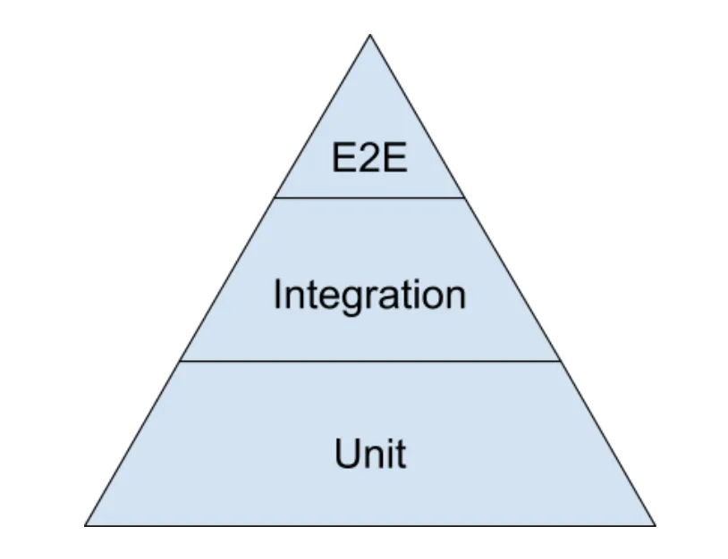

==Unit-тесты==. Они пишутся на отдельные, независимые, маленькие кусочки системы (например, на методы). Они выполняют простую функцию - проверить работу отдельного маленького кусочка.

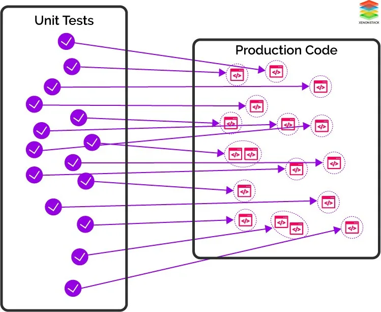

==Screenshot-тесты==. Они уже позволяют нам проверять интерфейс приложения. 

Если мы поменяем шрифт в одном месте и он поменятся в другом, то такой тест нам сообщит, что изменения произошли в разных местах и выдаст результат.

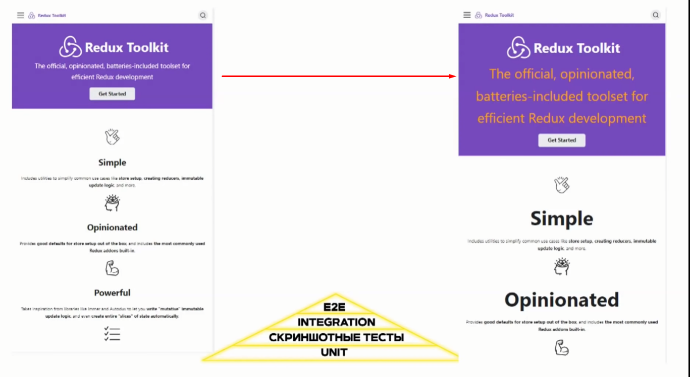

==Integration-тестирование==. Оно уже позволяет просмотреть работу нескольких методов в связке: один компонент рендерит внутри себя список других компонентов по запросу

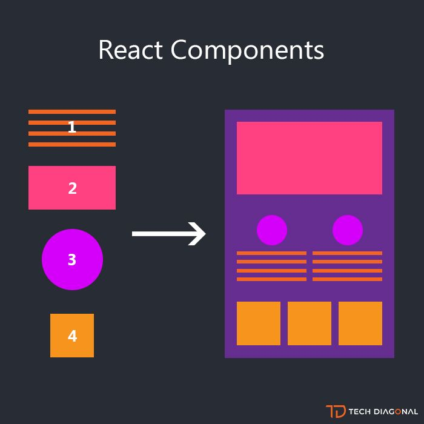

==E2E-тестирование==. Оно уже предназначено для проверки важных модулей системы:
- авторизация
- оплата
- создание сущностей
- удаление записи


Квадрат тестирования - это квадрат, который описывает валидные значения, которые может вернуть функция:
- Валидные значения
- Пограничные значения
- Невалидные значения

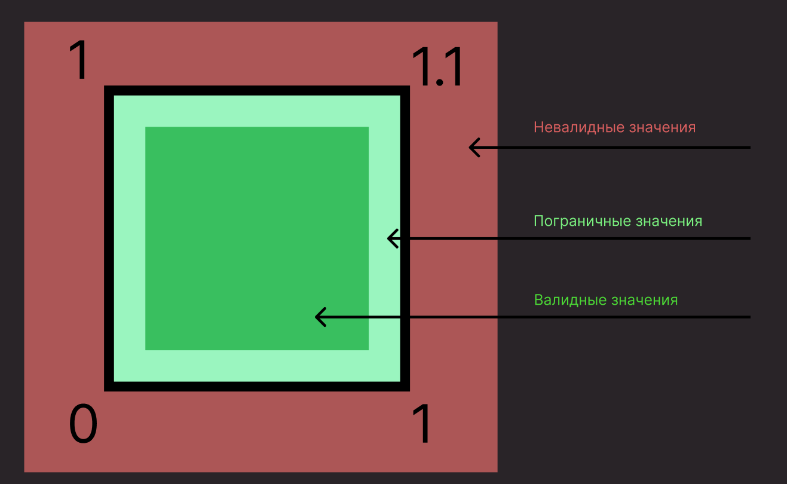

И вот пример использования квадрата:

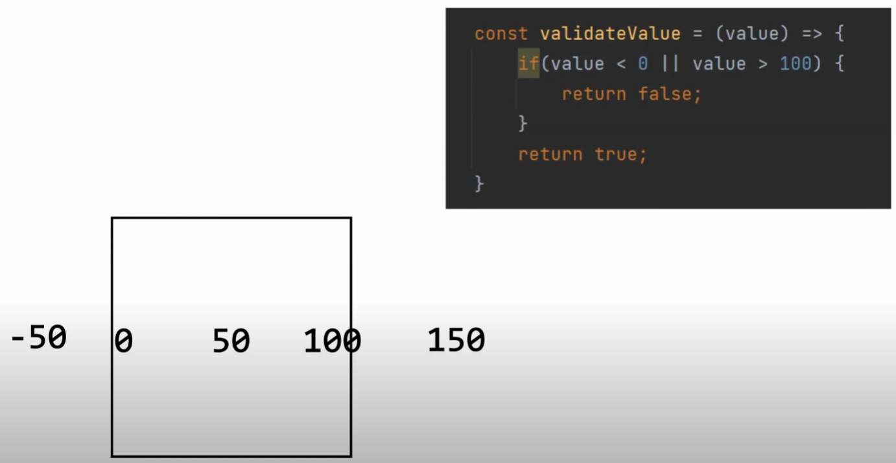

Технологии тестирования:
- `Jest` - самая популярная библиотека для написания любых тестов
- `React-testing-library` - библиотека для тестрования React-приложений
- `WebdriverIO` - E2E-тесты
- `Storybook` + `Loki` - скриншотные-тесты

## Практика. unit тесты с JEST

Устанавливаем в проект библиотеку для тестирования Jest

```bash
npm i -D jest
```

Далее напишем функцию, которую нужно проверить

`validateValue.js`
```JS
const validateValue = (value) => {  
    if (value < 0 || value > 100) {  
        return false;  
    }  
  
    return true;  
}  
  
module.exports = validateValue;
```

И далее нам нужно написать сами тесты для функции:
- `test()` (мы так же можем писать `it()` который является алиасом для `test()`) принимает в себя имя и функцию, которая будет исполнять тестирование
- `expect()` - основная функция, которая используется в тестах - в ней мы описываем, что мы ожидаем от выполнения операции. Внутрь неё передаём операцию и дальше по чейну нужно выбрать одну из функций-проверки
- `toBe()` принимает в себя то значение, которое должно оказаться в expect для успешного прохождения проверки

`validateValue.spec.js`
```JS
const validateValue = require('./validateValue');  
  
test('Валидация значения', () => {  
    expect(validateValue(50)).toBe(true);  
});
```

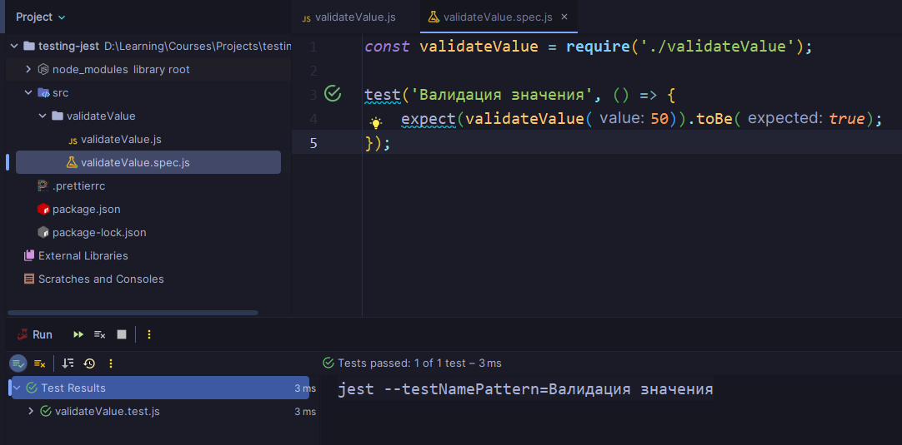

Так же мы можем описать сразу несколько тестов для нужного нам функционала:

`validateValue.spec.js`
```JS
const validateValue = require('./validateValue');

describe('validateValue', () => {
    test('Валидация значения', () => {
        expect(validateValue(50)).toBe(true);
    });

    it('Валидация значения - -1 - fail', () => {
        expect(validateValue(-1)).toBe(false);
    });

    it('Валидация значения - 101 - fail', () => {
        expect(validateValue(101)).toBe(false);
    });
});
```


Так же проверяем пограничные значения

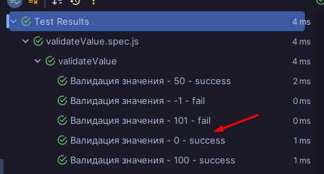

Так же дальше мы можем попробовать сравнить массивы:

`mapArrToString.js`
```JS
const mapArrToString = (arr) => {
	return arr.filter((item) => Number.isInteger(item)).map(String);
};

module.exports = mapArrToString;
```

Тут мы уже используем другие функции jest:
- `toEqual` проводит глубокое сравнение объектов и позволяет сравнить массивы и объекты (если попробовать через `toBe`, то он выдаст феил, так как он будет сравнивать ссылки, а не значения)
- чейн `not` инвертирует результат следующей операции (если у нас значения не эквивалентны, то `not` выдаст, что они эквивалентны)

`mapArrToString.spec.js`
```JS
const mapArrToString = require('./mapArrToString');

describe('mapArrToString', () => {
	it('Переданы корректные значения - success', () => {
		expect(mapArrToString([1, 2, 3])).toEqual(['1', '2', '3']);
	});

	it('Сместь из значений - fail', () => {
		expect(mapArrToString([1, 2, 3, null, undefined, 'asdasd'])).toEqual(['1', '2', '3']);
	});

	it('Пустой массив - success', () => {
		expect(mapArrToString([])).toEqual([]);
	});

	it('Генерация значений - fail', () => {
		expect(mapArrToString([])).not.toEqual([1, 2, 3]);
	});
});
```

Далее реализуем функционал возведения в степень

`square.js`
```JS
const square = (value) => {
	return value * value;
};

module.exports = square;
```

Так же условий сравнения в методе `expect` крайне большое количество и все из них можно посмотреть в [документации](https://jestjs.io/ru/docs/expect)

Так же jest предоставляет нам 4 функции, которые выполняют побочные действия между тестами:
- `beforeAll` 
- `beforeEach` 
- `afterAll`  
- `afterEach`

`square.spec.js`
```JS
const square = require('./square');

describe('validateValue', () => {
	let mockValue;

	// выполняется перед всеми тестами
	beforeAll(() => {
		mockValue = 3;
		console.log(mockValue);
	});

	// выполняется перед каждым тестом
	beforeEach(() => {
		mockValue++;
		console.log(mockValue);
	});

	it('Успешное значение - success', () => {
		expect(square(2)).toBe(4);
	});

	it('Три теста - success', () => {
		expect(square(2)).toBeLessThan(5);
		expect(square(2)).toBeGreaterThan(3);
		expect(square(2)).not.toBeUndefined();
	});

	// выполняется после всех тестов
	afterEach(() => {
		mockValue++;
		console.log(mockValue);
	});

	// выполняется после всех тестов
	afterAll(() => {
		mockValue = 0;
		console.log(mockValue);
	});
});
```

И теперь каждый тест триггерит изменение нашего значения вышеописанными методами

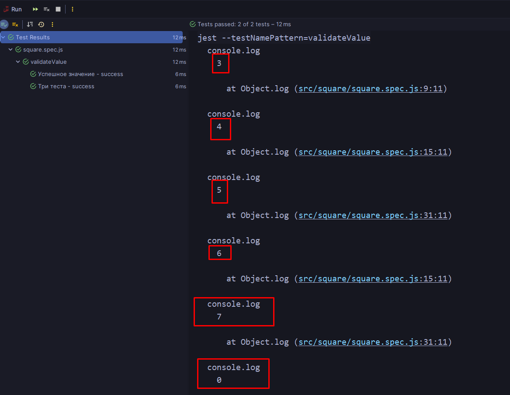

###### Моковые данные

Модифицируем нашу функцию таким образом, чтобы она возводила числов в степень через метод и могла не вызвать эту функцию, если число = 1 

`square.js`
```JS
const square = (value) => {
	if (value === 1) return 1;
	return Math.pow(value, 2);
};

module.exports = square;
```

Для того, чтобы посмотреть сколько раз вызовется определённая функция, мы можем:
- воспользоваться `jest.spyOn`, куда мы передадим библиотеку, за которой следим и её метод
- далее нам нужно вызвать целевую функцию
- и далее в `expect` передать наше моковое значение, где чейном проверяем количество вызовов

`square.spec.js`
```JS
const square = require('./square');  
  
describe('validateValue', () => {  
   it('Успешное значение - success', () => {  
      const spyMathPow = jest.spyOn(Math, 'pow');  
      square(2);  
      expect(spyMathPow).toBeCalledTimes(1);  
   });  
});
```


Однако тут нужно сказать, что моковые значения в Jest копятся и не делятся на тесты, поэтому второй шан тест уже выдал ошибку 

`square.spec.js`
```JS
const square = require('./square');  
  
describe('validateValue', () => {  
   it('Успешное значение - success', () => {  
      const spyMathPow = jest.spyOn(Math, 'pow');  
      square(2);  
      expect(spyMathPow).toBeCalledTimes(1);  
   });  
  
   it('Успешное значение - success', () => {  
      const spyMathPow = jest.spyOn(Math, 'pow');  
      square(1);  
      expect(spyMathPow).toBeCalledTimes(0);  
   });  
});
```


Чтобы определить нормальное поведение, нужно будет после каждого теста чистить моковые данные с помощью `jest.clearAllMocks()` 

`square.spec.js`
```JS
const square = require('./square');  
  
describe('validateValue', () => {  
   it('Успешное значение - success', () => {  
      const spyMathPow = jest.spyOn(Math, 'pow');  
      square(2);  
      expect(spyMathPow).toBeCalledTimes(1);  
   });  
  
   it('Успешное значение - success', () => {  
      const spyMathPow = jest.spyOn(Math, 'pow');  
      square(1);  
      expect(spyMathPow).toBeCalledTimes(0);  
   });  
  
   afterEach(() => {  
      jest.clearAllMocks();  
   });  
});
```

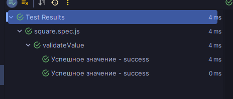

## Юнит тестирование асинхронных функций. Мокаем данные. Snapshots

Реализуем функцию, которая принимает в себя колбэк и время ожидания

`delay.js`
```JS
const delay = (callback, ms) => {
	return new Promise((resolve) => {
		setTimeout(() => {
			resolve(callback());
		}, ms);
	});
};

module.exports = delay;
```

И чтобы протестировать её достаточно просто воспользоваться async/await операторами

`delay.spec.js`
```JS
const delay = require('./delay');

describe('mapArrToString', () => {
	it('delay - success', async () => {
		const sum = await delay(() => 4 + 4, 1000);
		expect(sum).toBe(8);
	});
});
```

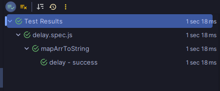

Дальше уже пойдёт функция получения данных с сервера, выделения из них id и перевода их в строки

`getData.js`
```JS
const axios = require('axios');
const mapArrToString = require('../mapArrToString/mapArrToString');

const getData = async () => {
	try {
		const response = await axios.get('https://jsonplaceholder.typicode.com/users');
		const userIds = response.data.map((user) => user.id);
		return mapArrToString(userIds);
	} catch (e) {
		console.error(e);
	}
};

module.exports = getData;
```

Тут нам потребуется уже замокать результат выполнения функции:
- `jest.mock()` - мокает модуль, котрый мы используем
- `mockReturnValue()` - передаёт те данные, которые должна вернуть вызываемая нами функция

Конкретно в данном примере
- сначала мокаем модуль `axios`, 
- затем вызываем его до выполнения нашей функции, которую мы проверяем с передачей замоканных данных
- вызываем функцию, которую мы проверяем (выполнение `axios` внутри функции `getData` заменяется на то, что мы замокали через `jest.mock()`)
- экспектим данные

`getData.spec.js`
```JS
const axios = require('axios');
const getData = require('./getData');

// мокаем использование модуля аксиоса
jest.mock('axios');

describe('Тесты', () => {
	let response;

	beforeEach(() => {
		response = {
			data: [
				{
					id: 1,
					name: 'Leanne Graham',
					username: 'Bret',
					email: 'Sincere@april.biz',
					address: {
						street: 'Kulas Light',
						suite: 'Apt. 556',
						city: 'Gwenborough',
						zipcode: '92998-3874',
						geo: {
							lat: '-37.3159',
							lng: '81.1496',
						},
					},
					phone: '1-770-736-8031 x56442',
					website: 'hildegard.org',
					company: {
						name: 'Romaguera-Crona',
						catchPhrase: 'Multi-layered client-server neural-net',
						bs: 'harness real-time e-markets',
					},
				},
				{
					id: 2,
					name: 'Ervin Howell',
					username: 'Antonette',
					email: 'Shanna@melissa.tv',
					address: {
						street: 'Victor Plains',
						suite: 'Suite 879',
						city: 'Wisokyburgh',
						zipcode: '90566-7771',
						geo: {
							lat: '-43.9509',
							lng: '-34.4618',
						},
					},
					phone: '010-692-6593 x09125',
					website: 'anastasia.net',
					company: {
						name: 'Deckow-Crist',
						catchPhrase: 'Proactive didactic contingency',
						bs: 'synergize scalable supply-chains',
					},
				},
			],
		};
	});

	it('Корректный результат', async () => {
		// вставляем в результат работы функции моковые данные
		axios.get.mockReturnValue(response);

		// вызываем саму функцию getData
		const data = await getData();

		// проверям количество раз срабатываний функции axios внутри getData
		expect(axios.get).toBeCalledTimes(1);

		// проверяем полученные данные
		expect(data).toEqual(['1', '2']);
	});
});
```

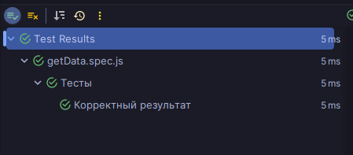

Так же у нас имеется метод `toMatchSnapshot`, который позволяет сохранить полученные данные из функции в отдельный файл

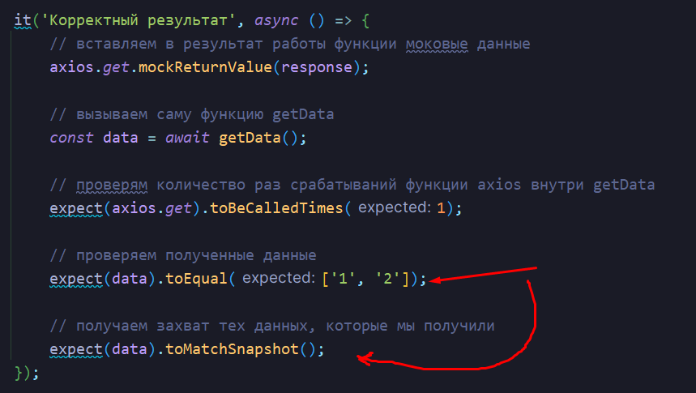

Так выглядит снепшот:

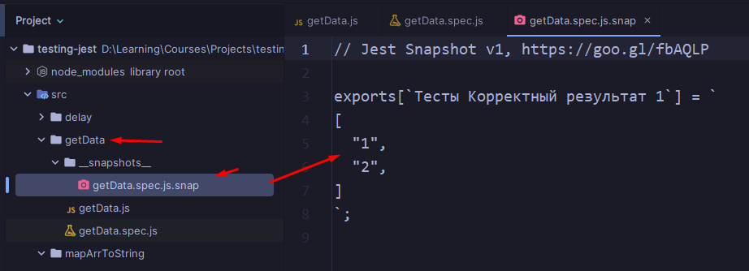

Если функция вернёт не те данные, что мы ожидали, то снепшот покажет, какие были валидные данные

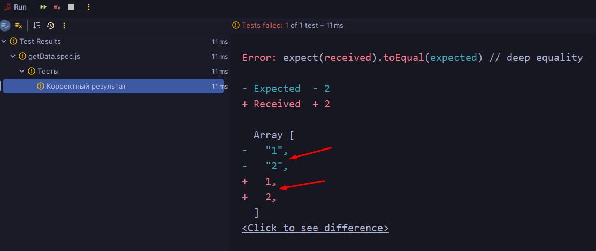

## Тестирование React приложений. React Testing library

Создадим простой компонент:

`App.js`
```JSX
function App() {
	return (
		<div className='App'>
			<h1>Hello</h1>
			<button>Button</button>
			<input type='text' placeholder={'input value'} />
		</div>
	);
}

export default App;
```

И далее познакомимся с некоторыми особенностями тестирования в реакте:
- `render()` - функция, которая рендерит нужный нам элемент на странице
- `screen` - объект, который хранит в себе вёрстку, которая должна пойти на страницу
	- `getByText` - получение элемента по тексту внутри него
	- `getByRole` - получение элемента по его роли на странице (инпут, кнопка, артикль)
	- `getByPlaceholderText` - получение элемента по тексту плейсхолдера
- `toBeInTheDocument` - проверяет, что элемент должен находиться на странице

`App.test.js`
```JS
import { render, screen } from '@testing-library/react';
import App from './App';

// сам тест
test('renders react', () => {
	// сюда передаём компонент, который нужно протестировать
	render(<App />);

	// тут мы записываем наше ожидание на экране (получаем вёрстку по определённому тексту)
	const helloWorldElement = screen.getByText(/hello/i); // ищем по тексту
	const btn = screen.getByRole('button'); // ищем по семантическим тегам
	const input = screen.getByPlaceholderText(/input value/i); // ищем по тексту в плейсхолдере

	// передаём ожидание и проверяем, что это должно быть в документе
	expect(helloWorldElement).toBeInTheDocument();
	expect(btn).toBeInTheDocument();
	expect(input).toBeInTheDocument();

	// тут мы так же можем сгенерировать снепшот инпута
	expect(input).toMatchSnapshot();

	// тут же мы можем вывести разметку в консоль
	screen.debug();
});
```

При использовании `screen.debug()` вся вёрстка, которая попадает в `screen`, будет находиться в консоли


И примерно таким образом выглядят снепшоты элементов

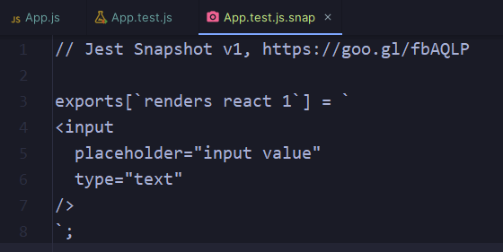

## findBy, getBy, queryBy. Пример с useEffect. Асинхронный код

Функции выборки делятся на следующие группы:
- `getBy...` - находит и возвращает элемент, но если не находит, то прокидывает ошибку и тест завершается с фейлом (`getAll...` возвращает массив элементов)
- `queryBy...` - находит и возвращает элемент, но если элемент не найден, то он нам даёт в этом просто убедиться присвоив в переменную `null` (`queryAll...` возвращает массив элементов)
- `findBy...` - работает как `queryBy...`, но возвращает промис от поиска, то есть работает асинхронно (`findAll...` возвращает массив элементов)

`App.test.js`
```JS
test('renders react', () => {  
   render(<App />);  
   const helloWorldElement = screen.queryByText(/helloswrld/i);  
   expect(helloWorldElement).toBeNull();  
});
```

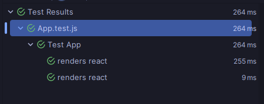

Уже в данном примере мы проводим поиск через `findByText`, который позволяет проверить наш асинхронный код появления текста `text` на странице 

```JSX
function App() {  
   const [data, setData] = useState(null);  
  
   useEffect(() => {  
      setTimeout(() => {  
         setData({});  
      }, 100);  
   }, []);  
  
   return (  
      <div className='App'>  
         {data && <div>text</div>}  
         <h1>Hello</h1>  
         <button>Button</button>  
         <input type='text' placeholder={'input value'} />  
      </div>  
   );  
}
```

```JSX
describe('Test App', () => {  
   test('renders react', async () => {  
      render(<App />);  
      const text = await screen.findByText(/text/i);  
      expect(text).toBeInTheDocument();  
   });  
});
```


Так же, чтобы проверить наличие определённых стилей на элементе, мы можем воспользоваться `toHaveStyle()`

```JSX
describe('Test App', () => {
	test('renders react', async () => {
		render(<App />);
		const text = await screen.findByText(/text/i);
		expect(text).toBeInTheDocument();
		expect(text).toHaveStyle({ color: 'red' });
	});
});
```

## Тестирование событий. onClick, onChange, onInput. FireEvent, userEvent

Далее реализуем переключение состояния отображения элемента (если `toggle` активен, то будет показываться элемент)

Так же тут будет передан `data-testid`, который позволит получить доступ к элементу через присвоенный ему `id`

```JSX
import { useEffect, useState } from 'react';

function App() {
	const [data, setData] = useState(null);
	const [toggle, setToggle] = useState(false);

	const onClick = () => setToggle((toggle) => !toggle);

	useEffect(() => {
		setTimeout(() => {
			setData({});
		}, 100);
	}, []);

	return (
		<div className='App'>
			{toggle && <div data-testid={'toggle-element'}>Toggle text</div>}
			{data && <div style={{ color: 'red' }}>text</div>}
			<h1>Hello</h1>
			<button data-testid={'toggle-button'} onClick={onClick}>
				Toggle
			</button>
			<input type='text' placeholder={'input value'} />
		</div>
	);
}

export default App;
```

Далее тут мы будем проверять работу тугглера кнопки:
- `getByTestId` позволяет получать элементы по ранее описанному атрибуту `data-testid`
- `fireEvent` позволяет триггерить определённые ивенты на выбранных нами элементах
- тут мы используем `queryByTestId` потому что элемент пропадает со страницы и значение будет закономерно `null`. Вынести один раз в переменную наш элемент, который исчезает нельзя и нам нужно будет его каждый раз получать через вызов `screen.queryByTestId('toggle-element')`

```JSX
import { fireEvent, render, screen } from '@testing-library/react';
import App from './App';

describe('Test App', () => {
	test('Toggle button Event', async () => {
		render(<App />);

		// тут мы получаем элемент со страницы по data-testid
		const btn = screen.getByTestId('toggle-button');

		// изначально элемента на странице нет, поэтому тут стоит использовать query
		// ожидаем, что элемента на странице пока нет
		expect(screen.queryByTestId('toggle-element')).toBeNull();

		// проверяем ивент клика по кнопке
		fireEvent.click(btn);

		// ожидаем, что элемент уже есть на странице после клика по кнопке
		expect(screen.queryByTestId('toggle-element')).toBeInTheDocument();

		// тут уже проверяем, что элемента на странице нет после клика
		fireEvent.click(btn);
		expect(screen.queryByTestId('toggle-element')).toBeNull();
	});
});
```

Тут с помощью `fireEvent.input` идёт проверка ввода значения в поле ввода. С помощью `toContainHTML` можно проверить, содержит ли данный HTML-элемент нужное нам значение

```JSX
<h1 data-testid={'value-elem'}>{value}</h1>
<input
	type='text'
	placeholder={'input value...'}
	onChange={(e) => setValue(e.target.value)}
/>
```

```JSX
describe('Test App', () => {  
   test('Input Event', async () => {  
      render(<App />);  
  
      // получаем инпут  
      const input = await screen.getByPlaceholderText(/input value/i);  
  
      // ожидаем, что в заголовке нет текста  
      expect(screen.queryByTestId('value-elem')).toContainHTML('');  
  
      // передаём событие  
      fireEvent.input(input, {  
         // сюда прилетает инпут  
         target: { value: '1234' },  
      });  
  
      // ожидаем текст  
      expect(screen.queryByTestId('value-elem')).toContainHTML('1234');  
   });  
});
```

Так же у нас имеется модуль `userEvent`, который выполняет полноценные действия пользователя на странице (двойной клик, наведение мыши, вставка и так далее). Он уже выполняет не искусственные действия, как `fireEvent`, а реальные действия пользователя

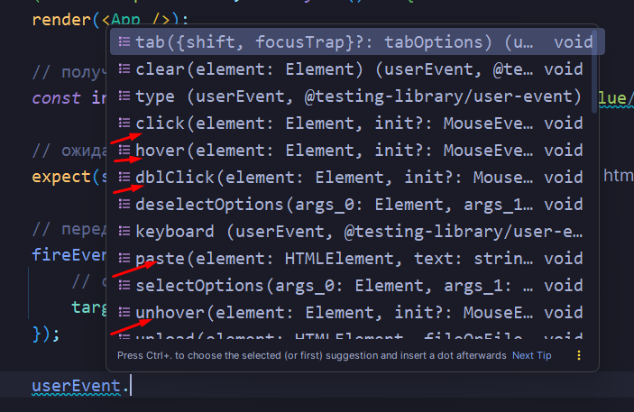

И примерно так будет выглядеть данный тест, но уже с `userEvent`:

```JSX
describe('Test App', () => {
	test('Input Event', async () => {
		render(<App />);

		// получаем инпут
		const input = await screen.getByPlaceholderText(/input value/i);

		// ожидаем, что в заголовке нет текста
		expect(screen.queryByTestId('value-elem')).toContainHTML('');

		// передаём событие
		userEvent.type(input, '1234');

		// ожидаем текст
		expect(screen.queryByTestId('value-elem')).toContainHTML('1234');
	});
});
```

## Тестирование компонента с асинхронной загрузкой данных с сервера


```JSX
import React, { useEffect, useState } from 'react';
import axios from 'axios';

const Users = () => {
	const [users, setUsers] = useState([]);

	const loadUsers = async () => {
		const { data } = await axios.get('https://jsonplaceholder.typicode.com/users');
		setUsers(data);
	};

	useEffect(() => {
		loadUsers();
	}, []);

	return (
		<div>
			{users.map((user) => (
				<div key={user.id} data-testid={'user-item'}>
					{user.name}
				</div>
			))}
		</div>
	);
};

export default Users;
```

```JSX
import { render, screen } from '@testing-library/react';
import Users from './Users';
import axios from 'axios';

jest.mock('axios');

describe('Users tests', () => {
	let response;

	beforeEach(() => {
		response = {
			data: [
				{
					id: 1,
					name: 'Leanne Graham',
				},
				{
					id: 2,
					name: 'Ervin Howell',
				},
			],
		};
	});

	it('should load users', () => {
		axios.get.mockReturnValue(response);
		render(<Users />);
		const users = screen.findAllByTestId('user-item');
		expect(users.length).toBe(2);
		expect(axios.get).toBeCalledTimes(1);
		screen.debug();
	});
});
```

## Интеграционное тестирование в связке с react router dom v6

###### Тестируем переход по ссылкам

Начальная сборка для тестирования роутинга:
- две страницы
- роутинг в `App`
- `BrowserRouter` в `index`

```JSX
const MainPage = () => {
	return <div data-testid={'main-page'}>MAIN PAGE</div>;
};

export default MainPage;
```

```JSX
const AboutPage = () => {
	return <div data-testid={'about-page'}>ABOUT PAGE</div>;
};

export default AboutPage;
```

```JSX
const root = ReactDOM.createRoot(document.getElementById('root'));
root.render(
	<React.StrictMode>
		<BrowserRouter>
			<App />
		</BrowserRouter>
	</React.StrictMode>,
);
```

```JSX
const App = () => {
	return (
		<div>
			<Link to={'/'} data-testid={'main-link'}>
				main
			</Link>
			<Link to={'/about'} data-testid={'about-link'}>
				about
			</Link>
			<Routes>
				<Route path={'/'} element={<MainPage />} />
				<Route path={'/about'} element={<AboutPage />} />
			</Routes>
		</div>
	);
};

export default App;
```

И таким способом мы можем проверить наш роутинг:
- в компонент `MemoryRouter` помещаем рендеримый компонент
- далее через `userEvent.click` переходим по страницам

```JSX
import { render, screen } from '@testing-library/react';  
import App from './App';  
import userEvent from '@testing-library/user-event';  
import { MemoryRouter } from 'react-router-dom';  
  
describe('Router Tests', () => {  
   it('should run on links', () => {  
      render(  
         <MemoryRouter>  
            <App />  
         </MemoryRouter>,  
      );  
      const mainLink = screen.getByTestId('main-link');  
      const aboutLink = screen.getByTestId('about-link');  
  
      userEvent.click(aboutLink); // переходим по первой ссылке  
  
      // ожидаем элемент страницы      
      expect(screen.getByTestId('about-page')).toBeInTheDocument();  
  
      userEvent.click(mainLink); // переходим по второй ссылке  
  
      // ожидаем элемент главной страницы      
      expect(screen.getByTestId('main-page')).toBeInTheDocument();  
   });  
});
```

###### Тестируем попадание на страницу Not Found

Страница ошибки:

```JSX
const ErrorPage = () => {  
   return <div data-testid={'not-found-page'}>Error</div>;  
};  
  
export default ErrorPage;
```

Добавляем роут на переход по неизвестной ссылке `/*`, по которому будет выпадать страница 404

```JSX
<Routes>  
   <Route path={'/'} element={<MainPage />} />  
   <Route path={'/about'} element={<AboutPage />} />  
   <Route path={'/*'} element={<ErrorPage />} />  
</Routes>
```

И в тесте мы можем сразу указать страницу, на которой мы должны отрендериться через передачу атрибута `initialEntries` в `MemoryRouter`

Конкретно тут написан любой роут, которого нет в приложении, чтобы отрендерился роут ошибки

```JS
it('error page', () => {  
   render(  
      <MemoryRouter initialEntries={['/asfd']}>  
         <App />  
      </MemoryRouter>,  
   );  
  
   expect(screen.getByTestId('not-found-page')).toBeInTheDocument();  
});
```

###### Тестирование перехода на сгенерированные страницы

Первым делом, создадим страницу отдельного пользователя (данные для всех будут одинаковыми и статичными)

`pages > UserDetailsPage.jsx`
```JSX
import React from 'react';  
  
const UserDetailsPage = () => {  
return <div data-testid={'user-page'}>User Details Page</div>;  
};  
  
export default UserDetailsPage;
```

Список пользователей будет сгенерирован ссылкой

`Users.js`


Добавляем ссылку на нужного пользователя

`App.js`


И для того, чтобы протестировать пользователя придётся уже вынести  внутрь `MemoryRouter` оба роута, по которым мы хотим переходить, так как наш компонент `App` не рендерится и мы из него не можем перейти на нужную страницу `user`. Так же нужно будет указать `/user` в путях `MemoryRouter`, чтобы сразу попасть на нужную нам страницу

`Users.tests.js`
```JS
import { getByTestId, render, screen } from '@testing-library/react';
import Users from './Users';
import axios from 'axios';
import userEvent from '@testing-library/user-event';
import { MemoryRouter, Route, Routes } from 'react-router-dom';
import UserDetailsPage from '../pages/UserDetailsPage';
import React from 'react';

jest.mock('axios');

describe('Users tests', () => {
	let response;
	beforeEach(() => {
		response = {
			data: [
				{
					id: 1,
					name: 'Leanne Graham',
				},
				{
					id: 2,
					name: 'Ervin Howell',
				},
				{
					id: 3,
					name: 'Clementine Bauch',
				},
			],
		};
	});

	// очищаем моки перед каждым применением axios
	afterEach(() => {
		jest.clearAllMocks();
	});

	it('should load users', () => {
		axios.get.mockReturnValue(response);
		render(<Users />);
		const users = screen.findAllByTestId('user-item');
		expect(users.length).toBe(3);
		expect(axios.get).toBeCalledTimes(1);
		screen.debug();
	});

	// пишем переход на страницу отдельного пользователя
	it('test open user page', async () => {
		axios.get.mockReturnValue(response);
		render(
			<MemoryRouter initialEntries={['/users']}>
				<Routes>
					<Route path={'/users'} element={<Users />} />
					<Route path={'/users/:id'} element={<UserDetailsPage />} />
				</Routes>
			</MemoryRouter>,
		);
		const users = await screen.findAllByTestId('user-item');
		expect(users.length).toBe(3);
		userEvent.click(users[2]);
		expect(getByTestId('user-page')).toBeInTheDocument();
	});
});
```

## Хелпер для удобного тестирования роутинга

Первым делом, вынесем всё наше дерево роутинга в отдельный компонент

`src > router > AppRouter.jsx`
```JSX
import React from 'react';
import { Route, Routes } from 'react-router-dom';
import MainPage from '../pages/MainPage';
import Users from '../Users/Users';
import UserDetailsPage from '../pages/UserDetailsPage';
import AboutPage from '../pages/AboutPage';
import ErrorPage from '../pages/ErrorPage';

const AppRouter = () => {
	return (
		<Routes>
			<Route path={'/'} element={<MainPage />} />
			<Route path={'/users'} element={<Users />} />
			<Route path={'/users/:id'} element={<UserDetailsPage />} />
			<Route path={'/about'} element={<AboutPage />} />
			<Route path={'/*'} element={<ErrorPage />} />
		</Routes>
	);
};

export default AppRouter;
```

Далее создадим хелпер, который будет в себя принимать ту конструкцию, которая требуется для тестирования нужных роутов приложения

`src > test > helpers > renderWithRouter.jsx
```JSX
import { MemoryRouter } from 'react-router-dom';
import AppRouter from '../../router/AppRouter';

export const renderWithRouter = (component, initialRoute = '/') => {
	return (
		<MemoryRouter initialEntries={[initialRoute]}>
			<AppRouter />
			{component}
		</MemoryRouter>
	);
};
```

 Так выглядит целевой компонент для тестирования:

`Users.jsx`
```JSX
const Users = () => {
	const [users, setUsers] = useState([]);

	const loadUsers = async () => {
		const resp = await axios.get('https://jsonplaceholder.typicode.com/users');
		setUsers(resp.data);
	};

	useEffect(() => {
		loadUsers();
	}, []);

	return (
		<div data-testid='users-page'>
			{users.map((user) => (
				<Link to={`/users/${user.id}`} key={user.id} data-testid='user-item'>
					{user.name}
				</Link>
			))}
		</div>
	);
};
```

Тут оставляем компонент с роутами

`App.jsx`
```JSX
const App = () => {
	return (
		<div>
			<Link to={'/'} data-testid={'main-link'}>
				main
			</Link>
			<Link to={'/about'} data-testid={'about-link'}>
				about
			</Link>
			<Link to={'/users'} data-testid={'about-link'}>
				users
			</Link>
			<AppRouter />
		</div>
	);
};
```

Теперь в тестах для запуска тестирования нужного роута, достаточно обернуть нужный компонент в `renderWithRouter()` хелпер

`Users.test.js`
```JS
import { render, screen } from '@testing-library/react';
import Users from './Users';
import axios from 'axios';
import userEvent from '@testing-library/user-event';
import React from 'react';
import { renderWithRouter } from '../test/helpers/renderWithRouter';

jest.mock('axios');

describe('USERS TEST', () => {
	let response;
	beforeEach(() => {
		response = {
			data: [
				{
					id: 1,
					name: 'Leanne Graham',
				},
				{
					id: 2,
					name: 'Ervin Howell',
				},
				{
					id: 3,
					name: 'Clementine Bauch',
				},
			],
		};
	});

	afterEach(() => {
		jest.clearAllMocks();
	});

	test('renders learn react link', async () => {
		axios.get.mockReturnValue(response);
		render(<Users />);
		const users = await screen.findAllByTestId('user-item');
		expect(users.length).toBe(3);
		expect(axios.get).toBeCalledTimes(1);
		screen.debug();
	});

	test('test redirect to details page', async () => {
		axios.get.mockReturnValue(response);
		render(renderWithRouter(<Users />));
		const users = await screen.findAllByTestId('user-item');
		expect(users.length).toBe(3);
		userEvent.click(users[0]);
		expect(screen.getByTestId('users-page')).toBeInTheDocument();
	});
});
```

###### Тестирование навбара приложения

Навбар будет хранить просто ссылки по страницам в нашем приложении реакта

`Navbar.jsx`
```JSX
import React from 'react';
import { Link } from 'react-router-dom';

const Navbar = () => {
	return (
		<div>
			<Link to={'/'} data-testid={'main-link'}>
				main
			</Link>
			<Link to={'/about'} data-testid={'about-link'}>
				about
			</Link>
			<Link to={'/users'} data-testid={'users-link'}>
				users
			</Link>
		</div>
	);
};

export default Navbar;
```

В основном компоненте приложения добавляем наш навбар

`App.js`
```JSX
const App = () => {
	return (
		<div>
			<Navbar />
			<AppRouter />
		</div>
	);
};
```

И тут пишем отдельные тейки тестирования под срабатывание разных роутов 

`Navbar.test.js`
```JSX
import userEvent from '@testing-library/user-event';
import { render, screen } from '@testing-library/react';
import { renderWithRouter } from '../../test/helpers/renderWithRouter';
import Navbar from './Navbar';

describe('navbar test', () => {
	it('test main link', () => {
		render(renderWithRouter(<Navbar />));

		const mainLink = screen.getByTestId('main-link');

		userEvent.click(mainLink);
		expect(screen.getByTestId('main-page')).toBeInTheDocument();
	});

	it('test users link', () => {
		render(renderWithRouter(<Navbar />));

		const usersLink = screen.getByTestId('users-link');

		userEvent.click(usersLink);
		expect(screen.getByTestId('users-page')).toBeInTheDocument();
	});

	it('test about link', () => {
		render(renderWithRouter(<Navbar />));

		const aboutLink = screen.getByTestId('about-link');

		userEvent.click(aboutLink);
		expect(screen.getByTestId('about-page')).toBeInTheDocument();
	});
});
```

## Интеграционное тестирование в связке с Redux toolkit

Первым делом, нам нужно создать стор

`store > store.js`
```JS
import { combineReducers, configureStore } from '@reduxjs/toolkit';
import counterReducer from './reducers/counterReducer';

const rootReducer = combineReducers({
	counter: counterReducer,
});

export const createReduxStore = (initialState = {}) => {
	return configureStore({
		reducer: rootReducer,
		preloadedState: initialState,
	});
};
```

Далее нужно будет создать срез, который вернёт нам редьюсер и два экшена

`store > selectors > counterReducer.js
```JS
import { createSlice } from '@reduxjs/toolkit';

export const counterSlice = createSlice({
	name: 'counter',
	initialState: {
		value: 0,
	},
	reducers: {
		increment: (state) => {
			state.value += 1;
		},
		decrement: (state) => {
			state.value -= 1;
		},
	},
});

export const { increment, decrement } = counterSlice.actions;

export default counterSlice.reducer;
```

Тут мы реализуем селектор, по которому мы будем получать значение

`store > selectors > getCounterValue > getCounterValue.js
```JS
// стоит подстраховаться и в селектор доставить проверку через nullish и подставлять 0
export const getCounterValue = (state) => state?.counter?.value || 0;
```

Тут мы должны вложить всё приложение в провайдер, который уже и будет распространять состояние по проекту

`index.js`
```JS
const root = ReactDOM.createRoot(document.getElementById('root'));
root.render(
	<React.StrictMode>
		<Provider store={createReduxStore()}>
			<BrowserRouter>
				<App />
			</BrowserRouter>
		</Provider>
	</React.StrictMode>,
);
```

Это компонент счётчика

`components > Counter > Counter.jsx`
```JS
import React from 'react';
import { useDispatch, useSelector } from 'react-redux';
import { getCounterValue } from '../../store/reducers/selectors/getCounterValue/getCounterValue';
import { increment, decrement } from '../../store/reducers/counterReducer';

const Counter = () => {
	const dispatch = useDispatch();
	const value = useSelector(getCounterValue);

	const onIncrement = () => {
		dispatch(increment());
	};

	const onDecrement = () => {
		dispatch(decrement());
	};

	return (
		<div>
			<h1 data-testid={'value-title'}>{value}</h1>
			<button data-testid={'increment-button'} onClick={onIncrement}>
				inc
			</button>
			<button data-testid={'decrement-button'} onClick={onDecrement}>
				dec
			</button>
		</div>
	);
};

export default Counter;
```

Это компонент, в котором располагается счётчик

`pages > MainPage.jsx`
```JSX
const MainPage = () => {
	return (
		<div data-testid={'main-page'}>
			MAIN PAGE
			<Counter />
		</div>
	);
};
```


## Тестируем селектор

Чтобы протестировать селектор, можно просто складывать в него различные значения и на выходе он просо должен вернуть нам то же значение

- пустой массив равен 0, так как в срезе изначально стоит 0
- если вложим значение, то оно и будет находиться в селекторе

`store > selectors > getCounterValue > getCounterValue.test.js
```JS
import { getCounterValue } from './getCounterValue';

describe('getCounterValue', () => {
	it('empty value', () => {
		expect(getCounterValue({})).toBe(0);
	});

	it('filled value', () => {
		expect(
			getCounterValue({
				counter: {
					value: 100,
				},
			}),
		).toBe(100);
	});
});
```

Далее мы тестируем функции из среза. 

- если мы ничего не передали в стейт, то значение будет идти от 0 при каждом действии
- если мы что-то передали в стейт, то на него будет действовать экшен (`increment`, `decrement`)

`store > selectors > counterReducer.test.js
```JS
import counterReducer, { decrement, increment } from './counterReducer';

describe('counterReducer', () => {
	it('empty state', () => {
		expect(counterReducer(undefined, increment())).toEqual({ value: 1 });
		expect(counterReducer(undefined, decrement())).toEqual({ value: -1 });
	});

	it('increment', () => {
		expect(counterReducer({ value: 0 }, increment())).toEqual({ value: 1 });
	});

	it('decrement', () => {
		expect(counterReducer({ value: 0 }, decrement())).toEqual({ value: -1 });
	});
});
```

Далее тестируем сам компонент счётчика.

- Чтобы достучаться до него и проверить редакс, нужно передать компонент внутри провайдера
- В провайдере можно задать начальное значение стейта, если нужно
- `render()` можно использовать просто как функцию и доставать все методы выборки с помощью screen, а можно достать из render его функции выборки и использовать их без обращения к `screen` (как удобнее, так и делаем, но во втором случае мы не сможем пользоваться выборкой из `screen`)
- функция сравнения `toHaveTextContent` позволяет нам найти содержание текста в определённом элементе

`components > Counter > Counter.test.jsx``
```JS
import Counter from './Counter';
import { render } from '@testing-library/react';
import userEvent from '@testing-library/user-event';
import { Provider } from 'react-redux';
import { createReduxStore } from '../../store/store';

describe('Counter component', () => {
	it('increment', () => {
		const { getByTestId } = render(
			<Provider
				store={createReduxStore({
					counter: { value: 10 },
				})}
			>
				<Counter />
			</Provider>,
		);

		const incrementButton = getByTestId('increment-button');

		expect(getByTestId('value-title')).toHaveTextContent('10');

		userEvent.click(incrementButton);

		expect(getByTestId('value-title')).toHaveTextContent('11');
	});
});
```

## Хелпер для удобного тестирования компонентов, в которых используется Redux

Мы можем создать такой же хелпер, который и создавали для роутинга, но для редакса

Однако, мы можем в хелперах заранее возвращать сгенерированный ответ от `render`, а не делать рендер в тесте

`test > helpers > renderWithRedux.js`
```JSX
import { createReduxStore } from '../../store/store';
import { render } from '@testing-library/react';
import { Provider } from 'react-redux';

export const renderWithRedux = (component, initialState = {}) => {
	const store = createReduxStore(initialState);

	return render(<Provider store={store}>{component}</Provider>);
};
```

И использовть его для тестирования

`Counter.test.js`
```JSX
describe('Counter component', () => {
	it('increment', () => {
		const { getByTestId } = renderWithRedux(<Counter />, { counter: { value: 10 } });

		const incrementButton = getByTestId('increment-button');

		expect(getByTestId('value-title')).toHaveTextContent('10');

		userEvent.click(incrementButton);

		expect(getByTestId('value-title')).toHaveTextContent('11');
	});
});
```

И так уже будет выглядеть хелпер для тестирования роутинга и редакса одновременно 

`test > helpers > renderTestApp.js`
```JSX
import { render } from '@testing-library/react';
import { createReduxStore } from '../../store/store';
import { Provider } from 'react-redux';
import { MemoryRouter } from 'react-router-dom';

export const renderTestApp = (component, options) => {
	const store = createReduxStore(options?.initialState);

	return render(
		<Provider store={store}>
			<MemoryRouter initialEntries={[options?.route]}>{component}</MemoryRouter>
		</Provider>,
	);
};
```

А так выглядит его применение в приложениях:

`Counter.test.js`
```JSX
describe('Counter component', () => {
	it('increment', () => {
		const { getByTestId } = renderTestApp(<Counter />, {
			route: '/',
			initialState: {
				counter: { value: 10 },
			},
		});

		const incrementButton = getByTestId('increment-button');

		expect(getByTestId('value-title')).toHaveTextContent('10');

		userEvent.click(incrementButton);

		expect(getByTestId('value-title')).toHaveTextContent('11');
	});
});
```


## e2e тесты с WebdriverIO


## PageObject паттерн


## Пример е2е теста с асинхронным кодом


## Скриншотные тесты storybook и loki js


